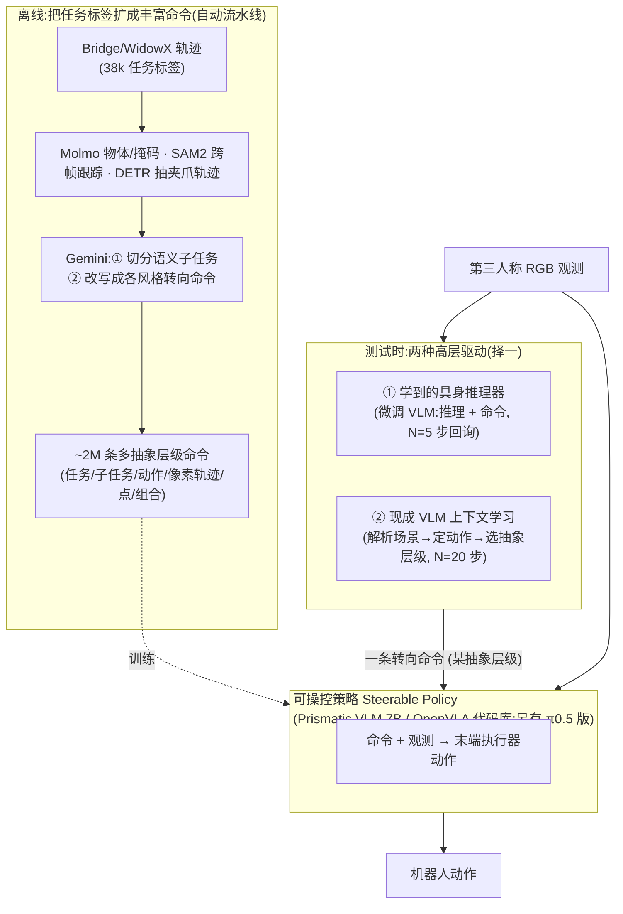

# Steerable Policies:为具身推理与分层控制训练「可操控」的 VLA 策略

> **arXiv**: [2602.13193](https://arxiv.org/abs/2602.13193)(*Steerable Vision-Language-Action Policies for Embodied Reasoning and Hierarchical Control*) | **机构**: UC Berkeley · Physical Intelligence · Google DeepMind(William Chen … Karl Pertsch、Sergey Levine) | **时间**: 2026.02(v1)/ 2026.04(v3)
> **路线**: 新范式 · 分层可操控(用丰富语言接口让 VLM 推理「驾驭」低层 VLA → 操作)

> [← 返回主报告](../index.md)

---

## TL;DR

预训练 **VLM** 有强常识与视觉推理,是机器人控制的宝贵先验;但「把这份知识接地到机器人行为」仍是难题。常见做法是分层栈——**高层 VLM 推理 + 低层策略(如 VLA)执行**——而**两层之间的接口通常只是一句自然语言任务指令**。本文指出:这从根本上**限制了 VLM 推理能在多大程度上调控底层行为**(高层「想得很细」,信息却在一句粗指令处被压扁),而且**只用任务标签训练出来的策略本身也不「可操控」**——就算给它更细的语言,它也不会照做。

**Steerable Policies(可操控策略)** 的解法:把 VLA **训练在多个抽象层级的丰富(合成)命令**上——任务、子任务、原子动作、**夹爪像素轨迹**、**坐标点**、以及它们的组合。低层一旦更可控,**预训练 VLM 的知识就能被「解锁」**,带来更好的任务泛化。论文用两种方式在测试时「驾驭」同一个可操控策略:

- **① 学到的高层具身推理器(learned embodied reasoner)**:一个微调过的 VLM,输出「一段推理 + 一条对应的转向命令(steering command)」,低层策略据此执行 **N=5** 步后再回询高层。
- **② 现成 VLM 的上下文学习(in-context learning)**:一个**未经训练**的现成 VLM,拿到「历史观测 + 历史命令」序列后,(1) 解析当前场景、(2) 判断机器人下一步该做什么、(3) **推理应该用哪个抽象层级**去命令策略,然后给出一条命令、执行 **N=20** 步。

在真机 **Bridge / WidowX** 操作上,这两种新方法都**超过了既有的具身推理 VLA(如 [ECoT](ecot))与基于 VLM 的分层基线(SayCan 式)**,在**泛化(generalization)与长程(long-horizon)**任务上尤为明显。

> ⚠️ 注意:论文主结果以**柱状图(误差棒 ±1 StdErr)**呈现、**未在图上标注具体数值**,故下文各泛化轴 / 各任务的**成功率确数待核**(见原文 Fig 5 / Fig 6 与项目页)。可独立核对的具体数字仅为:**数据规模 38k → 206k → ~2M 条命令**,以及**人类预言机(human oracle)在不受限转向下「接近 100%」成功(Fig 4)**。✅ 代码、模型权重与数据集均已开源。

---

## 1. 问题

要让 VLM 的常识推理真正帮到机器人控制,「VLM 当大脑、低层策略当手脚」的**分层范式**很自然。但作者指出其中有**两重瓶颈**:

1. **接口太粗**:多数分层方案里,VLM↔VLA 的接口只是**一句自然语言任务指令**(如「把胡萝卜放进锅里」)。高层即使做了细致的场景推理,信息也会在这句粗指令处被压扁——**低层无从据此精细调整**,VLM 的推理能力被白白浪费。
2. **策略不可控**:一个**只用任务标签训练**的低层策略,本身就**不具备「听更细的话」的能力**——你给它「向左一点」「先抓这个点」,它也不会照做。所以光把接口做细还不够,**策略必须先变得「可操控」**。

因此核心问题是:**怎样既设计出更丰富的语言接口、又训练出真正能被它操控的低层策略,使 VLM 的推理能可控地驱动底层行为,并在罕见 / 长程场景中带来可观的泛化收益?**

---

## 2. 方法与架构

*示意图(自绘,据论文描述,非原图)*

### 2.1 命令的抽象层级(核心)

可操控策略训练所用的「转向命令(steering command)」覆盖从粗到细、从语义到像素的多个层级:

| 层级 | 形式 | 论文示例 |
|---|---|---|
| 任务级 task | 标准任务标签 | 「把胡萝卜放进锅里」 |
| 子任务级 subtask | 分解后的子步骤 | 「伸向胡萝卜」 |
| 原子动作 atomic motion | 细粒度方向 / 夹爪指令 | 「向左移动」「张开夹爪」 |
| 夹爪轨迹 gripper trace | **像素坐标序列**,夹爪应沿其移动 | 「从 [x₁,y₁] 移到 [x₂,y₂]」 |
| 坐标点 point | 对物体 / 位置的**像素级指代** | 「在 \<胡萝卜位置\> 处抓取」 |
| 组合 combination | 混合多种风格 | 「从 [x,y] 向左,把蘑菇放到 [x₂,y₂] 的盘子上」 |

关键在于:**夹爪轨迹 / 坐标点把「空间接地(grounding)」直接写进了命令**——这正是 VLM 擅长产出、而粗任务指令完全表达不了的信息。

### 2.2 丰富命令怎么来:全自动合成流水线

为了不靠人工逐帧重标,作者用一套**自动流水线**把原始任务标签扩成海量多层级命令:

- **特征抽取**:**Molmo** 识别任务相关物体并生成分割掩码 → **SAM2** 把掩码在整条轨迹上跟踪 → **DETR** 抽取夹爪轨迹(得到像素级的轨迹 / 点)。
- **子任务切分**:用 **Gemini** 把每条 episode 切成若干语义子任务。
- **命令合成**:再用 **Gemini** 把每个子任务**改写成「所有风格」的等价转向命令**,并嵌入上一步抽到的接地特征(坐标 / 轨迹)。

规模:原始 **38,000** 条任务标签 → **206,000** 条子任务 → **近 200 万(~2M)** 条转向命令。

### 2.3 低层:可操控策略本体

可操控策略沿用 **OpenVLA 代码库**、采用**标准 Prismatic VLM 7B** 架构,在 **Bridge(WidowX)** 真机操作数据上训练,把**「转向命令(而非标准任务标签)+ 第三人称 RGB 观测」映射到末端执行器动作**。论文还给出基于 **π0.5** 框架的另一种实例化,说明该范式**不绑死某一种 VLA 骨干**。

### 2.4 高层:两种「驾驭」方式

同一个可操控策略,可由两类高层来驱动(见 §TL;DR):**①** 一个**学到的**具身推理器(微调 VLM,边推理边给命令,N=5 步回询);**②** 一个**现成**的 VLM,仅靠**上下文学习**(含「选择合适抽象层级」这一步),N=20 步给一次命令。二者的共同点是:**都通过那套丰富语言接口来「操控」底层**,而非只丢一句任务指令。

---

## 3. 关键设计与创新点

1. **「丰富语言接口」取代「一句粗指令」**:本文最核心的论点——让 VLM↔VLA 之间用**多抽象层级命令**(含像素级轨迹 / 点)而非单条任务指令,使高层推理能**可操控地**调控低层。
2. **把空间接地写进命令**:夹爪像素轨迹 / 坐标点这类命令,把 VLM 的视觉接地能力直接接到了控制上,弥补纯语言指令的空间表达缺口。
3. **可规模化的自动命令合成**:Molmo + SAM2 + DETR + Gemini 流水线,无需人工重标即可把 38k 标签扩成 ~2M 命令,解决「细粒度语言-控制对齐监督稀缺」的工程瓶颈。
4. **「可控策略」与「谁来控」解耦**:同一策略既能被**学到的推理器**驱动,也能被**现成 VLM 用上下文学习**驱动——后者意味着**无需为高层再训练**即可接入更强的通用 VLM。
5. **人类预言机给出可操控性上界**:不受限转向下人类操控可达「接近 100%」成功(Fig 4),从经验上证明**该策略确实是「可被语言操控」的**,而非徒有接口。

---

## 4. 实验与关键结果

- **本体 / 数据**:真机 **WidowX**,**Bridge** 任务族(项目页示例任务:「把胡萝卜放进锅里」「把西瓜放到毛巾上」「让盘子上只剩蓝色方块」「把锅叠到毛巾上」等;原文未把评测任务逐一命名,待核)。
- **评测维度**:沿 **in-distribution / 动作(motion)/ 空间(spatial)/ 语义(semantic)** 四类**泛化轴**评估;另设**多步 Bridge 任务**做**长程(long-horizon)**评测。
- **基线(均为论文点名对比)**:
  - 具身推理实验:**标准 OpenVLA(纯语言指令)**、**[ECoT](ecot)(具身思维链)**、**ECoT-Lite(两个变体)**、**不带推理的微调高层 VLM**(消融)。
  - 上下文学习实验:**标准 Bridge OpenVLA**、**SayCan 式基线(只用子任务级转向)**、**不带显式推理的 ICL**(消融)。

**结果(定性,确数待核)**:两种方法在**泛化与长程**任务上均**超越上述具身推理 VLA 与 VLM 分层基线**;原文以**柱状图 + ±1 StdErr 误差棒**呈现,**未标注数值**,故各轴成功率的**确切百分比待核**(见原文 Fig 5 / Fig 6)。

**可独立核对的硬数字**:

| 指标 | 数值 | 出处 |
|---|---|---|
| 任务标签 → 子任务 → 转向命令 | 38k → 206k → **~2M** | 正文 |
| 人类预言机(不受限转向) | **接近 100%** 成功 | Fig 4 说明 |

- **消融**:逐一**限制只用单一风格命令**(只任务 / 只子任务 / 只动作 / 只轨迹 / 只点),以及**去掉推理**的变体——用以说明「多层级 + 推理」相对单一接口的增益(各项确数待核)。

---

## 5. 局限与争议

- **依赖数据多样性**:作者明确指出,**LIBERO 这类「窄」数据集行为多样性不足**,在低多样性设定下「**用转向去解决全新或被大幅随机化的任务仍然困难**」——该范式的收益与底层数据的行为覆盖强相关。
- **标注链路误差会传导**:丰富命令由 Molmo / SAM2 / DETR / Gemini 自动产出,**这些模型的错误(物体识别、轨迹抽取、改写)会被带进训练命令**,其质量 / 偏差未做系统消融(待核)。
- **主结果缺数值表**:可获取版本主结果均为**未标注的柱状图**,**跨方法精确对比困难**;各泛化轴 / 各任务成功率确数**待核**。
- **单团队真机评测**:结论来自提出方在自家 WidowX/Bridge 设置下的评测,**暂无独立第三方在统一条件下复现**。
- **「接口」归因的边界**:把增益主要归于「更丰富的接口」是有力但偏单侧的论断——其中有多少来自接口设计、多少来自**额外合成命令数据本身**,需要更细的切分(部分由单风格消融回应,但仍待核)。

---

## 6. 在 VLA 谱系中的位置

- **与 [SteerVLA](steervla) 互为姊妹**:同一思想——「用丰富语言接口让 VLM 推理可操控地驾驭低层 VLA」——[SteerVLA](steervla) 把它落到**自动驾驶**(Bench2Drive),本文落到**桌面操作**(Bridge/WidowX);两篇共享 Catherine Glossop、Sergey Levine 等作者,可对照阅读。
- **建在 [OpenVLA](openvla) 之上**:复用其代码库与 Prismatic VLM 7B;另给出 **[π0.5](pi05)** 实例化,显示范式与骨干解耦。
- **与 [ECoT](ecot) 一脉而又超越**:ECoT(具身思维链)既是其思想前身(开源模型名即 `Embodied-CoT/…`),也是本文的**主要对比基线**;本文把「推理」从「写给自己看的 CoT」推进为「**可操控低层的细粒度命令接口**」。
- **相对端到端单体策略**([RT-2](rt2) / [OpenVLA](openvla) 把感知直接映射到动作 token),本文选择**显式分层 + 语言中介**,以回应「单体 VLA 在泛化 / 长程上偏弱」。
- **与双系统 / 分层范式**([Gemini Robotics](gemini-robotics) 的「ER 当大脑、VLA 边想边做」)同源,但把**「接口的丰富度」**本身当作核心研究对象;其像素轨迹 / 点命令也与**空间接地**路线([SpatialVLA](spatialvla))相呼应。

一句话定位:**Steerable Policies = 把「可操控的细粒度语言接口」当成一等公民——先用自动流水线把任务标签扩成 ~2M 多层级命令训练出一个真正「听得懂细话」的低层 VLA,再让学到的推理器或现成 VLM(上下文学习)去驾驭它,从而把 VLM 的常识解锁到操作泛化与长程任务上。**

---

## 来源

- arXiv 摘要页:https://arxiv.org/abs/2602.13193 (*Steerable Vision-Language-Action Policies for Embodied Reasoning and Hierarchical Control*;v1 2026-02-13,v3 2026-04-06;cs.RO)
- 项目主页:https://steerable-policies.github.io/ (示例任务、方法、视频)
- 代码:https://github.com/steerable-policies/steerable-policies-bridge
- 模型权重:Hugging Face `Embodied-CoT/steerable-policy-openvla-7b-bridge`;数据集 `Steering_features_bridge`
- 低层骨干来源 OpenVLA:https://arxiv.org/abs/2406.09246 ;ECoT(对比基线 / 前身):https://arxiv.org/abs/2407.08693
