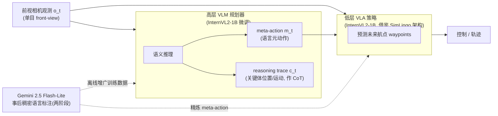

# SteerVLA:Steering Vision-Language-Action Models in Long-Tail Driving Scenarios

> **arXiv**: [2602.08440](https://arxiv.org/abs/2602.08440) | **机构**: Stanford University · UC Berkeley(Oier Mees 兼 Microsoft) | **时间**: 2026.02
> **路线**: 新范式 · 分层可操控(VLA → 自动驾驶)

> [← 返回主报告](../index.md)

---

## TL;DR

SteerVLA 把自动驾驶建模为一个**分层(hierarchical)策略**:**高层是一个 VLM 规划器**(由预训练 **InternVL2-1B** 微调而来),负责对场景做语义推理,产出一个**meta-action**(meta-action,语言形式的元动作,如「加速并大幅左转,同时谨慎观察路口」)外加一条**推理轨迹(reasoning trace,充当 chain-of-thought)**;**低层是一个 VLA 策略**(同样基于 InternVL2-1B,沿用 [SimLingo](https://arxiv.org/abs/2503.09594) 的架构),在「观测 + 高层 meta-action」条件下预测未来**航点(waypoints)**。论文的核心主张是:**VLM 与 VLA 之间不该只用一句粗粒度任务指令做接口**——那会让 VLM 强大的推理几乎无法真正"驾驭"底层行为;SteerVLA 转而设计一套**更丰富、更细粒度的语言接口**,让高层把推理的细微差别**接地(ground)**到底层的控制输出上。为获得"与车辆控制对齐"的细粒度语言监督,作者用一个 VLM(**Gemini 2.5 Flash-Lite**)对已有驾驶数据做**事后(in hindsight)稠密语言标注**。在 CARLA 闭环基准 **Bench2Drive** 上,SteerVLA 整体驾驶分 **90.71**,较最优基线 SimLingo(85.94)**+4.77**;在 11 个长尾场景构成的 **Bench2Drive-LongTail** 子集上达 **91.91**,较 SimLingo(83.87)**+8.04**。

> ⚠️ 注意:下文数值均为**作者自报**的闭环评测结果(单一团队、Bench2Drive 设置下),尚无独立第三方在统一条件下复现;代码在发布时标注为 "Coming Soon"。

---

## 1. 问题

自动驾驶的一个根本张力是:**如何把"针对长尾事件的高层语义推理"与"保证鲁棒行车的低层反应式控制"统一起来**。

- 互联网规模预训练的大型 **VLM** 具备强常识推理,能"看懂"罕见、复杂的长尾场景(施工、临时管制、异常交通参与者等),但它们**缺少与车辆控制接地的经验**,直接拿来开车并不安全。
- 端到端 **VLA** 驾驶策略反应快、能直接出动作,但对从未/极少见过的长尾情形泛化弱。

一个自然的做法是"VLM 当大脑、VLA 当手脚"的分层栈。但作者指出:**通行做法里 VLM↔VLA 的接口往往只是一句自然语言任务指令**,这从根本上**限制了 VLM 推理能在多大程度上调控底层行为**——高层"想得很细",信息却在一句粗指令处被压扁,低层无从据此精细调整。SteerVLA 要回答的核心问题是:**怎样设计 VLM 与 VLA 之间的语言接口,使高层推理真正可操控(steerable)地驱动低层控制,尤其在长尾场景下显著得分?**

---

## 2. 方法与架构

整体是一个**两层级联**:高层 VLM 规划器先对场景推理 → 产出 meta-action + 推理轨迹;低层 VLA 在「观测 + meta-action」条件下输出航点。**语言**是连接两层的接口。

*示意图(自绘,据论文描述,非原图)*

### 2.1 高层:VLM 规划器(meta-action + 推理轨迹)

高层由预训练 **InternVL2-1B** 微调得到。给定观测,它生成两样东西:

- **meta-action $m_t$**:一条语言形式的"元动作",描述接下来该如何驾驶(论文示例:「accelerate and make a wide left turn, cautiously monitoring the junction」/「加速并大幅左转,谨慎观察路口」)。它比"直行/左转/右转"这类离散指令**更细粒度、更带情境**。
- **推理轨迹 $c_t$**:描述场景中关键交通参与者的位置与运动,**充当 chain-of-thought**,把高层"为什么这么做"的依据显式写出来,便于接地到控制。

### 2.2 低层:VLA 控制策略(航点预测)

低层同样基于 **InternVL2-1B**,并**借鉴 SimLingo 的架构**(SimLingo 是 CVPR 2025 的纯视觉、闭环、语言-动作对齐驾驶工作)。它在「当前观测 + 高层 meta-action(及其推理)」条件下,**预测未来航点(waypoints)**,再交由下游控制执行。关键在于:低层不是被一句粗指令"命令",而是被一套**信息更丰富的语言接口**所"操控",从而能把高层推理的细微差别落到具体轨迹上。

### 2.3 数据:用 VLM 做事后稠密语言标注

要让上述语言接口"与车辆控制对齐",需要**细粒度、且与真实驾驶行为匹配的语言监督**。作者用 **Gemini 2.5 Flash-Lite** 对已有驾驶数据做**事后(in hindsight)自动标注**,流程为**两阶段**:先做**基线分类(baseline categorization)**,再结合**轨迹细节做精炼(refinement)**,产出对齐控制的 meta-action 与推理轨迹。训练所用数据为 **SimLingo 数据集**,在其上叠加这些自动标注的推理轨迹与精炼后的 meta-action。〔待核:标注 prompt 细节、标注规模/条数未在可获取材料中给出。〕

---

## 3. 关键设计与创新点

1. **"丰富语言接口"取代"一句粗指令"**:论文最核心的论点——VLM↔VLA 之间用细粒度语言(meta-action + 推理轨迹)而非单条任务指令,使高层推理能**可操控地**驾驭低层控制。这是与多数"VLM 规划 + 策略执行"分层方案的关键区别。
2. **meta-action + reasoning trace 双输出**:高层不仅给"做什么"(meta-action),还给"为什么"(对关键体位置/运动的 CoT),把推理依据显式接地到动作。
3. **事后稠密语言标注获取对齐监督**:用 Gemini 2.5 Flash-Lite 两阶段自动给驾驶数据打标,解决"细粒度语言-控制对齐监督稀缺"的工程瓶颈,且可规模化(无需人工逐帧标注)。
4. **聚焦长尾(long-tail)**:方法与评测都瞄准罕见复杂场景——这正是纯反应式 VLA 最吃亏、而 VLM 常识推理最该发力的地方;长尾子集 +8.04 远大于整体 +4.77,呼应了这一动机。
5. **轻量基座**:高/低层均用 **1B 级**的 InternVL2,而非超大 VLM,显示该范式不一定依赖巨型模型〔待核:推理频率/延迟、是否满足实时闭环的具体数字未在可获取材料中给出〕。

---

## 4. 实验与关键结果

- **仿真器 / 基准**:**CARLA** 仿真器下的闭环基准 **Bench2Drive**;长尾评测为其子集 **Bench2Drive-LongTail**(由 **11 个长尾场景**构成)。
- **主要基线**:**SimLingo**(可获取材料中明确点名的对比方法;论文另称"超越 state-of-the-art 方法",但其余基线名称未在可获取材料中逐一列出,待核)。

闭环驾驶分(driving score,越高越好)⚠️ 作者自报:

| 设置 | SteerVLA | SimLingo(基线) | 提升 |
|---|---|---|---|
| Bench2Drive 整体 | **90.71** | 85.94 | **+4.77** |
| Bench2Drive-LongTail | **91.91** | 83.87 | **+8.04** |

- **核心结论**:在整体与长尾两个设置上均超越 SimLingo,且**长尾收益(+8.04)显著大于整体(+4.77)**,支持"丰富语言接口让 VLM 推理在罕见场景中更能发挥"的论点。
- 〔待核:成功率(success rate)、各能力维度(per-ability)分项、以及"是否需要 meta-action / 是否需要推理轨迹 / 标注两阶段"等**消融实验**的具体数值,论文应有但未在可获取材料中给出确数。〕

---

## 5. 局限与争议

- **评测为作者自报**:核心对比均由提出方在 Bench2Drive(CARLA 仿真)设置下给出,**缺乏独立第三方在统一条件下的复现**;且 CARLA 闭环成绩与真实道路表现之间仍有 sim-to-real 间隙。
- **单目前视、OOD 恢复弱(作者自述局限)**:论文指出方法**依赖单一前视相机**,且在**分布外(out-of-distribution)状态下的恢复行为有限**;作者提出的未来方向是**引入多视角(multi-view)输入**与**纳入更多样的行为数据(diverse behavioral data)**。
- **依赖一个更强 VLM 做标注**:训练所需的细粒度语言监督来自 Gemini 2.5 Flash-Lite 的自动标注,**标注质量/偏差会传导进策略**;标注 prompt、规模与质控细节未充分披露(待核),复现门槛因此抬高(代码 "Coming Soon")。
- **"接口设计"归因的边界**:把长尾增益主要归于"更丰富的语言接口"是有力但偏单侧的论断——增益中有多少来自接口设计、多少来自额外的稠密标注数据本身,需要更细的消融来切分(待核)。

---

## 6. 在 VLA 谱系中的位置

SteerVLA 把机器人领域已成主流的**双系统 / 分层范式**——慢速 VLM 推理(System 2)+ 快速动作策略(System 1)——**迁移并特化到自动驾驶**,其独特卖点不是"更大的模型",而是**高层与低层之间那套可操控的细粒度语言接口**。

- 与 [Gemini Robotics](gemini-robotics) 的"ER 当大脑做推理、VLA 边想边做"一脉相承,但 SteerVLA 把**接口本身(meta-action + 推理轨迹)**作为核心研究对象,而非仅靠模型规模或部署架构。
- 与 [π0](pi0) 同属"VLM 语义先验 + 下游动作生成"的家族,但 SteerVLA **不直接生成连续动作分块**,而是**先出语言 meta-action 再由低层 VLA 出航点**,把"分层 + 语言中介"摆在更显眼的位置。
- 相对 [OpenVLA](openvla) / [RT-2](rt2) 代表的**端到端单体策略**(感知直接到动作 token),SteerVLA 选择**显式分层**,主打"用语言让高层推理可操控地调控低层"——是对"单体 VLA 在长尾上泛化弱"的一种结构性回应。
- 在自动驾驶垂类内,它与 SimLingo(其低层架构来源)、以及 OpenDriveVLA、HiST-VLA 等"VLA for driving"工作同处一个快速成形的子领域;SteerVLA 的差异化在于**把 VLM↔VLA 接口的丰富度当成提升长尾性能的主因**。

一句话定位:**SteerVLA = 把"双系统/分层 VLA"范式落到自动驾驶,并把"高低层之间的丰富语言接口"作为核心创新,以小模型(InternVL2-1B×2)在 Bench2Drive 长尾上取得显著增益。**

---

## 来源

- arXiv 摘要页:https://arxiv.org/abs/2602.08440 (SteerVLA: Steering Vision-Language-Action Models in Long-Tail Driving Scenarios;v1 2026-02-09,v2 2026-02-13;cs.RO)
- 项目主页:https://steervla.github.io/ (架构、Bench2Drive / Bench2Drive-LongTail、SimLingo 对比、代码 "Coming Soon")
- 文献综述(技术细节与确数交叉核对):https://www.themoonlight.io/en/review/steervla-steering-vision-language-action-models-in-long-tail-driving-scenarios
- 低层架构来源 SimLingo:https://arxiv.org/abs/2503.09594
