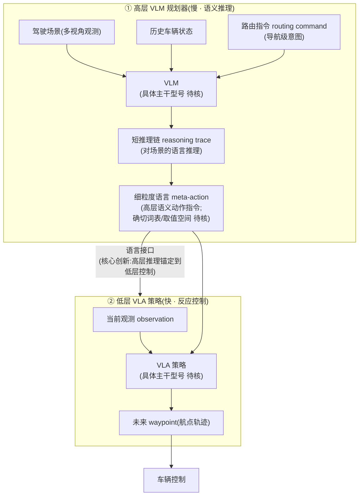
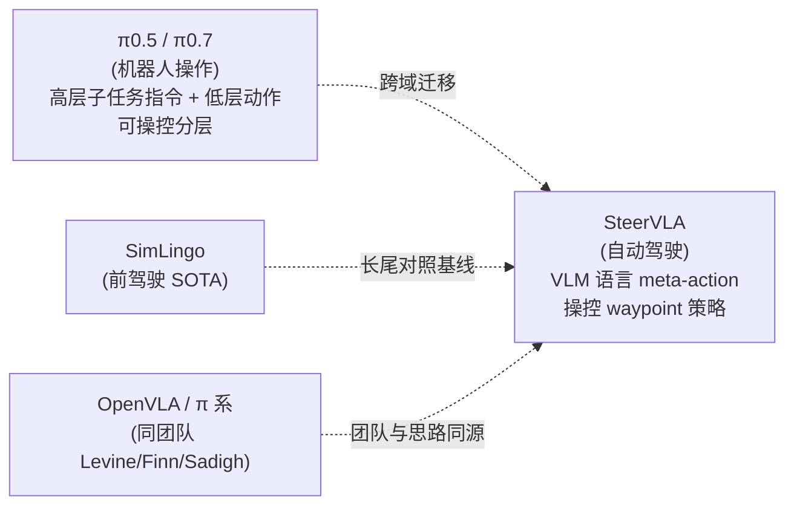

# SteerVLA:把 VLA「操控」范式迁到长尾驾驶

> **arXiv**: [2602.08440](https://arxiv.org/abs/2602.08440)(v1 2026-02-09 / v2 2026-02-13,cs.RO,CC BY 4.0)· ICLR 2026 投稿([OpenReview fS6UPyXF4A](https://openreview.net/forum?id=fS6UPyXF4A))
> **机构**: Stanford / UC Berkeley(据作者名单推断,论文页未显式列出,**待核**)
> **作者**: Tian Gao, Celine Tan, Catherine Glossop, Timothy Gao, Jiankai Sun, Kyle Stachowicz, Shirley Wu, Oier Mees, Dorsa Sadigh, Sergey Levine, Chelsea Finn(11 人)
> **路线**: 分层 / 双系统(高层 VLM 语言规划 + 低层 VLA 轨迹策略)——**本站首篇自动驾驶域 VLA 细读**
> **项目主页**: <https://steervla.github.io/>

> [← 返回主报告](../index.md)

---

## TL;DR

SteerVLA 把近年机器人 VLA 圈兴起的 **「可操控性(steerability)」** 思路搬到了**自动驾驶**:核心命题是——**互联网规模 VLM 有强常识/语义推理,却缺乏安全驾驶所需的「落地经验(grounded experience)」**;那就**别把所有知识硬塞进一个端到端大模型**,而是让 VLM 用语言去**操控(steer)**一个落地的驾驶策略。

它是一个**两级分层策略**:

1. **高层 VLM 规划器**:读入驾驶**场景**、**历史车辆状态**、**路由指令(routing command)**,先产出一段**短推理链(reasoning trace)**,再据此输出一个**细粒度语言 meta-action**(高层语义动作指令)。
2. **低层 VLA 策略**:以**当前观测 + 上面的 meta-action** 为条件,回归**未来 waypoint(航点轨迹)**用于控制。

论文反复强调的关键创新是**两级之间这条「丰富的语言接口」**:它让高层推理**锚定(ground)**到低层策略的实际控制输出上,而不是悬空地空想。为拿到能学出这种「推理 + 可操控」能力的监督信号,作者用 **VLM 对已有真机/仿真驾驶数据做事后(hindsight)稠密语言标注**,并称这是「强推理与可操控性的关键」。

在闭环 **Bench2Drive** 及其**长尾子集 Bench2Drive-LongTail** 上,SteerVLA ⚠️ **总驾驶分(driving score)超过 SOTA 4.77、长尾子集超过 8.04**(长尾对照为前 SOTA **SimLingo**)。

一句话:**SteerVLA = 「VLM 当教练、VLA 当司机」的分层驾驶策略——用语言 meta-action 把 VLM 的长尾常识推理「操控」进一个回归 waypoint 的落地策略,再用 VLM 事后稠密标注把这套「怎么开」的监督喂出来;在闭环长尾驾驶上以更大的边际(+8.04 vs +4.77)证明「分层 + 语言接口」对罕见事件尤其有用。**

> ⚠️ **可信度提示**:本页全部定量(+4.77 / +8.04 驾驶分)为**作者自评**,基于 Bench2Drive 闭环基准,**截至整理时(2026-06)无第三方独立复现**;论文为 ICLR 2026 **投稿(under review)**,非已接收。模型极新(2026-02 预印本),社区尚未充分审视。此外多项实现细节——**meta-action 的确切词表/取值空间、高层 VLM 与低层 VLA 的具体主干型号、用于模仿学习的具名驾驶数据集、完整结果表与五项城市驾驶技能的逐项分数**——一手摘要/项目页**未给出**,本页一律标 **待核**,不予编造。arXiv PDF(约 13.5MB)与全文 HTML 在整理时尚未可解析,定量以摘要/项目页/OpenReview 三处交叉为准。

---

## 1. 要解决的问题

自动驾驶的一个根本矛盾:**高层语义推理**(理解「前方事故要并线绕行」「那个行人像要横穿」这类**长尾事件**)与**低层反应式控制**(稳、准、实时地打方向/给油门)**难以兼得**。

- **纯模块化「感知-决策-控制」管线**:手工接口 + 规则组件,在复杂/长尾场景下容易**崩**(本站 [benchmarks](benchmarks.md) 与同期工作亦反复指出这点)。
- **直接把 VLM 端到端当司机**:VLM 自带互联网规模的常识与语义推理,但**没有安全车辆控制所需的落地经验**——它知道「事故现场要小心」,却未必能输出平滑、可执行、符合车辆动力学的控制量。
- **把所有知识塞进单一巨石模型(monolithic)**:作者明确反对——既难训练,又难让「常识」真正落到「控制」上。

SteerVLA 的回答是**分层 + 语言操控**:让 VLM **不直接开车**,而是**用细粒度语言指令去操控一个落地的、可被操控的(steerable)驾驶策略**。这样高层负责「长尾语义推理」,低层负责「鲁棒反应控制」,两者用一条**语言接口**衔接。

> 📌 这正是 [π0.5](pi05.md) / [π0.7](pi07.md) 在机器人操作里走的「高层子任务指令 + 低层动作」分层可操控路线,在**驾驶**域的对应物——同一批作者(Levine/Finn/Sadigh 等)把「可操控性」这条主线跨域迁移。

---

## 2. 方法与架构

> ⚠️ 下图依据论文摘要、项目页(steervla.github.io)与 OpenReview 摘要的文字描述绘制;**框图各模块的确切主干/维度为示意**,具体型号见标注的 **待核** 项。

### 2.1 两级分层:VLM 当教练,VLA 当司机

- **高层 VLM 规划器**(原文:"first reasons about the driving scene, historical vehicle states, and routing command to produce a meta-action"):
  - **输入**:驾驶场景 + 历史车辆状态 + **路由指令(routing command)**。路由指令是导航级的高层意图(如「下个路口左转 / 沿当前车道」),其**确切构成一手未定义,待核**。
  - **输出**:先出一段**短推理链(reasoning trace)**对场景做语言推理,**再据此**产出一个**细粒度语言 meta-action**。先推理后给指令,是为了「产出更好的 meta-action」。
- **低层 VLA 策略**(原文:"predicts future waypoints conditioned on both the observation and the meta-action"):
  - **输入**:当前观测 + 高层给的 meta-action。
  - **输出**:**未来 waypoint(航点)轨迹**,交给下游控制器执行。
  - 这是一个**可被操控(steerable)、灵活的低层策略**——同一观测下,喂不同 meta-action 会开出不同行为。

### 2.2 核心创新:两级之间的「语言接口」

作者把最关键的创新点定位为**高层 VLM 与低层 VLA 之间这条「丰富的语言接口(rich language interface)」**:它让**高层策略把自己的推理「锚定(ground)」到低层策略的控制输出上**。

直觉上的好处:
- **语言是天然的「可组合、可解释、可操控」接口**——比隐向量瓶颈(如 [Helix](helix.md) 的隐向量、[GO-1](go-1.md) 的潜动作 token)更可读、可由人或高层随时改写;
- **长尾事件**往往能用一句语义指令概括(「为横穿行人让行并慢下来」),让 VLM 的常识直接转译成低层可执行的操控信号。

> 关于「语言/隐向量/离散 token」三类高低层接口的横向对比,见 [双系统 / 分层架构原理](dual-system-architecture.md);SteerVLA 属其中**显式语言接口**一支,与 π0.5 的子任务指令同源。

### 2.3 训练:用 VLM 做「事后(hindsight)稠密语言标注」

要让模型学出「会推理、可操控」,得有对应监督信号。SteerVLA 的数据侧做法:

- **用 VLM 把已有的真机 + 仿真驾驶数据,事后(in hindsight)补上稠密语言标注**(dense language annotations)。即**不靠单一模型的具身经验**,而是借 VLM 的世界知识**给数据「加注」**。
- 作者称这些**与车辆控制对齐的细粒度语言标注「对有效推理与可操控性是关键(essential)」**。
- **低层 VLA** 通过在驾驶数据上做**模仿学习(imitation learning)**得到领域适配。

> ⚠️ 用于模仿学习的**具名驾驶数据集**、hindsight 标注的**具体提示/流程**、VLM 标注器型号,一手摘要/项目页**未给出,待核**。这套「VLM 事后稠密标注 → 喂出可操控策略」与 [π0.7](pi07.md) 的「富上下文标注消化数据」、[具身数据处理](data-processing.md) 中的伪标签/事后标注思路同宗。

---

## 3. 关键设计与创新点

1. **把「可操控 VLA」范式跨域迁到自动驾驶**:本站此前 24 篇细读全为机器人操作/人形;SteerVLA 是**首个**把「高层语言指令操控低层策略」这套机器人 VLA 思路系统迁移到**驾驶长尾**的工作。
2. **分层而非巨石**:显式反对「把所有知识塞进单一端到端模型」,主张 **VLM 推理 + 落地策略控制**解耦——与本站 [双系统/分层](dual-system-architecture.md) 主线一致。
3. **语言接口 grounding**:两级用**语言**衔接,让高层推理锚定到低层控制输出,兼顾可解释与可操控。
4. **VLM 事后稠密标注**:用 VLM 给真机/仿真数据补「怎么开」的语言监督,绕开「单模型具身经验不足」的瓶颈。
5. **长尾增益更大**:在长尾子集上的边际(+8.04)显著大于总分边际(+4.77),作者归因于**长尾场景更吃复杂推理 + 精确控制**——恰是分层语言操控的用武之地。

---

## 4. 实验与关键结果

> ⚠️ 全部为**作者自评**,基于闭环 Bench2Drive;逐项绝对分数与五项技能明细一手未在摘要/项目页给出,标 **待核**。

### 4.1 结果速览表

| 设定 | 指标 | SteerVLA | 对照 / 口径 | 来源 |
|---|---|---|---|---|
| Bench2Drive 闭环(总体) | 驾驶分(driving score)增益 | ⚠️ **+4.77** | 超「SOTA 方法」(总体对照具体模型 待核) | 摘要 / 项目页 |
| Bench2Drive-LongTail(长尾子集) | 驾驶分增益 | ⚠️ **+8.04** | 超前 SOTA **SimLingo**([arXiv:2503.09594](https://arxiv.org/abs/2503.09594)) | 项目页 |
| 五项城市驾驶技能 | 逐项分数 | 待核 | 仅见于项目页图(bench2drive.png),数值未文字化 | 项目页 |
| 绝对驾驶分 / 成功率 / route completion | 绝对值 | 待核 | 摘要/项目页只给「增益」非绝对值 | — |

### 4.2 要点解读

- **闭环、长尾、城市**:评测是**闭环(closed-loop)**的 **Bench2Drive**(CARLA 系闭环城市驾驶套件)+ 其**长尾子集**,覆盖「五项进阶城市驾驶技能」。闭环 + 长尾的设定本身比开环指标更贴近真实难度。
- **长尾边际 > 总体边际(8.04 > 4.77)**:这是论文的**核心卖点逻辑**——越是罕见、越吃推理与精确控制的场景,「分层 + 语言操控」越占便宜。
- **定性 rollout**(项目页演示):绕开事故并线、对向车切入本车道、转弯让行横穿行人、行人乱穿、前车急刹、高速上静止车切入等——典型长尾事件。
- **对照基线**:长尾子集明确对照 **SimLingo**(前 SOTA);**总体**对照的具体模型集合**待核**。

> 📍 **口径提醒**:摘要/项目页给的是**相对 SOTA 的增益(+4.77 / +8.04)**,而非绝对驾驶分;不同 Bench2Drive 复现的绝对分受版本/协议影响大,引用时务必连同「相对增益 + 对照为 SimLingo(长尾)」一并标注。

---

## 5. 在 VLA 谱系中的位置

- **承「可操控分层」主线([π0.5](pi05.md) / [π0.7](pi07.md))**:π0.5 引入高层子任务指令 + 低层动作的分层条件化,π0.7 扩成富上下文「可操控」提示;SteerVLA 把同一思想**迁到驾驶**——高层 meta-action 操控低层 waypoint 策略。
- **承「双系统/分层」家族([dual-system-architecture](dual-system-architecture.md))**:慢 VLM 语义推理(System 2)+ 快反应控制(System 1)的语义分层;接口取**显式语言**,而非 [Helix](helix.md) 隐向量或 [GO-1](go-1.md) 潜动作 token。
- **与 [Gemini Robotics](gemini-robotics.md) 对照**:同为「大模型推理 + 落地控制」的解耦,但 Gemini 是云-端**延迟解耦**,SteerVLA 是**语言语义解耦**,且面向驾驶长尾。
- **团队同源**:作者含 Sergey Levine、Chelsea Finn、Dorsa Sadigh、Oier Mees 等——[OpenVLA](openvla.md)、π 系([pi0.md](pi0.md))、机器人「可操控」研究的同一 Stanford/Berkeley 圈子,把方法论延伸到自动驾驶域。
- **域的新颖性**:这是本站细读首次进入**自动驾驶**(此前全为桌面/移动操作与人形)。驾驶的动作空间(waypoint 轨迹)、评测(闭环 Bench2Drive)、长尾定义都与机器人操作不同,横比成功率时**不可与操作类基准混算**。

---

## 6. 局限与存疑

1. **全为作者自评、投稿中、无第三方复现**:+4.77 / +8.04 均自评,论文为 ICLR 2026 under review(非接收),2026-02 预印本极新,社区尚未充分审视。
2. **关键实现细节缺口(本页多处 待核)**:meta-action 的确切词表/取值空间、高低层主干型号、模仿学习用的具名数据集、完整结果表与五项技能逐项分,一手摘要/项目页未给出。结论的可复现性依赖这些未公开细节。
3. **只给相对增益、缺绝对分**:无法独立判断 SteerVLA 的绝对驾驶分/route completion 处于 Bench2Drive 排行榜何位置;「超 SOTA」的总体对照集合不明。
4. **依赖 VLM 事后标注的质量**:整套「推理 + 可操控」监督来自 VLM 对数据的 hindsight 标注;若标注有偏/有幻觉,可能把错误常识灌进低层策略——一手未讨论该风险的量化影响。
5. **仿真闭环 vs 真车**:Bench2Drive 为(CARLA 系)仿真闭环,**长尾子集**虽贴近罕见事件,但**真车部署的 sim-to-real 差距**一手未涉及;驾驶安全的尾部风险对此尤为敏感。
6. **语言接口的延迟与频率**:高层 VLM 出推理链 + meta-action 的**推理频率/端到端延迟**一手未给(驾驶对实时性要求高);分层是否引入额外延迟、如何与控制频率匹配,**待核**。

---

## 来源

- 论文:SteerVLA: Steering Vision-Language-Action Models in Long-Tail Driving Scenarios. arXiv:2602.08440(v1 2026-02-09 / v2 2026-02-13,cs.RO,CC BY 4.0)。<https://arxiv.org/abs/2602.08440>
- 项目主页(架构描述 / 定性 rollout / 五项技能图):<https://steervla.github.io/>
- OpenReview(ICLR 2026 投稿,标题作 "Steering Vision-Language-Action Models Toward Effective Long-Tail Driving",摘要与方法描述):<https://openreview.net/forum?id=fS6UPyXF4A>
- HuggingFace Papers 摘要页:<https://huggingface.co/papers/2602.08440>
- 长尾对照基线 SimLingo:arXiv:2503.09594

> 说明:本页定量(+4.77 / +8.04)为**作者自评**,基于闭环 Bench2Drive,无第三方复现,论文投稿中;meta-action 词表、主干型号、具名数据集、完整结果表与五项技能逐项分等一手未给出处,均标「待核」不予编造。引用时请连同自评属性与上述口径保留。
