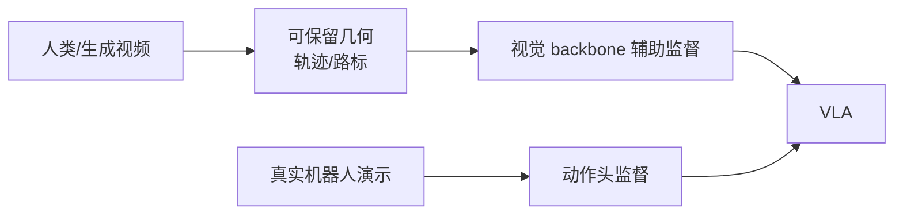

# Supervise What Survives:生成视频只拿来监督几何,不伪造动作标签

> **arXiv**: [2606.24448](https://arxiv.org/abs/2606.24448) | **时间**: 2026.06 | **路线**: VLA · 生成数据 / 几何监督
> [← 返回 VLA 总览](/vla/) · [具身数据全景](embodied-data)

## TL;DR

这篇的判断非常克制:生成机器人视频可以帮 VLA,但不能把生成视频硬当成真实遥操作数据。视频生成里较可靠保留下来的,是“哪里会动、末端大概到哪里”的视觉几何;真实机器人动作标签则很容易失真。

所以它提出的原则是 **supervise what survives**:只监督生成视频中仍可信的几何信号,不要伪造动作标签。

## 方法

论文的 GRA 思路可以概括为:

1. 从人类或生成视频中抽取姿态/运动线索。
2. 经过 retarget、仿真和投影,得到未来 2D 末端路标等几何监督。
3. 用这些信号辅助训练视觉 backbone。
4. 动作头仍然只使用真实机器人演示训练。

## 谱系位置

- 与 [具身数据全景](embodied-data):补上“视频生成数据能用到什么程度”的边界。
- 与 [RoboDream](/wam/papers/robodream):RoboDream 更偏数据合成引擎;本文更强调合成数据的可信监督切片。
- 与 [Qwen-RobotWorld](/wam/papers/qwen-robotworld):后者生成未来视觉轨迹;本文提醒动作监督不能从视觉生成里粗暴反推。

## 局限与待核

- 几何监督的质量依赖姿态估计、retarget 和投影链路。
- 只监督视觉 backbone 是否足以提升复杂接触任务,需要更多真实任务验证。
- 如果生成视频本身物理不可信,几何信号也可能带偏模型。

## 来源

- arXiv:[2606.24448](https://arxiv.org/abs/2606.24448).

