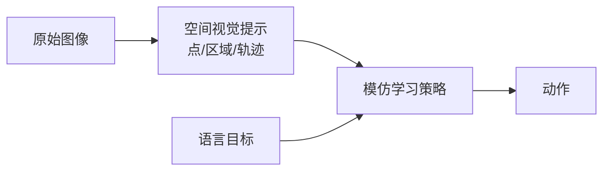

# SVP-IL:用空间视觉提示做模仿学习接口

> **arXiv**: [2606.25360](https://arxiv.org/abs/2606.25360)(*Spatial Visual Prompts for Imitation Learning*) | **时间**: 2026.06 | **路线**: VLA 相关 · 空间提示 / 模仿学习接口
> [← 返回 VLA 总览](/vla/) · [SpatialVLA](spatialvla)

## TL;DR

SVP-IL 不一定是一个完整新 VLA 基座,但它抓住了 VLA 的老问题:自然语言很难精确表达“抓这里”“沿这条路径移动”“避开这个区域”。Spatial Visual Prompt 把空间意图直接画在视觉输入或视觉表征里,让策略获得更明确的位置提示。

这与 [Steerable Policies](steerable-policies) 的像素点/夹爪轨迹命令非常接近:都在寻找比一句任务语言更细的控制接口。

## 问题

模仿学习中,语言标签通常是粗粒度的:

- “把红块放进碗里”没有告诉机器人从哪抓。
- “擦桌子”没有告诉机器人覆盖路径。
- “打开抽屉”没有明确接触点和拉动方向。

空间视觉提示把这些信息变成可见、可对齐的条件。

## 方法位置

## 谱系位置

- 与 [SpatialVLA](spatialvla):SpatialVLA 是给 VLA 注入空间表征;SVP-IL 是把空间意图作为提示接口。
- 与 [Steerable Policies](steerable-policies):二者都证明“接口设计”本身会影响 VLA 能否被高层有效操控。
- 与 [G³VLA](g3vla):G³VLA 处理相机几何,SVP-IL 处理用户/任务空间意图。

## 局限与待核

- 空间提示从哪里来很关键:人工标注、VLM 生成还是自动轨迹抽取,成本和噪声都不同。
- 对开放词汇任务,视觉提示与语义目标的绑定仍可能出错。
- 作为 VLA 相关接口工作,本站先观察级收录。

## 来源

- arXiv:[2606.25360](https://arxiv.org/abs/2606.25360) *Spatial Visual Prompts for Imitation Learning*.

