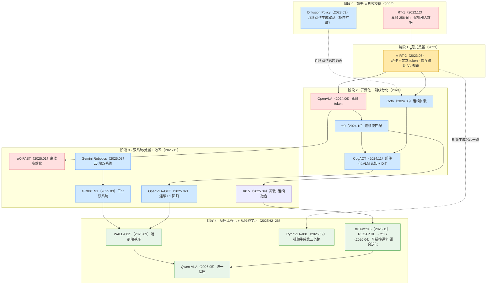
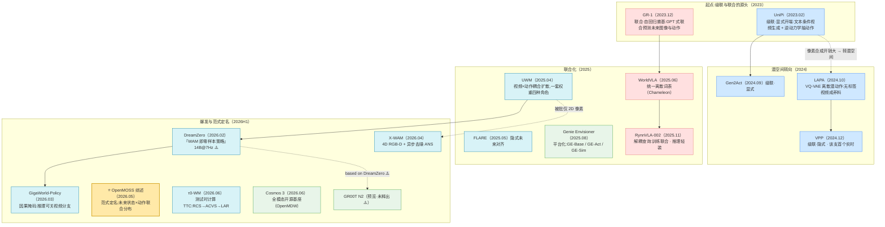

# VLA × WAM 具身智能发展时间线(2022 → 2026)

> [← 返回主报告](../index.md) · [WAM 总览](/wam/)

> **本页用途**:把 VLA 主报告的「五阶段发展主线」与 [WAM 总览](/wam/)的「级联 → 联合 → 跨范式」演进,拍平成**双主线、按时间排序的里程碑速查**——总览图、谱系图、里程碑大表、纵切与暗线均 VLA / WAM 并立,每个工作可点进细读。
> **可信度**:凡标 ⚠️ 者为提出方/厂商自评数据,非同行评审或独立第三方复现,采信请注意。
> **日期口径**:以 arXiv 首次预印本 / 官方发布为准(同月工作按主线逻辑先后排列)。

---

## 一、总览图

### 1.1 VLA 主线(五阶段 × 三条动作路线)

*配色:🟥 离散 token · 🟦 连续扩散/流匹配 · 🟩 端到端基座/最新前沿 · 🟨 全场分水岭 RT-2。*

### 1.2 WAM 主线(级联 → 联合 → 范式定名)

*配色:🟦 级联(显式/隐式)· 🟥 联合·自回归 · 🩵 联合·扩散 · 🟩 跨范式基座/平台 · 🟨 范式定名综述。完整 taxonomy(单流/多流、三组耦合维度)见 [WAM 总览 §二](/wam/)。*

---

## 二、谱系图(线 = 技术路线/范式 · 站 = 论文细读)

上面的五阶段图是**逻辑骨架**,下面两张是全量细读站点的**时间轴实景**:横轴为 arXiv 提交年月,点击任一站进入对应细读。VLA 在上、WAM 在下;本页 §三 起的里程碑大表为 VLA 主线口径,WAM 全景解读见 [WAM 总览](/wam/)。

<LineageMap track="vla" />

<LineageMap track="wam" />

---

## 三、里程碑大表(按时间排序)

### 3.1 VLA 主线

> **路线图例**:`离散` = 离散自回归动作 token;`连续` = 扩散/流匹配/L1 回归连续动作;`混合` = 高层离散 + 底层连续;`双系统` = 慢 VLM 推理 + 快控制器执行;`第三条路` = 视频生成预训练。

| 时间 | 工作 | 机构 | 路线 | 一句话意义 | 细读 |
|---|---|---|---|---|---|
| **2022.12** | **RT-1** | Google / Everyday Robots | 离散(256-bin) | **VLA 前史**:用 Transformer + 13 万真机轨迹证明"架构 + 规模换泛化",确立离散 256-bin 动作 token 范式,数据成为 OXE 核心来源 | [→ 细读](rt1.md) |
| **2023.03** | **Diffusion Policy** | Columbia / TRI / MIT | 连续(条件扩散) | **连续动作生成奠基**:把动作生成表述为条件去噪扩散,天生擅长多峰分布 + 动作分块,是后来 Octo/π0/GR00T 动作专家的思想源头 | [→ 细读](diffusion-policy.md) |
| **2023.07** | ⭐ **RT-2** | Google DeepMind | 离散 token | **全场分水岭**:把动作塞进 VLM 词表当文本 token,首次证明互联网视觉-语言知识可迁移到机器人控制,VLA 范式诞生 | [→ 细读](rt2.md) |
| **2024.05** | **Octo** | UC Berkeley 等 | 连续(扩散) | 模块化开源框架,OXE 80 万轨迹训练 transformer 扩散策略,消费级 GPU 数小时可微调到新本体 | [→ 细读](octo.md) |
| **2024.06** | **OpenVLA** | Stanford 等 | 离散 token | 7B 全开源,Llama2 + DINOv2/SigLIP;⚠️ 用 1/7 参数在 29 任务上超 55B RT-2-X 16.5%,把范式平民化 | [→ 细读](openvla.md) |
| **2024.10** | **π0** | Physical Intelligence | 连续(流匹配) | PaliGemma + 独立流匹配动作专家;流匹配 + 动作分块达 50 Hz 高频灵巧控制(叠衣服) | [→ 细读](pi0.md) |
| **2024.11** | **CogACT** | 清华 / 微软亚研院 | 连续(组件化 DiT) | **组件化 VLA**:VLM 只出"认知 token",动作交给专门的 DiT 扩散专家;⚠️ SimplerEnv Google Robot VM 74.8%(原传 82.7 已更正) | [→ 细读](cogact.md) |
| **2025.01** | **π0-FAST** | Physical Intelligence | 离散(高效化) | DCT 频域分词压缩动作 token,让自回归离散 VLA 也能高频运行,补齐离散路线短板 | [→ 细读](pi0-fast.md) |
| **2025.02** | **OpenVLA-OFT** | Stanford 等 | 连续(L1 回归) | OFT 配方 = 并行解码 + 动作分块 + 连续表示 + L1 回归;⚠️ 提速 26×、LIBERO 97.1% 刷新 SOTA | [→ 细读](openvla-oft.md) |
| **2025.02** | **Helix** | Figure AI | 双系统 | ⚠️ 厂商自评:7B VLM(7–9 Hz)+ 80M 控制器(200 Hz),35-DoF 控制人形上半身,首个驱动双协作机器人的 VLA(无细读) | — |
| **2025.03** | **Gemini Robotics** | Google DeepMind | 双系统(云-端) | 云端跑蒸馏 Gemini backbone(<160 ms)+ 本机 action decoder,端到端 250 ms / 50 Hz;配套 ER 把具身推理拉成可评测能力层 | [→ 细读](gemini-robotics.md) |
| **2025.03** | **GR00T N1** | NVIDIA | 双系统(DiT 流匹配) | 工业级双系统:VL 模块(~10 Hz)推理 + DiT(16 步块)实时动作;"数据金字塔"(真机 + 人类视频 + 合成) | [→ 细读](groot-n1.md) |
| **2025.04** | **π0.5** | Physical Intelligence | 混合 | 基于 π0 实现开放世界泛化,首次让端到端机器人在全新住宅做长程操作;高层离散 FAST + 底层流匹配,两路合一 | [→ 细读](pi05.md) |
| **2025.09** | **WALL-OSS** | 自变量 X²Robot | 混合(端到端基座) | Qwen2.5-VL MoE(~4B)端到端具身基座,FAST 分支 + 流匹配分支并存,"统一跨层级 CoT";⚠️ Wall-OSS-0.5 零样本真机 | [→ 细读](wall-oss.md) |
| **2025.09** | **RynnVLA-001** | 阿里达摩院 + 湖畔 | 第三条路(视频生成) | 基于 Chameleon 文生图扩展的自回归视频生成基座 + ActionVAE;⚠️ 三项真机均 90.6%,优于 π0/GR00T N1.5 | [→ 细读](rynnvla.md) |
| **2025.11** | **π0.6 / π\*0.6** | Physical Intelligence | 混合 + 真机 RL | 知识隔离训练(动作专家梯度不回传主干)+ RECAP 真机强化学习;⚠️ 最难任务吞吐翻倍、失败率约减半;从模仿迈向"从经验学习" | [→ 细读](pi06.md) |
| **2026.04** | **π0.7** | Physical Intelligence | 可操控通才(分层混合) | 富上下文条件化(子任务/视觉子目标/策略元数据)+ 混合质量数据;⚠️ 单一通才不微调追平 π*0.6 RL 专家,零样本跨本体叠衣 80% 接近人类遥操作;初步组合泛化 | [→ 细读](pi07.md) |
| **2026.05** | **Qwen-VLA** | 阿里 Qwen | 连续(统一基座) | Qwen3.5-4B + 1.15B DiT 流匹配,一个架构统一操作/导航/轨迹;⚠️ LIBERO 97.9%、R2R 69.0% OSR | [→ 细读](qwen-vla.md) |
| **2026.06** | **Qwen-RobotManip** | 阿里 Qwen | 连续(操作 VLA) | Qwen3.5-4B + flow-matching DiT,80 维统一 state-action + camera-frame EEF delta;约 38,100h 开源/人类视频语料 ⚠️ | [→ 细读](qwen-robotmanip.md) |
| **2026.06** | **Qwen-RobotNav** | 阿里 Qwen | 导航 waypoint 执行器 | Qwen3-VL + 轻量 waypoint head,VLN/PointNav/ObjNav/Tracking/driving 统一为可重配置 observation context 的导航调用 ⚠️ | [→ 细读](qwen-robotnav.md) |

### 3.2 WAM 主线

> **范式图例**(本站谱系口径):`级联` = 先预测未来(显式像素 / 隐式潜空间)、再反推动作;`联合` = 单一模型内联合建模未来状态与动作(自回归 / 扩散 / 混合);`跨范式` = 基座 / 平台 / 仿真 / 数据引擎。机构与年月取自[全模型规格对比](/wam/papers/models-spec)档案表(「待核」= 摘要未明列、本站不硬填);此处选里程碑节点,完整 29 篇逐格对照见该页。

| 时间 | 工作 | 机构 | 范式 | 一句话意义 | 细读 |
|---|---|---|---|---|---|
| **2023.02** | **UniPi** | 待核(摘要未明列) | 级联·显式 | **级联开端**:把决策重述为文本条件视频生成——先合成未来帧,再用逆动力学抽动作("policy-as-video") | [→ 细读](/wam/papers/unipi) |
| **2023.12** | **GR-1** | 待核(推断字节系) | 联合·自回归 | **联合·自回归奠基**:GPT 式因果 Transformer 端到端联合预测未来图像与动作,字节 GR 系开端(195M);⚠️ CALVIN 94.9% | [→ 细读](/wam/papers/gr-1) |
| **2024.10** | **LAPA** | 待核(摘要未明列) | 级联·隐式 | VQ-VAE 从无动作标签视频发现**离散潜动作**、预训练 latent VLA 再微调——无标签视频成为可用养料(ICLR 2025) | [→ 细读](/wam/papers/lapa) |
| **2024.12** | **VPP** | 待核(页面未明列) | 级联·隐式 | 以视频扩散模型的**预测性内部表征**条件化隐式逆动力学;级联·隐式支**首个做到实时**;⚠️ CALVIN ABC-D 相对 +18.6% | [→ 细读](/wam/papers/vpp) |
| **2025.04** | **UWM** | 待核(摘要未明列) | 联合·扩散 | 视频×动作**耦合扩散**、各模态独立扩散时间步——一套权重切换策略/正逆动力学/视频生成四角色(RSS 2025) | [→ 细读](/wam/papers/uwm) |
| **2025.05** | **FLARE** | NVIDIA GEAR 等 | 联合·混合 | **隐式未来对齐**:可学习 future token 对齐冻结教师编码的真实未来特征,可直接利用无动作视频 | [→ 细读](/wam/papers/flare) |
| **2025.06** | **WorldVLA** | 阿里达摩院 | 联合·自回归 | 视觉与动作全量化进**同一词表**(Chameleon)的自回归动作世界模型,预测与动作互为增益 | [→ 细读](/wam/papers/worldvla) |
| **2025.08** | **Genie Envisioner** | 智元 AgiBot | 跨范式·平台 | **平台化**:GE-Base(视频底座)/ GE-Act(流匹配动作)/ GE-Sim(神经仿真)把策略学习/评估/仿真收进单一视频生成框架 | [→ 细读](/wam/papers/genie-envisioner) |
| **2025.11** | **RynnVLA-002** | 阿里达摩院 | 联合·自回归 | **解耦查询**:动作预测与动作条件视觉预测共享建模空间联合共训,作策略时不 roll out 未来帧;Apache-2.0 全开 | [→ 细读](/wam/papers/rynnvla-002) |
| **2026.02** | **DreamZero** | 待核(36 作者) | 联合·扩散 | 《WAM 即零样本策略》:把「预演未来→反推动作」放进推理主回路,14B 视频扩散压到 7Hz 实时闭环 ⚠️ | [→ 细读](/wam/papers/dreamzero) |
| **2026.03** | **GigaWorld-Policy** | GigaAI 极佳视界 | 联合·扩散 | Wan 2.2 基 + **因果掩码**:训练期联合、推理期可跳过视频分支——「推理期关掉世界模型」趋势代表 | [→ 细读](/wam/papers/gigaworld-policy) |
| **2026.04** | **X-WAM** | 待核(摘要未明列) | 联合·扩散 | 把世界建模升到 **4D**(多视角 RGB-D)+ **异步去噪 ANS**:动作少步数实时、视频全步数保真;⚠️ RoboCasa 79.2% | [→ 细读](/wam/papers/x-wam) |
| **2026.05** | ⭐ **OpenMOSS 综述** | 复旦 OpenMOSS 等 | —(范式定名) | **WAM 正式定名**:「未来状态与动作的联合分布」两条硬判据 + 级联/联合 taxonomy,首个系统梳理 ⚠️(arXiv:2605.12090) | [→ WAM 总览](/wam/) |
| **2026.06** | **τ0-WM** | 智元 Finch · 上海创智 | 联合·扩散 | **测试时计算 TTC**:RCS 轻量初筛→低于阈值才 ACVS 推演 + LAR 修正;5.5B / 27,300h;⚠️ 两任务均值 0.43→0.60 | [→ 细读](/wam/papers/tau0-wm) |
| **2026.06** | **Cosmos 3** | NVIDIA Research | 跨范式·基座 | **全模态开源基座**:MoT 两塔统一语言/图像/视频/音频/动作,一次前向兼 VLM/视频生成/模拟器/策略;OpenMDW 可商用 ✅ | [→ 细读](/wam/papers/cosmos3) |
| **2026.06** | **Qwen-RobotWorld** | 阿里 Qwen | 跨范式·基座/数据引擎 | 语言条件视频世界模型:Qwen2.5-VL action encoder + 60 层 double-stream MMDiT + EWK 8.6M video-text pairs;服务合成数据/评测/规划 ⚠️ | [→ 细读](/wam/papers/qwen-robotworld) |

---

## 四、按路线 / 范式纵切

### 4.1 VLA:三条动作生成路线

把上表竖着看,可以看清三条动作生成路线如何并行演进、相互借鉴:

| 路线 | 起点 | 演化 | 当前形态 |
|---|---|---|---|
| **离散 token** | RT-1(256-bin, 2022)→ RT-2(文本 token, 2023) | OpenVLA(开源, 2024)→ π0-FAST(频域分词高效化, 2025) | 被混合系统吸收为"高层子任务"分支 |
| **连续扩散/流匹配** | Diffusion Policy(2023)→ Octo(2024) | π0(流匹配, 2024)→ CogACT(组件化 DiT, 2024)→ OpenVLA-OFT(L1 回归, 2025)→ GR00T N1(2025) | 前沿主力,尤其精细灵巧控制 |
| **混合 / 双系统 / 第三条路** | Helix / Gemini Robotics / GR00T(双系统, 2025) | π0.5(离散+连续合一, 2025)→ WALL-OSS(双分支基座, 2025)→ RynnVLA(视频生成, 2025) | π0.6 + RECAP 真机 RL,基座工程化 + 从经验学习 |

> **总体判断**(同主报告):技术天平整体倒向连续动作生成,但领先混合系统在高层抽象子任务上仍保留离散 token——两条路并非互斥,正走向融合。详见主报告[第三部分 · 技术路线之争](../index.md#三技术路线之争离散-token-vs-连续扩散流匹配)。

### 4.2 WAM:级联 → 联合 → 跨范式

| 范式线 | 起点 | 演化 | 当前形态 |
|---|---|---|---|
| **级联(显式/隐式)** | UniPi(显式像素, 2023) | Gen2Act(2024)→ LAPA / VPP(转潜空间, 2024) | 隐式潜空间派 2025H2 起明显增多(赌实时性与表征效率) |
| **联合·自回归** | GR-1(显式解耦, 2023) | WorldVLA(统一词表, 2025)→ RynnVLA-002(解耦查询, 2025) | 推理期轻装化:训练联合、作策略不 roll out 未来帧 |
| **联合·扩散** | UWM(耦合扩散, 2025) | DreamZero(零样本策略, 2026)→ GigaWorld-Policy / X-WAM(2026)→ τ0-WM(TTC, 2026) | 当前主战场:实时化(ANS / 因果掩码)+ 测试时计算 |
| **联合·混合 / 跨范式** | UVA(2025)· Genie Envisioner(平台, 2025) | FLARE(隐式对齐)→ OA-WAM / HiMem-WAM(槽位 / 记忆, 2026);GE-Sim 2.0 / Cosmos 3 / RoboDream(2026) | 结构创新 + 基座 / 仿真 / 数据引擎分工 |

> **总体判断**(同 [WAM 总览 §5.3](/wam/)):WAM 更可能是 VLA 的**扩展与吸收**而非取代——综述措辞是「rather than actions alone」,业界在 VLA 既有骨架上逐步引入世界建模(GR-1 → GR00T、RynnVLA → 002),二者大概率走向融合;「取代」尚无经核查的基准证据支撑(待核)。

---

## 五、贯穿全程的暗线(竖看时间线)

### 5.1 VLA 四条暗线(主报告口径)

主报告提炼的四条始终在演进的主轴(定义与详述以[主报告 §1.1 · 四条暗线](../index.md#一范式演进与奠基)为权威源),映射到上面的时间线:

1. **知识来源**:机器人数据(RT-1)→ +互联网视觉-语言知识(RT-2)→ +人类视频/合成数据(GR00T、RynnVLA)→ +真机部署经验(π\*0.6 的 RECAP RL)。
2. **动作生成**:离散 token → 离散 vs 连续分化 → 分层(高层离散 + 底层连续)+ 效率优化 → 多路并存/融合。
3. **系统形态**:单体大模型 → 双系统(慢推理 System 2 + 快执行 System 1,Helix/Gemini Robotics/GR00T)。
4. **学习范式**:模仿学习(行为克隆)→ 模仿 + 强化(从经验中学习,RECAP)。

### 5.2 WAM 四条暗线(规格对比页「跨行观察」口径)

权威源为 [WAM 全模型规格对比 §四](/wam/papers/models-spec),此处对照时间线转述:

1. **基座收敛与再多元化**:2026 新批多自 **Wan 系**视频基座初始化(DexWorldModel / WALL-WM / GigaWorld-Policy / DreamZero),NVIDIA 系自带 Cosmos;但 2026-04 之后 MotuBrain 用生数 Vidu、WAV 实查依赖 GE-Base / LTX-Video——「Wan 一统」并未发生。
2. **像素 vs 潜空间贯穿三类范式**:像素派(UniPi / UWM / DreamZero / WALL-WM)赌「看得见的未来」带来可解释性与数据引擎能力;潜空间派(VPP / LAPA / LaDi-WM / FLARE / DexWorldModel / GR00T N2)赌实时性与表征效率——后者 2025H2 起明显增多。
3. **推理期把世界模型「关掉」成新趋势**:GigaWorld-Policy(因果掩码,可跳视频分支)、UVA(推理跳过视频头)、RynnVLA-002(解耦查询)殊途同归——训练期联合、推理期轻装。
4. **开源谱系两极**:Apache-2.0 全开(RynnVLA-002)与 OpenMDW 可商用(Cosmos 3)在一端,多数处于「论文先行、权重未放」;**第三方可复核评测几乎缺位**——这正是 WAM 比 VLA(有 LIBERO 等公共基准传统)更年轻的标志。

---

## 六、主要信源(arXiv / 官方页面)

### 6.1 VLA 主线

| 工作 | 一手信源 |
|---|---|
| RT-1 | arxiv.org/abs/2212.06817 · robotics-transformer1.github.io |
| Diffusion Policy | arxiv.org/abs/2303.04137 · diffusion-policy.cs.columbia.edu |
| RT-2 | arxiv.org/abs/2307.15818 |
| Octo | arxiv.org/abs/2405.12213 |
| OpenVLA | arxiv.org/abs/2406.09246 |
| π0 | arxiv.org/abs/2410.24164 |
| CogACT | arxiv.org/abs/2411.19650 · cogact.github.io |
| π0-FAST | arxiv.org/abs/2501.09747 · pi.website/research/fast |
| OpenVLA-OFT | arxiv.org/abs/2502.19645 · openvla-oft.github.io |
| Helix | figure.ai/news/helix |
| Gemini Robotics | arxiv.org/abs/2503.20020 · deepmind.google/discover/blog/gemini-robotics |
| GR00T N1 | arxiv.org/abs/2503.14734 · github.com/NVIDIA/Isaac-GR00T |
| π0.5 | arxiv.org/abs/2504.16054 · pi.website/blog/pi05 |
| WALL-OSS | arxiv.org/abs/2509.11766 · github.com/X-Square-Robot/wall-x |
| RynnVLA-001 | arxiv.org/abs/2509.15212 · huggingface.co/Alibaba-DAMO-Academy |
| π0.6 / π\*0.6 | arxiv.org/abs/2511.14759 · pi.website/blog/pistar06 |
| π0.7 | arxiv.org/abs/2604.15483 · pi.website/blog/pi07 |
| Qwen-VLA | arxiv.org/abs/2605.30280 · github.com/QwenLM/Qwen-VLA |
| Qwen-RobotManip | arxiv.org/abs/2606.17846 · github.com/QwenLM/Qwen-RobotManip |
| Qwen-RobotNav | arxiv.org/abs/2606.18112 · github.com/QwenLM/Qwen-RobotNav |

### 6.2 WAM 主线

| 工作 | 一手信源 |
|---|---|
| UniPi | arxiv.org/abs/2302.00111 |
| GR-1 | arxiv.org/abs/2312.13139 |
| LAPA | arxiv.org/abs/2410.11758 |
| VPP | arxiv.org/abs/2412.14803 |
| UWM | arxiv.org/abs/2504.02792 |
| FLARE | arxiv.org/abs/2505.15659 |
| WorldVLA | arxiv.org/abs/2506.21539 |
| Genie Envisioner | arxiv.org/abs/2508.05635 |
| RynnVLA-002 | arxiv.org/abs/2511.17502 |
| DreamZero | arxiv.org/abs/2602.15922 |
| GigaWorld-Policy | arxiv.org/abs/2603.17240 |
| X-WAM | arxiv.org/abs/2604.26694 |
| OpenMOSS 综述 | arxiv.org/abs/2605.12090 |
| τ0-WM | arxiv.org/abs/2606.01027 |
| Cosmos 3 | arxiv.org/abs/2606.02800 |
| Qwen-RobotWorld | arxiv.org/abs/2606.17030 · qwen.ai/blog?id=qwen-robotworld |

---

*本时间线 VLA 主线基于《VLA(视觉-语言-动作)模型发展深度调研报告》的发展主线与五阶段整理;WAM 主线基于 [WAM 总览](/wam/)与[全模型规格对比](/wam/papers/models-spec)的范式谱系整理。⚠️ 标记处为提出方/厂商自评数据;「待核」= 一手源未给出,本站不编造。*
