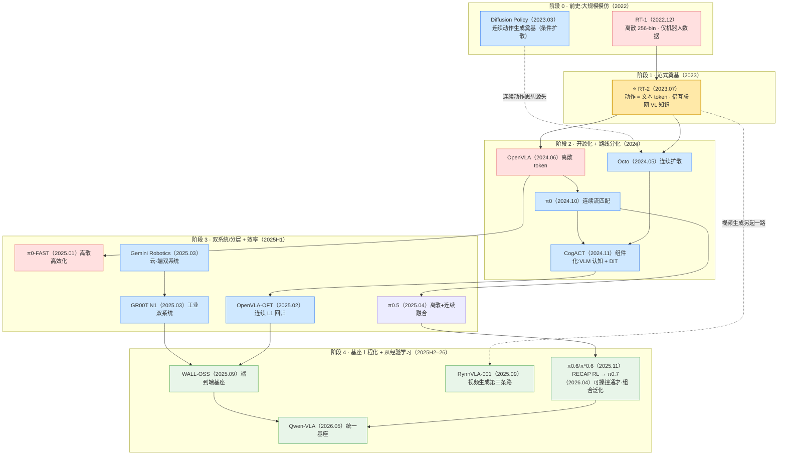

# VLA / 具身智能发展时间线(2022 → 2026)

> [← 返回主报告](../index.md)

> **本页用途**:把主报告的「五阶段发展主线」拍平成一张**按时间排序的里程碑大表**,每个工作一行,点链接进对应细读。
> **可信度**:凡标 ⚠️ 者为提出方/厂商自评数据,非同行评审或独立第三方复现,采信请注意。
> **日期口径**:以 arXiv 首次预印本 / 官方发布为准(同月工作按主线逻辑先后排列)。

---

## 一、总览图(五阶段 × 三条动作路线)

*配色:🟥 离散 token · 🟦 连续扩散/流匹配 · 🟩 端到端基座/最新前沿 · 🟨 全场分水岭 RT-2。*

---

## 二、里程碑大表(按时间排序)

> **路线图例**:`离散` = 离散自回归动作 token;`连续` = 扩散/流匹配/L1 回归连续动作;`混合` = 高层离散 + 底层连续;`双系统` = 慢 VLM 推理 + 快控制器执行;`第三条路` = 视频生成预训练。

| 时间 | 工作 | 机构 | 路线 | 一句话意义 | 细读 |
|---|---|---|---|---|---|
| **2022.12** | **RT-1** | Google / Everyday Robots | 离散(256-bin) | **VLA 前史**:用 Transformer + 13 万真机轨迹证明"架构 + 规模换泛化",确立离散 256-bin 动作 token 范式,数据成为 OXE 核心来源 | [→ 细读](rt1.md) |
| **2023.03** | **Diffusion Policy** | Columbia / TRI / MIT | 连续(条件扩散) | **连续动作生成奠基**:把动作生成表述为条件去噪扩散,天生擅长多峰分布 + 动作分块,是后来 Octo/π0/GR00T 动作专家的思想源头 | [→ 细读](diffusion-policy.md) |
| **2023.07** | ⭐ **RT-2** | Google DeepMind | 离散 token | **全场分水岭**:把动作塞进 VLM 词表当文本 token,首次证明互联网视觉-语言知识可迁移到机器人控制,VLA 范式诞生 | [→ 细读](rt2.md) |
| **2024.05** | **Octo** | UC Berkeley 等 | 连续(扩散) | 模块化开源框架,OXE 80 万轨迹训练 transformer 扩散策略,消费级 GPU 数小时可微调到新本体 | [→ 细读](octo.md) |
| **2024.06** | **OpenVLA** | Stanford 等 | 离散 token | 7B 全开源,Llama2 + DINOv2/SigLIP;⚠️ 用 1/7 参数在 29 任务上超 55B RT-2-X 16.5%,把范式平民化 | [→ 细读](openvla.md) |
| **2024.10** | **π0** | Physical Intelligence | 连续(流匹配) | PaliGemma + 独立流匹配动作专家;流匹配 + 动作分块达 50 Hz 高频灵巧控制(叠衣服) | [→ 细读](pi0.md) |
| **2024.11** | **CogACT** | 清华 / 微软亚研院 | 连续(组件化 DiT) | **组件化 VLA**:VLM 只出"认知 token",动作交给专门的 DiT 扩散专家;⚠️ SimplerEnv Google Robot VM 74.8%(原传 82.7 已更正) | [→ 细读](cogact.md) |
| **2025.01** | **π0-FAST** | Physical Intelligence | 离散(高效化) | DCT 频域分词压缩动作 token,让自回归离散 VLA 也能高频运行,补齐离散路线短板 | [→ 细读](pi0-fast.md) |
| **2025.02** | **OpenVLA-OFT** | Stanford 等 | 连续(L1 回归) | OFT 配方 = 并行解码 + 动作分块 + 连续表示 + L1 回归;⚠️ 提速 26×、LIBERO 97.1% 刷新 SOTA | [→ 细读](openvla-oft.md) |
| **2025.02** | **Helix** | Figure AI | 双系统 | ⚠️ 厂商自评:7B VLM(7–9 Hz)+ 80M 控制器(200 Hz),35-DoF 控制人形上半身,首个驱动双协作机器人的 VLA(无细读) | — |
| **2025.03** | **Gemini Robotics** | Google DeepMind | 双系统(云-端) | 云端跑蒸馏 Gemini backbone(<160 ms)+ 本机 action decoder,端到端 250 ms / 50 Hz;配套 ER 把具身推理拉成可评测能力层 | [→ 细读](gemini-robotics.md) |
| **2025.03** | **GR00T N1** | NVIDIA | 双系统(DiT 流匹配) | 工业级双系统:VL 模块(~10 Hz)推理 + DiT(16 步块)实时动作;"数据金字塔"(真机 + 人类视频 + 合成) | [→ 细读](groot-n1.md) |
| **2025.04** | **π0.5** | Physical Intelligence | 混合 | 基于 π0 实现开放世界泛化,首次让端到端机器人在全新住宅做长程操作;高层离散 FAST + 底层流匹配,两路合一 | [→ 细读](pi05.md) |
| **2025.09** | **WALL-OSS** | 自变量 X²Robot | 混合(端到端基座) | Qwen2.5-VL MoE(~4B)端到端具身基座,FAST 分支 + 流匹配分支并存,"统一跨层级 CoT";⚠️ Wall-OSS-0.5 零样本真机 | [→ 细读](wall-oss.md) |
| **2025.09** | **RynnVLA-001** | 阿里达摩院 + 湖畔 | 第三条路(视频生成) | 基于 Chameleon 文生图扩展的自回归视频生成基座 + ActionVAE;⚠️ 三项真机均 90.6%,优于 π0/GR00T N1.5 | [→ 细读](rynnvla.md) |
| **2025.11** | **π0.6 / π\*0.6** | Physical Intelligence | 混合 + 真机 RL | 知识隔离训练(动作专家梯度不回传主干)+ RECAP 真机强化学习;⚠️ 最难任务吞吐翻倍、失败率约减半;从模仿迈向"从经验学习" | [→ 细读](pi06.md) |
| **2026.04** | **π0.7** | Physical Intelligence | 可操控通才(分层混合) | 富上下文条件化(子任务/视觉子目标/策略元数据)+ 混合质量数据;⚠️ 单一通才不微调追平 π*0.6 RL 专家,零样本跨本体叠衣 80% 接近人类遥操作;初步组合泛化 | [→ 细读](pi07.md) |
| **2026.05** | **Qwen-VLA** | 阿里 Qwen | 连续(统一基座) | Qwen3.5-4B + 1.15B DiT 流匹配,一个架构统一操作/导航/轨迹;⚠️ LIBERO 97.9%、R2R 69.0% OSR | [→ 细读](qwen-vla.md) |

---

## 三、按动作路线纵切(三条主线的演化)

把上表竖着看,可以看清三条动作生成路线如何并行演进、相互借鉴:

| 路线 | 起点 | 演化 | 当前形态 |
|---|---|---|---|
| **离散 token** | RT-1(256-bin, 2022)→ RT-2(文本 token, 2023) | OpenVLA(开源, 2024)→ π0-FAST(频域分词高效化, 2025) | 被混合系统吸收为"高层子任务"分支 |
| **连续扩散/流匹配** | Diffusion Policy(2023)→ Octo(2024) | π0(流匹配, 2024)→ CogACT(组件化 DiT, 2024)→ OpenVLA-OFT(L1 回归, 2025)→ GR00T N1(2025) | 前沿主力,尤其精细灵巧控制 |
| **混合 / 双系统 / 第三条路** | Helix / Gemini Robotics / GR00T(双系统, 2025) | π0.5(离散+连续合一, 2025)→ WALL-OSS(双分支基座, 2025)→ RynnVLA(视频生成, 2025) | π0.6 + RECAP 真机 RL,基座工程化 + 从经验学习 |

> **总体判断**(同主报告):技术天平整体倒向连续动作生成,但领先混合系统在高层抽象子任务上仍保留离散 token——两条路并非互斥,正走向融合。详见主报告[第三部分 · 技术路线之争](../index.md#三技术路线之争离散-token-vs-连续扩散流匹配)。

---

## 四、贯穿全程的四条暗线(竖看时间线)

主报告提炼的四条始终在演进的主轴(定义与详述以[主报告 §1.1 · 四条暗线](../index.md#一范式演进与奠基)为权威源),映射到上面的时间线:

1. **知识来源**:机器人数据(RT-1)→ +互联网视觉-语言知识(RT-2)→ +人类视频/合成数据(GR00T、RynnVLA)→ +真机部署经验(π\*0.6 的 RECAP RL)。
2. **动作生成**:离散 token → 离散 vs 连续分化 → 分层(高层离散 + 底层连续)+ 效率优化 → 多路并存/融合。
3. **系统形态**:单体大模型 → 双系统(慢推理 System 2 + 快执行 System 1,Helix/Gemini Robotics/GR00T)。
4. **学习范式**:模仿学习(行为克隆)→ 模仿 + 强化(从经验中学习,RECAP)。

---

## 五、主要信源(arXiv / 官方页面)

| 工作 | 一手信源 |
|---|---|
| RT-1 | arxiv.org/abs/2212.06817 · robotics-transformer1.github.io |
| Diffusion Policy | arxiv.org/abs/2303.04137 · diffusion-policy.cs.columbia.edu |
| RT-2 | arxiv.org/abs/2307.15818 |
| Octo | arxiv.org/abs/2405.12213 |
| OpenVLA | arxiv.org/abs/2406.09246 |
| π0 | arxiv.org/abs/2410.24164 |
| CogACT | arxiv.org/abs/2411.19650 · cogact.github.io |
| π0-FAST | arxiv.org/abs/2501.09747 · pi.website/research/fast |
| OpenVLA-OFT | arxiv.org/abs/2502.19645 · openvla-oft.github.io |
| Helix | figure.ai/news/helix |
| Gemini Robotics | arxiv.org/abs/2503.20020 · deepmind.google/discover/blog/gemini-robotics |
| GR00T N1 | arxiv.org/abs/2503.14734 · github.com/NVIDIA/Isaac-GR00T |
| π0.5 | arxiv.org/abs/2504.16054 · pi.website/blog/pi05 |
| WALL-OSS | arxiv.org/abs/2509.11766 · github.com/X-Square-Robot/wall-x |
| RynnVLA-001 | arxiv.org/abs/2509.15212 · huggingface.co/Alibaba-DAMO-Academy |
| π0.6 / π\*0.6 | arxiv.org/abs/2511.14759 · pi.website/blog/pistar06 |
| π0.7 | arxiv.org/abs/2604.15483 · pi.website/blog/pi07 |
| Qwen-VLA | arxiv.org/abs/2605.30280 · github.com/QwenLM/Qwen-VLA |

---

*本时间线基于《VLA(视觉-语言-动作)模型发展深度调研报告》的发展主线与五阶段整理。⚠️ 标记处为提出方/厂商自评数据。*
