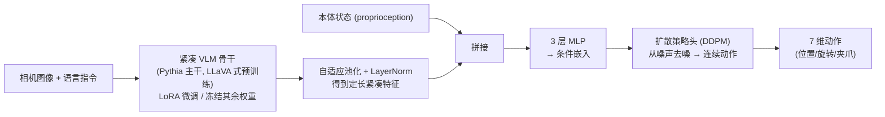

# TinyVLA:面向快速、数据高效的紧凑型视觉-语言-动作模型

> **arXiv**: [2409.12514](https://arxiv.org/abs/2409.12514) | **机构**: 华东师范大学 · 美的集团 AI 实验室 · 雪城大学 · 北京人形机器人创新中心 · 上海大学(据作者信息) | **时间**: 2024.09(v1;最新 v5 为 2025.05)
> **路线**: 连续动作 · 扩散策略(高效紧凑 / 数据高效,免机器人数据预训练)

> [← 返回主报告](../index.md)

---

## TL;DR
TinyVLA 针对当时主流 VLA(如 OpenVLA-7B)的两大痛点——**推理慢**与**依赖大规模机器人数据预训练**——给出一条"轻量化"路线。它的两条核心契约是:**(1) 用一个紧凑的多模态模型(70M–1.4B 参数、以 Pythia 为语言主干、按 LLaVA 流程在视觉-语言数据上预训练)作为骨干并初始化,而不是堆叠 7B 级大模型;(2) 在下游微调阶段,不再用自回归逐 token 生成离散动作,而是给骨干外挂一个扩散策略(Diffusion Policy)头直接生成连续动作**。训练时对 VLM 主干用 LoRA、冻结其余权重以保留预训练知识,扩散头则全量训练,**整条流程不含机器人数据预训练阶段**。作者报告:最大变体 TinyVLA-H(1.3B)在真机单臂五任务上平均成功率 94.0% ⚠️、显著高于 OpenVLA 的 68.3% ⚠️;单动作推理约 14ms(A6000),相对 OpenVLA 快约 20 倍、参数少约 5.5 倍 ⚠️。它本质上是把 Diffusion Policy 的动作生成能力"嫁接"到一个小型 VLM 上,用预训练多模态知识换取语言/物体/环境层面的泛化。

---

## 1. 问题
彼时(2024 年)以 RT-2、OpenVLA 为代表的 VLA 把动作当作离散 token、由一个网络规模的大语言模型自回归生成,效果强但代价高,论文指出两点障碍:

- **推理慢、部署重**:7B 级骨干 + 自回归逐 token 解码,单步动作延迟高,难以满足机器人对高控制频率的需求。论文给出对照:OpenVLA-7B 单动作约 292ms、OpenVLA-1B 约 140ms ⚠️。
- **预训练成本高、数据门槛高**:OpenVLA 这类模型依赖在大规模机器人数据(论文提到约 97 万条 OpenX 轨迹)上预训练,数据采集与训练开销巨大,普通团队难以复现。

TinyVLA 的回答:把骨干换成**已经在通用视觉-语言数据上训练好的小型多模态模型**,直接微调到机器人任务上;动作生成改用**扩散策略头**以避开自回归解码,从而在不做机器人数据预训练的前提下,同时改善速度与数据效率。

## 2. 方法与架构

整体可拆成三块:**紧凑多模态骨干 → 特征聚合与条件构造 → 扩散策略动作头**。

*示意图(自绘,据论文描述,非原图)*

### 2.1 紧凑多模态骨干
骨干采用参数量约 70M–1.4B 的小型 VLM,以 **Pythia** 作为语言模型后端,并按 **LLaVA** 流程在视觉-语言数据上完成多模态预训练(对齐视觉与语言)。论文给出三档变体:**TinyVLA-S(总参 422M)、TinyVLA-B(740M)、TinyVLA-H(1.3B)**。微调阶段对 VLM 主干使用 **LoRA**(约 5% 可训练参数),冻结其余权重,以尽量保留预训练得到的视觉骨干与视觉-语言对齐知识。各变体可训练参数分别约 101M / 138M / 143M ⚠️(据 Table II)。各档对应的具体 Pythia 规模,论文正文未逐一明示(待核)。

### 2.2 特征聚合与条件构造
骨干输出的多模态特征先经**自适应池化层 + LayerNorm**,得到"定长、紧凑"的特征表示;再与**本体状态(proprioceptive state)拼接**,送入一个 **3 层 MLP**,生成扩散头所需的**条件嵌入(conditional embeddings)**。

### 2.3 扩散策略动作头
动作生成直接采用 **Diffusion Policy(DP)** 作为策略头,基于 DDPM:网络**预测噪声**而非直接回归动作,从高斯噪声出发、在上述条件嵌入引导下迭代去噪,得到连续动作输出(论文描述为 7 维:位置 / 旋转 / 夹爪)。这一头部在微调时**全量训练**。是否预测多步动作块(action chunk)及其时域长度,论文正文未给出明确数值(待核;Diffusion Policy 原范式通常预测动作序列)。

## 3. 关键设计与创新点
- **以"通用多模态预训练"替代"机器人数据预训练"**:复用小型 VLM 已学到的视觉-语言知识做初始化,绕开大规模 OpenX 级机器人预训练,降低数据与算力门槛。
- **扩散头取代自回归 token 解码**:避免逐 token 生成离散动作,论文将其归因为"快速推理、强性能、优泛化"的来源,直接服务于高频控制。
- **LoRA 冻结主干 + 扩散头全量训练的混合训练策略**:小比例可训练参数(约 5%)保护预训练知识、抑制过拟合,扩散头则充分学习动作分布。
- **小而多档(S/B/H)**:在 422M–1.3B 区间提供尺寸-性能权衡,便于按算力/频率约束选型;论文对照里最大的同类骨干(PaliGemma)为 3B。

## 4. 实验与关键结果
论文在 **MetaWorld 仿真(50 任务)**、**真机单臂(Franka,5 任务,每任务约 100 条轨迹)** 与 **真机双臂(3 任务)** 上评测,并与 OpenVLA、Diffusion Policy 等对比。以下数值均为**作者自评口径**:

| 设置 | 指标 | TinyVLA(H) | 对照 | 备注 |
|---|---|---|---|---|
| MetaWorld(50 任务) | 平均成功率 | 31.6% ⚠️ | Diffusion Policy 10.5% ⚠️ | 难度分布 Easy28/Med11/Hard6/VeryHard5 |
| 真机单臂(Franka,5 任务) | 平均成功率 | 94.0% ⚠️ | OpenVLA 68.3% ⚠️ | 论文称领先约 25.7%;FlipMug、StackCubes 各 98.3% ⚠️ |
| 真机双臂(3 任务) | 平均成功率 | 44.5% ⚠️ | OpenVLA 0% ⚠️ | 任务 PlaceBread / StackCubes / PlaceTennisBag |
| 单动作推理延迟 | ms(A6000) | 14ms ⚠️ | OpenVLA-7B 292ms / OpenVLA-1B 140ms ⚠️ | 论文称约快 20 倍、参数少约 5.5 倍 |

此外论文强调,在语言指令、新物体、环境变化等多个泛化维度上,TinyVLA 在**不做大规模机器人预训练**的前提下取得与 OpenVLA "相当或更优"的表现。具体各任务/各泛化维度的逐项分解数值此处未尽列(待核,见原文 Table I–IV)。

## 5. 局限与争议
- **无独立"局限"章节**:论文未设专门的 Limitations 小节,以下据正文讨论归纳。
- **空间泛化可能弱于大规模预训练模型**:论文在空间泛化(spatial generalization)讨论中承认 OpenVLA 略优,作者推测原因正是其在大规模机器人数据上训练——这反映"免机器人预训练"路线在空间外推上的潜在代价。
- **规模与上限**:骨干仅 422M–1.3B,绝对容量有限;在更复杂、长程或更大任务分布上的可扩展性,论文未充分验证(待核)。
- **结果均为作者自评**:成功率/延迟/倍数等关键数字均出自论文自身实验设置(已以 ⚠️ 标注),与不同硬件、不同实现下的可复现性需第三方验证。
- **动作头细节未尽**:动作块长度、去噪步数、控制频率等工程参数论文正文未完整给出(待核)。

## 6. 在 VLA 谱系中的位置
TinyVLA 处在"**离散动作 token + 自回归大模型**"与"**连续动作 + 扩散生成**"两条路线的交叉点上,选择站在后者一侧并主打"轻量 + 免机器人预训练":

- 动作生成范式直接继承 [Diffusion Policy](diffusion-policy):把条件扩散去噪的动作头嫁接到 VLM 骨干上;同源思想也见于 [Octo](octo) 的扩散动作头。
- 与 [OpenVLA](openvla) 形成最直接对照——后者是 7B 自回归 + 大规模 OpenX 预训练的代表,TinyVLA 用更小骨干、扩散头、无机器人预训练去逼近其性能;这一"如何让 OpenVLA 又快又省"的命题,也与 [OpenVLA-OFT](openvla-oft) 的优化微调思路、[π0-FAST](pi0-fast) 的高效动作 token 化等同向。
- 相对 [RT-1](rt1)/[RT-2](rt2) 的离散 token 自回归路线,TinyVLA 代表的是"小骨干 + 扩散动作专家"的另一极;而 [π0](pi0)、[GR00T N1](groot-n1)、[CogACT](cogact) 等则在更大模型 + 流匹配/扩散动作专家方向上把这条连续动作路线推向规模化。整体看,TinyVLA 是连续动作路线中"高效紧凑、数据高效"分支的代表性早期工作,与后续同类高效 VLA(如 SmolVLA)在动机上一脉相承。

---

## 来源
- 论文摘要页:<https://arxiv.org/abs/2409.12514>
- 论文 HTML 全文:<https://arxiv.org/html/2409.12514>
- 项目页:<https://tiny-vla.github.io>
