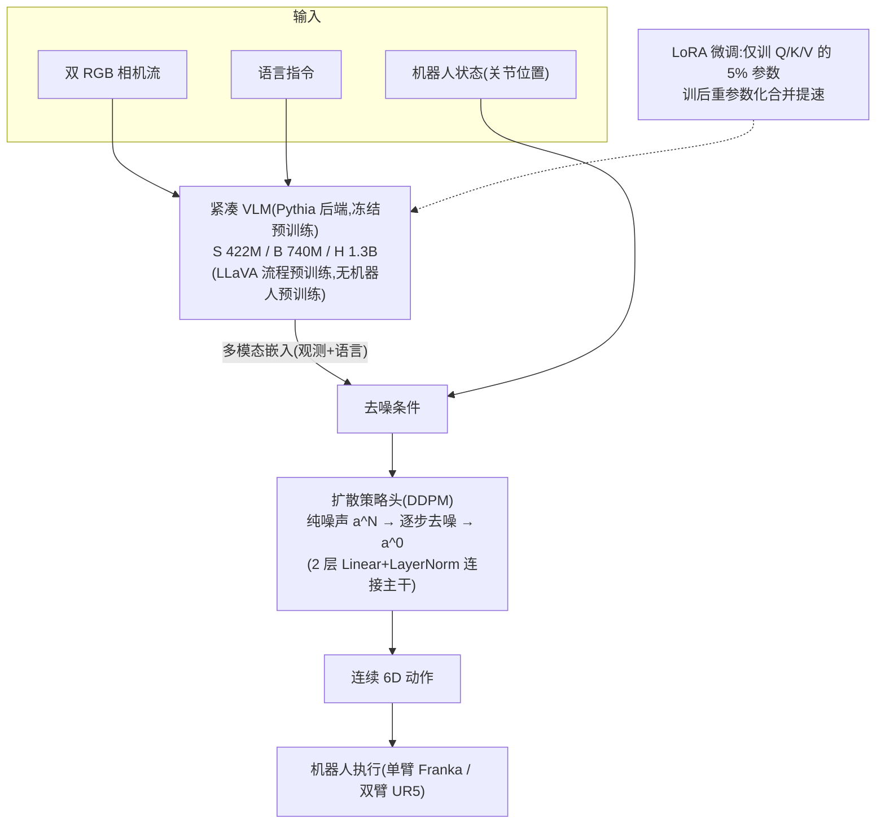
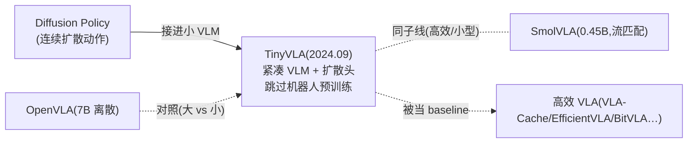

# TinyVLA:小、快、省数据的紧凑 VLA

> **arXiv**: [2409.12514](https://arxiv.org/abs/2409.12514)(2024.09,RA-L 2025)
> **机构**: 美的集团 AI 研究院 / 华东师范大学 等
> **作者**: Junjie Wen, Yichen Zhu, Jinming Li, Minjie Zhu, Kun Wu, Zhiyuan Xu, Ning Liu, Ran Cheng, Chaomin Shen, Yaxin Peng, Feifei Feng, Jian Tang
> **路线**: 连续(扩散策略头)+ 紧凑/高效(跳过大规模机器人预训练)
> **项目主页**: <https://tiny-vla.github.io>

> [← 返回主报告](../index.md)

---

## TL;DR

TinyVLA 是一个主打**「小、快、省数据」**的紧凑 VLA,直接对标 [OpenVLA](openvla.md)(7.2B):它用**自训的紧凑 VLM**(Pythia 语言后端,三档 **422M / 740M / 1.3B**)接一个**扩散策略头**直出连续动作,并刻意**跳过大规模机器人预训练**——不像 OpenVLA 要在 OXE 97 万样本上预训,TinyVLA **每任务仅用 100 条遥操作轨迹**微调。

三个核心抓手:

1. **紧凑 VLM 主干**(<1.3B,Pythia 后端):替代 7B+ 大模型,**推理延迟比 OpenVLA 低 20×**(A6000 实测,TinyVLA-H)。三档:S(422M/101M 可训)、B(740M/138M)、H(1.3B/143M)。
2. **扩散策略头(Diffusion Policy head,DDPM)**:多模态嵌入(观测 + 语言)作去噪条件,从纯噪声逐步去噪出连续 6D 动作——避开自回归逐 token 解码与离散化收敛难题。
3. **跳过机器人预训练 + LoRA 微调**:VLM 用 LLaVA 流程预训练(纯视觉-语言),机器人侧**只微调**,LoRA 仅训 **5% 参数**(Q/K/V),训后重参数化合并提速。

⚠️ 战绩:**真机单臂 5 任务平均 94.0**,超 OpenVLA(用了 970K 预训)的 68.3、参数少 **5.5×**(1.3B vs 7.2B);其中 **TinyVLA-B(740M)均 77.4 已超 OpenVLA**。MetaWorld 仿真 50 任务均 **31.6**,超 Diffusion Policy 的 10.5(Hard 任务约 6 倍)。最有意思的是**双臂 UR5 任务:OpenVLA 和 DP 全部 0%**(它们的预训练只有单臂数据),**TinyVLA-H 是唯一能成功的**。

一句话:**TinyVLA = 「不靠大规模机器人预训练也能打」的紧凑高效 VLA——拿自训的小 VLM(<1.3B)接扩散策略头,LoRA 只训 5% 参数、每任务 100 条演示,就在真机上以 5.5× 更少参数反超 OpenVLA,推理快 20×;它是「高效/小型 VLA」子线最常被当 baseline 的奠基工作之一。**

> ⚠️ **可信度提示**:本页定量(真机 94.0、超 OpenVLA +25.7、MetaWorld 31.6、延迟 20×)为**作者自评**(RA-L 2025 同行评审,但非独立第三方复现)。S2 引用约 **331**(量级高,具体口径以检索时为准)。作者自述局限:**空间泛化弱于 OpenVLA**(归因于未做大规模机器人预训练);**TinyVLA-S(422M)性能差**(均 23.3,需 B/H 档才可靠)。视觉编码器具体型号、训练步数/batch/GPU 小时一手未给(标待核)。

---

## 1. 要解决的问题

VLA 强,但**又大又慢又费数据**:

1. **参数巨大、推理慢**:[OpenVLA](openvla.md) 7B、[RT-2](rt2.md) 最大 55B,自回归逐 token 解码,实时控制吃力。
2. **依赖大规模机器人预训练**:OpenVLA 要在 OXE **97 万样本**上预训才有泛化——采集与算力门槛高。
3. **离散化的代价**:把连续动作量化成 token,既损精度又使解码慢、收敛难。

TinyVLA 的问题就是:**能否用一个紧凑 VLM + 扩散动作头,跳过大规模机器人预训练,只靠少量演示,就达到甚至超过 7B 大模型?** 这是「高效/小型 VLA」这条子线的核心命题。

> 📌 本站此前已收 [SmolVLA](smolvla.md)(0.45B,冻结 SmolVLM-2 + 流匹配),TinyVLA 是更早(2024.09)、最常被当 baseline 的**紧凑 VLA 奠基**之一,二者共同支撑「小型高效 VLA」子线;与 [推理加速与部署](inference-deployment.md) 专题强相关。

---

## 2. 方法与架构

### 2.1 紧凑 VLM 主干(三档)

自训的小 VLM,**Pythia** 语言后端 + LLaVA 流程训练的视觉编码器(具体型号**待核**):

| 档位 | 总参数 | 可训参数 | 对照 OpenVLA |
|---|---|---|---|
| TinyVLA-S | 422M | 101M | 7.2B |
| TinyVLA-B | 740M | 138M | — |
| TinyVLA-H | 1.3B | 143M | — |

### 2.2 扩散策略头(连续动作)

接在多模态主干后的 **Diffusion Policy 头(基于 DDPM)**:训练时给动作加 K 步高斯噪声、学预测噪声并减除;推理从纯噪声 a^N 逐步去噪到 a^0。多模态嵌入(观测 + 语言联合编码)作为**去噪条件**,经两层 Linear+LayerNorm 接入。直出连续 6D 动作——**避开离散 token 的精度损失与自回归慢解码**。

### 2.3 跳过机器人预训练 + LoRA

- **关键主张:跳过大规模机器人预训练**。VLM 只做 LLaVA 视觉-语言预训练;机器人侧**直接微调**,每任务仅 **100 条遥操作轨迹**(双 RGB + 关节状态)。
- **LoRA 微调**:只训注意力 Q/K/V,**可训参数仅占 Transformer 的 5%**;训练后**重参数化合并** LoRA 权重以提速。

---

## 3. 关键设计与创新点

1. **紧凑 VLM(<1.3B)替代 7B+**:推理延迟降 **20×**(A6000,TinyVLA-H vs OpenVLA)。
2. **扩散策略头直出连续动作**:避免自回归逐 token 解码与离散化收敛难题。
3. **跳过大规模机器人预训练**:无 OXE 970K,每任务仅 100 轨迹即达 94% 真机成功率,**数据效率极高**。
4. **LoRA(5% 参数)+ 重参数化合并**:兼顾微调成本与推理速度。
5. **首个成功做双臂操作的紧凑 VLA**:OpenVLA/DP 因单臂预训练在双臂任务全失败,TinyVLA 唯一成功——泛化能力匹敌大规模预训练模型。

---

## 4. 实验与关键结果

> ⚠️ 全部为**作者自评**(RA-L 2025;非第三方复现)。

### 4.1 真机单臂 Franka(5 任务,20 trials/任务,3 检查点均值,⚠️ 自评)

| 模型 | 参数 | 平均成功率 |
|---|---|---|
| Diffusion Policy | — | 35.3 |
| Multimodal Diffusion | — | 18.0 |
| OpenVLA(970K 预训) | 7.2B | 68.3 |
| **TinyVLA-B** | 740M | **77.4** |
| **TinyVLA-H** | 1.3B | **94.0** |

→ TinyVLA-H 超 OpenVLA **+25.7%**,参数少 **5.5×**;连 740M 的 B 档都超 OpenVLA。

### 4.2 真机双臂 UR5(3 任务,10 trials,⚠️ 自评)

| 模型 | 平均 |
|---|---|
| OpenVLA | **0**(全失败) |
| Diffusion Policy | **0**(全失败) |
| **TinyVLA-H** | **~65** |

→ OpenVLA/DP 的预训练只有单臂数据,双臂任务全军覆没;**TinyVLA-H 唯一能成功**。

### 4.3 MetaWorld 仿真(50 任务,⚠️ 自评)

| 模型 | Easy | Medium | Hard | Very Hard | 平均 |
|---|---|---|---|---|---|
| Diffusion Policy | 23.1 | 10.7 | 1.9 | 6.1 | 10.5 |
| **TinyVLA-H** | 77.6 | 21.5 | 11.4 | 15.8 | **31.6** |

→ 超 DP **+21.1**,Hard 任务约 **6×**。

### 4.4 泛化与效率(⚠️ 自评,定性)

- **推理延迟**:TinyVLA-H 比 OpenVLA **低 20×**(A6000)。
- **泛化**:指令/视角/背景/光照/干扰物泛化与 OpenVLA 相当或更优,DP 多失败;**空间泛化 OpenVLA 略优**(得益于大规模预训练,作者自述局限);视觉泛化匹配 OpenVLA(未用数据增强)。

---

## 5. 在 VLA 谱系中的位置

- **承 [Diffusion Policy](diffusion-policy.md)**:把扩散策略头接进紧凑 VLM,继承连续动作生成的多峰建模优势。
- **对照 [OpenVLA](openvla.md)(大 vs 小)**:同为通用操作 VLA,TinyVLA 用 1/5.5 参数、无大规模机器人预训练反超真机——证明「小模型 + 好动作头 + 省数据」可行。
- **与 [SmolVLA](smolvla.md) 同子线**:都主打紧凑高效,SmolVLA(2025.06,0.45B,冻结 SmolVLM-2 + 流匹配 + 异步推理)是更晚、更系统的开源代表;TinyVLA(2024.09)更早、引用更高(S2 ~331),是该子线最常见的 baseline 之一。
- **效率子线引子**:被 VLA-Cache、EfficientVLA、BitVLA、DeeR-VLA 等加速/压缩工作广泛当对照。

---

## 6. 局限与存疑

1. **空间泛化弱于 OpenVLA**:作者归因于未做大规模机器人数据预训练——「省预训练」的代价。
2. **视角泛化偶尔失败**:±30° 容忍范围内仍有失败案例。
3. **模型规模依赖**:TinyVLA-S(422M)性能差(均 23.3%),需 B/H 档才可靠——「小」是有下限的。
4. **复现细节待核**:视觉编码器具体型号、训练步数/batch/GPU 小时一手未公开;代码/权重确切链接以项目页为准。
5. **自评为主**:真机/仿真数字均作者自评,无第三方同口径复现。

---

## 来源

- 论文:TinyVLA: Towards Fast, Data-Efficient Vision-Language-Action Models for Robotic Manipulation. arXiv:2409.12514(RA-L 2025)。<https://arxiv.org/abs/2409.12514>
- 项目主页:<https://tiny-vla.github.io>
- 对照大模型 OpenVLA:见本站 [OpenVLA 细读](openvla.md)(arXiv:2406.09246);同子线 [SmolVLA](smolvla.md)

> 说明:本页定量(真机 94.0、超 OpenVLA +25.7、MetaWorld 31.6、延迟 20×)为**作者自评**,基于真机/MetaWorld,无第三方复现;视觉编码器型号、训练步数/GPU 小时一手未给处标「待核」。引用请连同自评属性与「空间泛化弱于 OpenVLA」这一作者自述局限保留。
