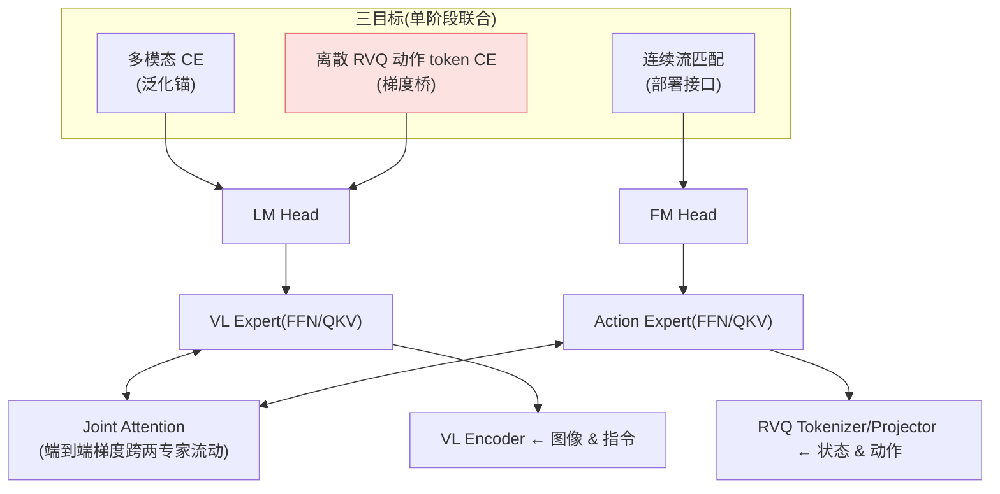

# Wall-OSS-0.5 细粒度解读

> **来源**: 《Wall-OSS-0.5 Technical Report — Pretrain Once, Act Anywhere》 · X Square Robot(自变量机器人)· 2026(arXiv 编号**待核**;本地 PDF 文件名 wallx_2602,疑似 2026.02)· 代码 github.com/X-Square-Robot/wall-x · **路线**:梯度桥接 co-training(离散 RVQ 桥 + 多模态锚 + 流匹配部署),MoT 双专家
> [← 返回主报告](../index.md)

---

## TL;DR

Wall-OSS-0.5 是 [WALL-OSS](wall-oss.md)(自变量 2509.11766)的技术报告级后续,要回答一个"基础模型该不该信"的尖锐问题:**VLA 预训练本身能不能直接产出可执行的机器人行为,还是它只是给下游微调提供一个更好的初始化?** 它的答案是前者——"**Pretrain Once, Act Anywhere**":一个建于 **Qwen2.5-VL-3B-Instruct** 之上、加动作生成组件的 **4B 开源 VLA**,**不做任务微调**就能在 17 任务真机零样本套件上完成多项任务(Block Sorting 100%、Fruit Sorting 96%、Ring Stacking 86%、留出可形变任务 Rope Tightening 82% ⚠️)。

核心方法是 **梯度桥接 co-training(gradient-bridged co-training)**,单阶段联合三个目标、各司其职:

1. **离散 RVQ 动作 token 交叉熵 = 梯度桥**:用 next-token 预测把动作监督喂进主干。因为它走 VLM 原生的自回归接口,**对主干的塑造远强于流匹配**,且梯度方向与连续控制正相关——这是"让主干变得 action-aware"的主力。
2. **多模态交叉熵 = 泛化锚**:在图文 grounding 数据上训练,把主干拴在指令跟随、视觉 grounding、具身场景理解上,其更新方向与动作优化基本正交,起锚定而非竞争作用。
3. **连续流匹配 = 部署接口**:训练连续动作生成器,推理时**只走流匹配通路**(离散通路靠注意力掩码解耦,仅在训练期承担"梯度桥")。

关键区别于 [π0.5](pi05.md) / [知识隔离 KI](knowledge-insulation.md):后者用 **stop-gradient 隔离**动作专家梯度以保护主干;Wall-OSS-0.5 反其道——**保留端到端梯度流**,主动用离散 token CE 这座"桥"把主干推向控制(消融证明:去掉梯度桥/隔离梯度/延迟 co-training 都显著掉点)。微调后在 15 任务真机套件上平均 task progress **60.5%**,超 [π0.5](pi05.md) 的 43.0(**+17.5pp**)、超世界-动作模型 DreamZero 的 33.4 ⚠️。

> ⚠️ 本文全部成绩来自 X Square Robot **自家技术报告**,基于自有真机套件与自建评测,**无第三方在统一基准下的独立复现**;task progress 为"分步部分完成度"(非二元成功率)。凡定量标 ⚠️,一手未给标"待核"。

---

## 1. 要解决的问题

VLA 预训练正成为机器人策略的主流基座,但有个常被回避的拷问:**预训练的 VLA,其能力几乎总是在"任务特定微调之后"才被报告**——那预训练本身到底产出了可执行行为,还是只给下游学习了个更好的起点?Wall-OSS-0.5 把目标定为"**面向部署的 VLA 预训练**":预训练 checkpoint **直接当真机策略评测**,这就对模型提三个硬要求——① 开箱能执行有用的操作技能;② 保住 VLM 派生的视觉-语言能力以保持指令-grounded;③ 让下游适配更省样本。

更底层的张力在训练目标:**连续流匹配**是天然的执行接口(直接建模未量化动作),但**对预训练 VLM 主干的更新很弱**;**离散动作 token 预测**恰好互补——next-token 交叉熵是 VLM 原生接口、强烈塑造主干,但解码出的离散动作对精细控制又太糙。冻结/截断梯度(π0.5/KI 路线)能保住主干先验,代价是**阻止了精确动作目标去塑造大主干**。Wall-OSS-0.5 的设计因此不是"连续 vs 离散"的二选一,而是:**如何在训练期利用离散通路塑造主干,同时在部署期保留连续动作。**

---

## 2. 方法与架构

*图注:MoT 把视觉/语言/离散动作 token 路由进 VL Expert,连续动作进 Action Expert;两专家共享 Joint Attention,梯度**端到端跨专家流动**(是路由分解,而非梯度隔离)。离散通路是"训练期"梯度桥,连续通路是"部署期"接口。*

### 2.1 MoT 双专家路由(主干)

从 **Qwen2.5-VL-3B-Instruct** 初始化,扩成 **Mixture-of-Transformers(MoT)**,共约 **4B** 参数:原 3B VLM 作 **VL Expert**,新增 **Action Expert** 提供动作生成能力。四路 token 流——视觉、语言、本体感觉、离散动作——走 VL Expert;带噪连续动作 token 走 Action Expert。两专家共享序列级注意力上下文(动作能 attend 到视觉/语言),但注意力掩码让**离散与连续动作 token 在前向中互不可见**,使两条动作通路可独立训练与评测;同时**梯度不被阻断**,流匹配的梯度仍经共享注意力流向 VL Expert。

### 2.2 Vision-Aligned RVQ 动作分词器(替代 FAST)

为让离散 token 成为"对主干有语义"的训练接口(而非单纯低失真压缩),用一个**学习式 Vision-Aligned 残差向量量化(RVQ)分词器**替代规则式 [FAST](pi0-fast.md):Encoder–RVQ–Decoder 结构,工作在 **delta-action(增量动作)**空间;三个目标共塑 token 空间——**视觉-动作对齐**(把动作 latent 拉向 VLM 视觉特征)、**下一帧预测**(让 token 编码动作后果)、**DCT 域重建**(抑制高频抖动)。得到的离散表示同时可重建、视觉对齐、物理平滑。

### 2.3 Action-Space Supervision(动作空间监督)

标准流匹配在**速度场**上算损失;Wall-OSS-0.5 把损失直接放在**恢复出的原始动作空间**上(对 timestep 加 (1−τ)² 权重),并把采样偏向**高噪声区**(τ 用 Beta(1.5,1) → s=0.999)。动机:机器人动作低维、平滑,任务结构主要在**低频轨迹形状**而非高频细节,高噪声步决定全局轨迹形状、是质量上限所在。消融(§5.2)显示这提升收敛速度、峰值性能与训练稳定性。

### 2.4 训练目标与配置

复合目标:**ℒ = ℒ_flow + 0.01·ℒ_act-CE + 0.01·ℒ_mm-CE**(λ_act = λ_mm = 0.01)。因为 ℒ_flow 数量级比两个 CE 小约两个量级,0.01 的权重恰好把 CE 拉到与流匹配可比的尺度,避免语言式预测主导动作学习。动作:多模态数据按 **9:1** 批内混合。优化器用 **Muon**(对每个专家的 2D 参数,视觉嵌入/LM head 用 AdamW)+ 自研分布式 **DMuon**(把 Newton–Schulz 计算分片,端到端开销降最多 100×);全局 batch **8192**、bf16、峰值 LR 1e-4、图像长边 448px。**单阶段**训练,三源数据混合(见 §3)。

### 2.5 动作接口与部署

VLM 式对话序列:`[System] Embodiment prompt [User] Observation/Instruction/Proprioception [Assistant] ⟨action_ar_token⟩⟨action_flow_token⟩×N`。动作空间 **26 维**:每臂相对 3D 位置 + 相对 6D 旋转 + 1D 夹爪(双臂 20D)+ 3D 移动底盘速度 + 1D 升降 + 2D 头部;用 6D 旋转避免 SO(3) 奇异/万向锁。推理只解连续通路。**部署栈**:CUDA Graph 捕获整个去噪步 + 自研融合 kernel,相对 PyTorch eager **4× 加速**;RTX 5090 三视角输入,224² 约 **21 Hz** / 448² 约 **15 Hz**(去噪 T=10)⚠️。

---

## 3. 数据配方

- **动作数据**:一个 epoch 超 **100 万条轨迹**,**约 60% 自采 + 40% 开源**。自采覆盖桌面双臂 + 移动操作两大平台,另用自研 embodiment-free 设备 **XRZero-G0** 低成本采集。开源 10 个子集(AgiBotWorld Beta 24.6%、RoboMIND v2.0 21.7%、Fractal 12.3%、RealOmin 10.9%、DROID 10.7%、RoboCOIN 7.3%、RoboMIND v1 3.8%、RoboChallenge 3.6%、BRIDGE v2 2.7%、Galaxea Open-World 2.4%)。统一动作 schema(双臂末端位姿/关节/夹爪/底盘/升降/头动),平方根幂采样(p=0.5)抑制长尾、保多样性。
- **多模态数据**:约 **9000 万样本** = 7800 万开源 + **1200 万 embodied bridge**(从动作轨迹自动合成的"桥接"样本,把多模态理解与动作预测连起来,分物体/空间/场景/任务四级理解)。开源部分三类:通用图文(CAPSFUSION/Cambrian/COCO/VQAv2 等)、具身感知(RoboPoint/SpaceThinker/RefSpatial 等)、具身认知(Robo2VLM/Cosmos-Reason1 等)。

数据规模/配比详见本站 [具身数据全景](embodied-data.md) 与 [数据处理](data-processing.md) 的同类梳理。

---

## 4. 实验与关键结果

> ⚠️ 全部为 X Square Robot 自评(自有真机套件,task progress = 分步完成度,max 100,每任务 10 条轨迹),无第三方统一复现。

### 4.1 预训练零样本(不微调,17 任务)

| checkpoint | 50k | 100k | 200k | 300k | 350k | **400k** |
|---|---|---|---|---|---|---|
| Seen(12 任务) | 26.1 | 31.7 | 40.1 | 40.4 | 48.1 | **50.0** |
| Unseen(5 任务) | 24.2 | 41.0 | 38.8 | 34.8 | 47.6 | **53.6** |
| Overall(17 任务) | 25.5 | 34.5 | 39.8 | 38.7 | 47.9 | **51.1** |

400k 时达 ≥60% 的任务(Table 3):**Block Sorting 100% · Fruit Sorting 96% · Ring Stacking 86% · Rope Tightening 82%(留出·可形变)· Cup Grasping 64% · Bean Pouring 60%(留出)**。作者强调:语义类任务是最强维度(400k 均值 72.6%),因为离散 token CE 让动作通路暴露于 VLM 语义先验;精细插入/可形变折叠类仍受底层控制瓶颈(Towel Folding 10%、Table Setting 9%、Charger Plugging 9%)。能力呈"阶梯式涌现"(如 Block Sorting 中后期从 ~50% 跳到 100%)。

### 4.2 微调后基线对比(15 任务 = 10 操作 + 5 推理,各约 500 条演示)

| 模型 | 操作(10) | 推理(5) | **总(15)** |
|---|---|---|---|
| **Wall-OSS-0.5** | **61.1** | 59.3 | **60.5** |
| [π0.5](pi05.md) | 35.0 | 58.9 | 43.0 |
| DreamZero(世界-动作模型) | 33.7 | 32.7 | 33.4 |

相对 π0.5 **总 +17.5pp**,在 10 任务操作子集上 **+26%** ⚠️。三者均用各自官方预训练权重、同数据同协议微调。

### 4.3 多模态理解(vs 基座 Qwen2.5-VL-3B)

| 维度 | 基准 | Qwen2.5-VL-3B | Wall-OSS-0.5 | Δ |
|---|---|---|---|---|
| 具身 grounding | Emb. Grounding(自建) | 9.0 | 30.8 | **+21.8** |
| 摆放推理 | Where2Place | 4.0 | 15.0 | +11.0 |
| 具身场景 | EO-Bench | 20.8 | 24.7 | +3.9 |
| 通用 VQA | ERQA | 38.3 | 32.8 | **−5.5** |
| 通用 VQA | RealWorld VQA | 59.2 | 44.2 | **−15.0** |

---

## 5. 局限与争议

- **"保住通用 VL"被自家数据部分证伪**:报告主张"动作训练不侵蚀 grounded VL 能力",但 Table 7 显示**通用 VQA 明显退化**(RealWorld VQA −15.0、ERQA −5.5),只有**具身 grounding 涨**(+21.8)。更准确的表述是:**它用一部分通用 VQA 能力换来了具身 grounding 的大幅提升**,而非"全面保住"。引用 +21.8 时应同时说明通用 VQA 的代价。
- **全自评、无第三方复现**:零样本/微调/多模态成绩均为 X Square Robot 自有套件自评;对比 π0.5/DreamZero 虽同协议,仍是作者自行复现基线。task progress 为分步完成度,数值上**高于**二元成功率口径,跨工作横比需谨慎。
- **精细 / 可形变控制仍弱**:零样本下 Towel Folding 10%、Charger Plugging 9% 等;精度瓶颈在底层控制,正是微调要补的"能力差"。
- **arXiv/正式发表状态待核**:本细读据本地技术报告 PDF(文件名 wallx_2602)整理,arXiv 编号与同行评审状态未在文中给出,标**待核**;代码 wall-x 已开源。
- **资源门槛**:高分辨率(448px)+ 多视角 + 4B 主干,部署需 RTX 5090 级算力才达 15 Hz;DMuon、CUDA Graph 等工程优化复现成本不低。

---

## 6. 在 VLA 谱系中的位置

Wall-OSS-0.5 是 [WALL-OSS](wall-oss.md) 之后自变量的技术报告级基座,把后者点到为止的"梯度桥接预训练"完整展开。它最值得记的坐标是**在"梯度"这条解耦轴上与 π 系反向**:

- [π0.5](pi05.md) / [知识隔离 KI](knowledge-insulation.md) 用 **stop-gradient 隔离**动作专家梯度,**保护**预训练主干不被连续控制信号污染;
- **Wall-OSS-0.5 保留端到端梯度流**,反而主动用**离散 RVQ 动作 token 的交叉熵当"桥"**,让动作目标去**塑造**主干——它认为问题不是"动作梯度会污染主干",而是"连续流匹配对主干塑造太弱",于是借离散通路的强梯度补上。

这正好补全本站 [双系统架构原理](dual-system-architecture.md) 里"梯度隔离"一类的**反例/对立面**:同样面对"主干 vs 动作专家如何共处",π 系选择隔离、自变量选择桥接。与 [WALL-OSS](wall-oss.md) 相比,Wall-OSS-0.5 的主要进化是:MoT 双专家显式路由、Vision-Aligned RVQ 替代 FAST、Action-Space Supervision、以及"预训练即可部署"的评测立场。底层动作生成仍属"连续流匹配"家族(同 [π0](pi0.md))。

相关条目:[WALL-OSS](wall-oss.md) · [π0.5](pi05.md) · [知识隔离 KI](knowledge-insulation.md) · [双系统架构原理](dual-system-architecture.md) · [π0-FAST](pi0-fast.md)(FAST 分词对照)· [π0](pi0.md)

---

## 来源

- 技术报告:《Wall-OSS-0.5 Technical Report: Pretrain Once, Act Anywhere》,X Square Robot Team(自变量机器人),2026(arXiv 编号待核;本地 PDF wallx_2602)。架构(MoT/RVQ/Action-Space Supervision)、梯度桥接 co-training、损失权重、数据配方、Table 2/3/4/7 成绩均出自此报告正文与附录。
- 代码:github.com/X-Square-Robot/wall-x
- 前作:[WALL-OSS 细读](wall-oss.md)(arXiv:2509.11766)
- 说明:本页定量均为厂商技术报告自评、无第三方统一基准复现;task progress 为分步完成度口径;"保住通用 VL"一项已据其自家 Table 7 做了纠偏(见 §5)。
