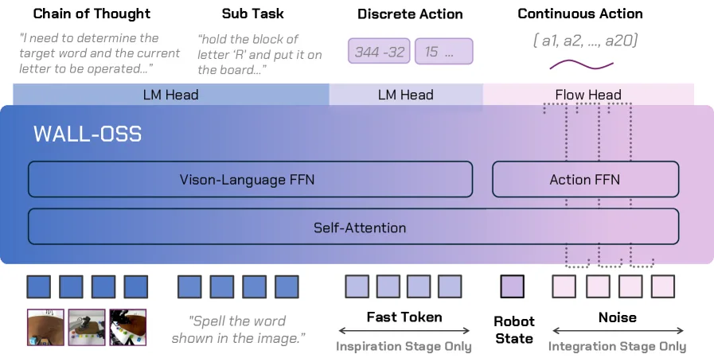
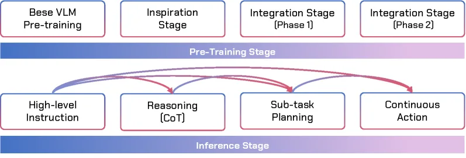

# WALL-OSS / Wall-OSS-0.5:点燃 VLM 走向具身空间的端到端基座

> **arXiv**: [2509.11766](https://arxiv.org/abs/2509.11766) (v1)
> **机构**: X Square Robot(自变量机器人)
> **时间**: 2025.09(WALL-OSS);2026.05.28(Wall-OSS-0.5 开源)
> **路线**: 端到端具身基座 —— 单一可微框架内统一"指令推理 → 子目标分解 → 细粒度动作合成"(**Unified Cross-Level CoT**),基于 **Qwen2.5-VL** 主干 + **紧耦合 MoE**,**离散 FAST token** 与**连续流匹配(flow matching)双分支**

[← 返回主报告](../index.md)

---

## TL;DR

WALL-OSS 是自变量机器人(X Square Robot)提出的**端到端具身基座 VLA**,它的出发点是一句诊断:**现有 VLM 对"空间"与"动作"理解不足**——它们能读图说话、能推理,却"无身体",既不会从与物理世界的交互中自我修正,也不会输出可执行动作。WALL-OSS 的目标,是把一个通用 VLM(**Qwen2.5-VL**)"点燃(Ignite)"成一个具身基座,使其同时具备三种能力:**① 具身感知的视觉-语言理解;② 强语言-动作关联;③ 鲁棒的(长程)操作**。

它的两条主线:

1. **紧耦合架构 + Unified Cross-Level CoT(统一跨层级思维链)**:用**一个可微框架、一个主干**把"高层指令推理 → 子目标分解(子任务规划)→ 细粒度连续动作合成"串成一条端到端的前向链路。同一组多模态输入,既可以走 **LM Head** 出文本/思维链/子任务/离散 FAST 动作 token,也可以走 **Flow Head** 出连续动作。
2. **两阶段课程(discrete priors → continuous control)**:① **Inspiration(灵感)阶段**用**离散 FAST token** 把"粗粒度、语义对齐的动作意识"植入 VLM 输出空间;② **Integration(整合)阶段**换上**连续流匹配头(flow-matching head)**,把高频精细控制补回来。由一个**带静态路由(static router)的紧耦合 MoE** 在不同阶段激活不同专家(Vision-Language FFN / Action FFN),弥合"训练目标鸿沟"。

工程落地:基于 Qwen2.5-VL 的 MoE 架构(HF 模型类 `Qwen2_5_VLMoEForAction`,约 **4B 参数**,BF16),官方在 GitHub `X-Square-Robot/wall-x` 与 HF `x-square-robot/wall-oss-flow` / `wall-oss-fast` 同时放出**流匹配分支**与 **FAST 离散 token 分支**两个模型。**Wall-OSS-0.5**(2026.05.28 开源)在此基础上引入 **"Gradient-Bridged Pretraining(梯度桥接预训练)"**,主打**可直接部署、零样本真机操作**。

> ⚠️ **可信度提示**:本文性能数字、"可直接部署 / 零样本"等说法均为**厂商(X Square Robot)自述**,非独立第三方复现。此外,arXiv 摘要页**未直接印出 "X Square Robot" 机构名**——机构归属由其官方 GitHub/HF 组织名(`X-Square-Robot` / `x-square-robot`)与项目页 `x2robot.com` 推断,**高置信但属推断**。Wall-OSS-0.5 的细节(梯度桥接、17 任务零样本套件)来自 2026.05 的开源发布,**不在** arXiv:2509.11766 v1 论文中。

---

## 1. 要解决的问题

语言与视觉的基础模型进展迅猛,GPT-5、Gemini 2.5 这类强大的多模态模型已能联合处理文本与视觉流、保持谨慎推理与低错误率。但 WALL-OSS 指出:**这些系统在很大程度上仍是"无身体的(disembodied)"**——它们既不会通过与物理世界交互获得反馈来自我精炼,也不生成可执行动作。于是在具身空间里,**动作理解与动作生成成了通往 AGI 的核心瓶颈**。

把 VLM 迁移到具身领域时,论文识别出三类**根本性失配(fundamental mismatches)**,正是 WALL-OSS 要逐一弥合的:

1. **模态鸿沟(modality gap)**:VLM 擅长"视觉↔语言",而机器人需要"视觉/语言↔动作"。动作是一种新模态,直接嫁接到 VLM 上会放大 tokenization 与独立性假设的裂缝。
2. **预训练分布鸿沟(pretraining-distribution gap)**:VLM 在网页图文上预训练,缺乏具身场景所需的空间定位、本体几何、操作进度等知识(论文用一组 Embodied VQA 揭示:基线 Qwen2.5-VL-3B 在物体定位 Object Grounding 上仅 46.1%)。
3. **训练目标鸿沟(training-objective gap)**:VLM 是 next-token 交叉熵,而连续动作常用**扩散/流匹配**去学速度场。把流匹配目标**直接**接到 VLM 上,论文称会造成"灾难性退化",削弱语言-动作对齐与泛化——这与"图像/视频领域统一理解与生成"时遇到的困难同源。

WALL-OSS 的定位,就是用一套**紧耦合架构 + 多策略课程**同时弥合这三道鸿沟,提供一条**从 VLM 到具身基座、可靠且可扩展**的路径。

---

## 2. 方法与架构

WALL-OSS 的核心是把"想做什么(推理/子任务)"与"怎么做(连续动作)"统一进**同一个可微框架**,并用**两阶段课程**先离散后连续地训练它。下面分四小节:2.1 整体架构(紧耦合主干 + 双输出头),2.2 Unified Cross-Level CoT,2.3 两阶段课程(Inspiration / Integration),2.4 紧耦合 MoE 与静态路由。

> **图注(译自原文 Figure 3,Architecture of WALL-OSS)**:主干为 **QwenVL2.5-3B**。输入是多视角图像(第一人称 egocentric + 腕部 arm-mounted 相机)与文本指令;在共享的 **Self-Attention** 之上,**Vision-Language FFN** 与 **Action FFN** 两套专家并存。输出端有两个头:**LM Head** 负责 **Chain of Thought(思维链)/ Sub-task(子任务)/ Discrete Action(离散 FAST 动作 token)**;**Flow Head** 负责 **Continuous Action(连续动作)**,以机器人本体状态(Robot State)与噪声(Noise)为条件做流匹配。无论走哪个头,都**条件于同一份多模态输入**。

### 2.1 整体架构:紧耦合主干 + 双输出头

记输入对 $\mathbf{c}=(\text{vision},\text{instruction})$,其 VLM 编码为 $\mathbf{h}=F_\theta(\mathbf{c})$,$F_\theta$ 即参数为 $\theta$ 的 **Qwen2.5-VL** 主干。模型**根据训练阶段产出不同输出,但始终条件于同一份多模态输入**:

- **离散侧(LM Head)**:沿用 VLM 的自回归 next-token 通道,输出**文本、思维链、子任务文本,以及经 FAST tokenization 离散化的动作 token**。
- **连续侧(Flow Head / Action FFN)**:一个**流匹配头**,以 VLM 编码 $\mathbf{h}$、机器人本体状态与噪声为条件,回归速度场,输出**连续动作**。

两套输出头共享同一个带 self-attention 的主干,视觉、语言、动作三种表示**通过注意力彼此交互**,再由**静态路由**分流到各自的 FFN 专家(见 2.4)。这正是"紧耦合(tightly coupled)"的含义:不是把动作模块外挂在 VLM 旁边,而是让动作表示**进入主干的注意力与专家结构内部**,以强制"语言-动作绑定"。

### 2.2 Unified Cross-Level CoT:一条前向链路串起三个层级

WALL-OSS 最核心的概念是 **Unified Cross-Level CoT(统一跨层级思维链)**:在**单一可微框架**内,无缝统一**指令推理(instruction reasoning)→ 子目标分解(subgoal decomposition)→ 细粒度动作合成(fine-grained action synthesis)**。

与 GR00T N1 等"双系统/分层"做法不同,WALL-OSS 采用**单模型的 Uni-CoT 形式**,端到端学习"指令 → CoT → 子任务 → 连续动作"的前向映射(原文称 unified CoT forward mapping)。这条链路**可以包含、也可以跳过中间推理步骤**(推理时既能"高层指令 → 推理(CoT)→ 子任务规划 → 连续动作"逐级展开,也能直接出动作),从而既保留 VLM 的语义与推理能力,又能把它"压"到细粒度动作上。直觉上:它把"高层语义 → 细粒度动作"的分解过程显式地编进同一个模型的前向计算,迫使模型理解指令、子目标与动作之间的关系,而不是把规划和控制割裂成两个独立系统。

> **图注(译自原文 Figure 4,training and inference pipeline)**:**上排(预训练阶段 Pre-Training Stage)**依次为 **Base VLM Pre-training → Inspiration Stage → Integration Stage(Phase 1)→ Integration Stage(Phase 2)**;**下排(推理阶段 Inference Stage)**为 **High-level Instruction → Reasoning(CoT)→ Sub-task Planning → Continuous Action**——即 Unified Cross-Level CoT 在推理时的逐级展开。

### 2.3 两阶段课程:Inspiration(离散)→ Integration(连续)

整体配方遵循 **discrete priors → continuous control(先离散先验,再连续控制)**。预训练由两大组件构成:**Inspiration of the VLM** 与 **Integration of the three modalities(V-L-A)**。

**① Inspiration(灵感)阶段 —— 用离散 FAST token 点燃具身意识**

先**复用预训练 VLM 的原始 FFN**,叠加**具身 VQA(Embodied VQA)**强化机器人环境中的空间推理;训练目标包含掩码语言建模、图/视频-文本对比、指令跟随、时序顺序/因果建模,以建立扎实的"接地(grounded)视觉-语言先验"。**与此并行,引入离散动作目标**:把连续动作轨迹 $\mathbf{a}$ 经 **FAST tokenization** 离散化为 token 序列 $\mathbf{z}_{1:K}$(流程为 **DCT → 量化 Quant → BPE**,沿用 π0-FAST),让文本 token 与离散动作 token 对齐:

$$\mathbf{z}_{1:K}=\textsc{FAST}(\mathbf{a}),\qquad \mathcal{L}_{\text{Inspiration}}=\lambda_{\text{VQA}}\sum_{t}-\log p_\theta(\tau_t\mid\tau_{<t},\mathbf{c})+\lambda_{\text{D}}\sum_{k}-\log p_\theta(z_k\mid z_{<k},\mathbf{c})$$

其中 $\tau_t$ 是第 $t$ 个文本 token,$\lambda_{\text{VQA}}$ / $\lambda_{\text{D}}$ 分别是 VQA 与离散动作目标的权重。该阶段产出**思维链推理、子任务预测、离散 FAST 动作 token**——具身 VQA 提升 VLM 的空间理解,FAST token 预测给出**粗粒度动作理解**,二者一起"点燃"出初始 VLM 的基础具身推理与动作意识。

**② Integration(整合)阶段 —— 换上流匹配头补回高频控制**

在上述先验之上,**用连续动作建模(流匹配)替换离散动作预测**,并细分两个 Phase:

- **Phase 1**:**冻结 VLM**,只训练 Action FFN 下的 **flow head**。构造带噪样本并回归速度场:
$$x_t=(1-\rho(t))\,x_0+\rho(t)\,\epsilon,\qquad \mathcal{L}_{\text{Integration}}=\lambda_{\text{C}}\,\mathbb{E}\big[w(t)\,\|v_\phi(x_t,\mathbf{h},t)-(\epsilon-x_0)\|_2^2\big]$$
其中 $v_\phi$ 是以 VLM 编码 $\mathbf{h}$ 为条件的速度场网络,$\rho(t)$ 为噪声调度,$w(t)$ 为时间加权。
- **Phase 2**:**解冻 VLM**,做联合优化,让视觉-语言主干与连续动作头一起端到端精调。

"先冻结主干只学动作头、再解冻联合训练"的两段式,既保护了 Inspiration 阶段建立的语义/推理能力,又把高频精细控制平稳地接进来。

### 2.4 紧耦合 MoE 与静态路由

弥合"训练目标鸿沟"的关键工程,是一个**紧耦合的 MoE 架构 + 静态路由(static router)**:在 Integration 阶段,视觉、语言、动作表示**通过注意力交互**,然后由**静态路由(而非可学习的 softmax/top-k 路由)**把**动作中心(action-centric)特征导向 Action FFN**、把**视觉-语言特征导向 Vision-Language FFN**。也就是说,**不同阶段激活不同专家、不同权重,对应不同的动作建模方式(离散 or 连续)**,从而在同一模型里弥合"next-token 交叉熵 vs 流匹配速度场"这道目标鸿沟,同时用静态路由**强制强语言-动作绑定**。这与"靠学习式路由自动分配专家"的常规 MoE 形成对比——这里专家归属由模态/特征类型**确定性地**决定。

数据侧采用**多模态与机器人数据协同训练(co-training)**:从 VLM 初始化,联合训练网页图文、对话、长视频与**多本体(multi-embodiment)机器人数据**,在注入具身空间语义的同时**保住开放世界的视觉-语言能力**;数据来源含**自采动作数据、开源动作数据、多模态 VQA**三大类(原文 Figure 5)。

### 2.5 Wall-OSS-0.5:梯度桥接预训练(Gradient-Bridged Pretraining)

> 以下来自 **2026.05.28 的开源发布**,不在 arXiv:2509.11766 v1 论文中,属厂商自述。

**Wall-OSS-0.5** 在 WALL-OSS 基础上提出 **"Gradient-Bridged Pretraining(梯度桥接预训练)"**:**以离散动作 token 的交叉熵作为"梯度桥(gradient bridge)"**,把离散动作先验的监督信号桥接到连续控制的学习中(可理解为对 WALL-OSS"离散先验→连续控制"两阶段思路的进一步内聚)。规模仍约 **4B**,主打 **"可直接部署(deploy-ready)、零样本真机操作(zero-shot real-robot)"**——即开箱即用、无需在目标任务上再采数微调即可上真机。

---

## 3. 关键设计与创新点

1. **Unified Cross-Level CoT(统一跨层级思维链)**:用**单一可微框架、单模型**把"指令推理 → 子目标分解 → 细粒度动作合成"串成一条端到端前向链路,而非分层双系统;链路可含可跳过中间推理步骤。这是 WALL-OSS 区别于 GR00T N1 等"双系统/分层"做法的核心标签。
2. **紧耦合架构 + 双输出头**:动作表示进入主干注意力与专家结构内部(LM Head 出离散/CoT/子任务,Flow Head 出连续动作),以**强制语言-动作绑定**,而非外挂式动作模块。
3. **discrete priors → continuous control 的两阶段课程**:Inspiration 用 FAST 离散 token 植入粗粒度动作意识,Integration 用流匹配头(先冻结后解冻两 Phase)补回高频精细控制,系统性弥合"训练目标鸿沟"。
4. **带静态路由的紧耦合 MoE**:用确定性静态路由把动作/视觉-语言特征分流到各自 FFN 专家,不同阶段激活不同专家以适配离散/连续两种动作建模——这是其"目标鸿沟"弥合的机制载体。
5. **具身 VQA 协同训练弥合预训练分布鸿沟**:用面向具身、空间定位、进度建模的 VQA 任务补 VLM 的具身短板(物体定位 46.1% → 91.6%,见第 4 节)。
6. **双分支开源**:同时放出**流匹配分支(wall-oss-flow)**与 **FAST 离散分支(wall-oss-fast)**两个可用模型,覆盖"连续高频控制"与"离散自回归"两条路线。
7.(Wall-OSS-0.5)**Gradient-Bridged Pretraining**:以离散动作 token 交叉熵作梯度桥,主打可直接部署、零样本真机。

---

## 4. 实验与关键结果

> ⚠️ 以下数字均为 **X Square Robot 自评**,无独立第三方复现;**无 SimplerEnv / LIBERO / CALVIN / RoboCasa 等公开横评基准上的可比数据**,故下表均为厂商自定评测口径。

**速览表 A — 具身 VQA 基准(WALL-OSS vs 基线,原文 Table 2;单位 %)**

| 模型 | 设定 | Object Grounding(物体定位) | Scene Captioning(场景描述) | Action Planning(动作规划) | 来源 |
|---|---|---|---|---|---|
| Qwen2.5-VL-3B | 基线(未具身化) | 46.1 | 57.7 | 59.8 | 原文 Table 2 ⚠️ |
| **WALL-OSS** | 具身 VQA 协同训练后 | **91.6** | **87.6** | **69.0** | 原文 Table 2 ⚠️ |
| 提升(绝对值,pp) | — | +45.5 | +29.9 | +9.2 | 由上两行算得 |

> 口径:三项均为厂商自定义 Embodied VQA 子任务的准确率(%),非任何公开 VQA 基准;数值与基线均出自原文 Table 2,为 X Square Robot 自评。

**速览表 B — 机器人操作评测套件(原文 Figure 6/7,定性结论)**

| 评测维度 | 任务(单指令) | 任务(长程/推理) | 对比设定 | 结论 | 来源 |
|---|---|---|---|---|---|
| ① 指令理解/推理/泛化 ② 长程多阶段规划与执行 ③ 动作精度与鲁棒性 | Pick-Up-Waste、Place-by-Color、Instruction-Pick-Place、Pick-Place-Cup | Set-Table、Block-Spell、Tidy-Bedroom | In-distribution(ID)与 Out-of-distribution(OOD)两种,对比多个 SOTA 策略 | 称 WALL-OSS **优于强基线**,并涌现"零样本指令跟随"能力 | 原文 Figure 6/7 ⚠️ |

> 口径:共 **6 个操作任务**;原文以 Figure 6/7 给出 ID/OOD 成功率柱状对比,本细读未抄录逐任务数值(原文以图形呈现),仅录其定性结论。长程任务以 task-progress 而非二元成功率度量。

**速览表 C — Wall-OSS-0.5 零样本真机套件(2026.05.28 开源发布,厂商自述)**

| 模型 | 设定 | 套件规模 | 总体指标 | 代表性单项 | 来源 |
|---|---|---|---|---|---|
| **Wall-OSS-0.5**(约 4B) | 零样本真机(zero-shot,目标任务无再采数微调) | 17 任务 | task-progress(任务进度)**> 80** | Block Sorting **100**、Fruit Sorting **96**、Ring Stacking **86** | 报告 §5.1 / 开源发布 ⚠️ |

> 口径:**task-progress(任务进度,非二元成功率)**,意味着部分任务未必完全做完;单项 100/96/86 亦为进度分。该套件与"梯度桥接预训练"均来自 2026.05 开源发布,**不在** arXiv:2509.11766 v1 论文中。⚠️ 厂商自述,无第三方复现。

要点解读见下。

**(1) 具身 VQA 基准:相对基线 Qwen2.5-VL-3B 大幅提升(原文 Table 2)**

| 模型 | Object Grounding(物体定位) | Scene Captioning(场景描述) | Action Planning(动作规划) |
|---|---|---|---|
| Qwen2.5-VL-3B(基线) | 46.1% | 57.7% | 59.8% |
| **WALL-OSS** | **91.6%** | **87.6%** | **69.0%** |

物体定位近乎翻倍(+45.5 个百分点),直接印证"具身 VQA 协同训练弥合预训练分布鸿沟"的有效性。

**(2) 机器人操作评测套件(原文 Figure 6/7)**
评测套件围绕三个核心维度:**① 语言指令理解、推理与泛化;② 长程多阶段任务的规划与执行;③ 动作精度与鲁棒性**。含 **6 个操作任务**:单指令任务(**Pick-Up-Waste、Place-by-Color、Instruction-Pick-Place、Pick-Place-Cup**)与长程/推理任务(**Set-Table、Block-Spell、Tidy-Bedroom**)。论文在 **In-distribution(ID)** 与 **Out-of-distribution(OOD)** 两种设置下与多个 SOTA 策略对比,称 **WALL-OSS 优于强基线**,并展现"预训练后涌现的零样本指令跟随"能力。

**(3) Wall-OSS-0.5 零样本真机套件(2026.05 发布,厂商自述)**
一套 **17 任务零样本真机评测**,**task-progress(任务进度)> 80**;代表性单项:**Block Sorting 100、Fruit Sorting 96、Ring Stacking 86**。强调**未在目标任务上采数微调即上真机**(zero-shot)。

---

## 5. 局限与争议

1. **全为厂商自评**:Embodied VQA、操作任务成功率、Wall-OSS-0.5 零样本真机数字均由 X Square Robot 自行评测,**无独立第三方复现**;"可直接部署 / 零样本"为厂商宣称。
2. **机构归属属推断**:arXiv 摘要页未直接印 "X Square Robot",机构由官方 GitHub/HF 组织名与项目页 `x2robot.com` 推断(高置信但非论文页面直证)。
3. **版本/能力边界需厘清**:Wall-OSS-0.5 的 **Gradient-Bridged Pretraining** 与 17 任务零样本套件来自 **2026.05 的开源发布**,**不在** arXiv:2509.11766 v1 论文中;不应把 0.5 的结论直接归到原 WALL-OSS 论文。
4. **参数口径需注意**:论文主干写明为 **QwenVL2.5-3B**,而 HF 工程实现(`Qwen2_5_VLMoEForAction`)因 MoE 多专家权重而约 **4B**;"3B 主干"与"约 4B 模型"指代不同口径,引用时宜区分。
5. **长程任务以进度度量**:长程任务(Set-Table / Tidy-Bedroom / 零样本套件)用 **task-progress** 而非纯二元成功率,意味着部分任务未必完全做完,"零样本可直接部署"的强度应结合这一点理解。
6. **"灾难性退化"等动机性论断**:论文以"直接嫁接流匹配会造成灾难性退化"作为两阶段课程的动机,但该退化主要以本文自身实验呈现,跨设置的普适性仍待外部验证。

---

## 6. 在 VLA 谱系中的位置

- **与 [[pi0-fast]] 同源(FAST tokenizer)**:Inspiration 阶段的离散动作先验**直接沿用 π0-FAST 的 FAST tokenization**(DCT → 量化 → BPE),把动作压成可与文本对齐的离散 token。这条离散路线是 WALL-OSS"先离散先验"的基石。
- **与 [[pi05]] 同思路(两阶段:离散统一 → 连续精控)**:WALL-OSS 的 **Inspiration(离散 FAST)→ Integration(连续流匹配)**与 π0.5 的**预训练(离散 token 统一异构数据)→ 后训练(接上流匹配 action expert)**几乎是同一种"先用离散把广度/语义打满,再用流匹配把高频连续控制补回来"的配方;区别在于 WALL-OSS 用**紧耦合 MoE + 静态路由**承载两种目标,并以 **Unified Cross-Level CoT** 显式编码"指令→子任务→动作"的跨层级链路。
- **同 Qwen 基座(对照 [[qwen-vla]])**:与一系列以 **Qwen2.5-VL** 为底座的 VLA 共享主干血统,差异主要在动作建模(双分支 + MoE)与训练课程上。
- **与分层前沿对照([[groot-n1]])**:GR00T N1 走"System-2 推理 + System-1 控制"的**双系统/分层**;WALL-OSS 反其道而行,主打**单模型 Uni-CoT**——把推理、子任务与连续动作压进同一可微前向,声称这样能更强地绑定语言与动作。
- **与离散自回归路线([[rt2]]、[[openvla]])对照**:WALL-OSS 并不二选一,而是把离散(LM Head / FAST)与连续(Flow Head / 流匹配)装进同一主干,用阶段化课程各取所长。

一句话:**WALL-OSS 是自变量机器人提出的端到端具身基座,用"紧耦合 MoE + 静态路由"把离散 FAST 与连续流匹配两条动作建模路线装进同一个 Qwen2.5-VL 主干,并以 Unified Cross-Level CoT 在单一可微框架里统一"指令推理→子目标分解→细粒度动作合成";它沿用 π0-FAST 的 FAST tokenizer、复刻 π0.5 的"离散→连续"两阶段配方,代价是性能与"零样本可直接部署"均为厂商自评、尚待第三方验证,且 Wall-OSS-0.5 的梯度桥接预训练属后续开源发布而非原论文内容。**

---

## 来源

- 论文:WALL-OSS: Igniting VLMs toward the Embodied Space. arXiv:2509.11766 (X Square Robot / 自变量机器人, 2025.09). <https://arxiv.org/abs/2509.11766>
- HTML 全文(图 3/4 来源):<https://arxiv.org/html/2509.11766v1>
- 代码:GitHub <https://github.com/X-Square-Robot/wall-x>
- 模型:HuggingFace `x-square-robot/wall-oss-flow`、`x-square-robot/wall-oss-fast`
- 项目页:<https://x2robot.com>
- 架构图:本仓库 `images/wall-oss_arch.webp`(原文 Figure 3 Architecture of WALL-OSS,源文件 `x3.png`)
- 训练/推理流程图:本仓库 `images/wall-oss_pipeline.webp`(原文 Figure 4 training and inference pipeline,源文件 `x4.png`)

> 说明:第 4 节全部数字、"可直接部署 / 零样本"等说法均为 **X Square Robot 实验室自评**,无独立第三方复现;机构归属由官方 GitHub/HF 组织名推断;Wall-OSS-0.5 的梯度桥接预训练与 17 任务零样本套件来自 2026.05 开源发布,不在 arXiv v1 论文中。引用时请注明上述属性。
