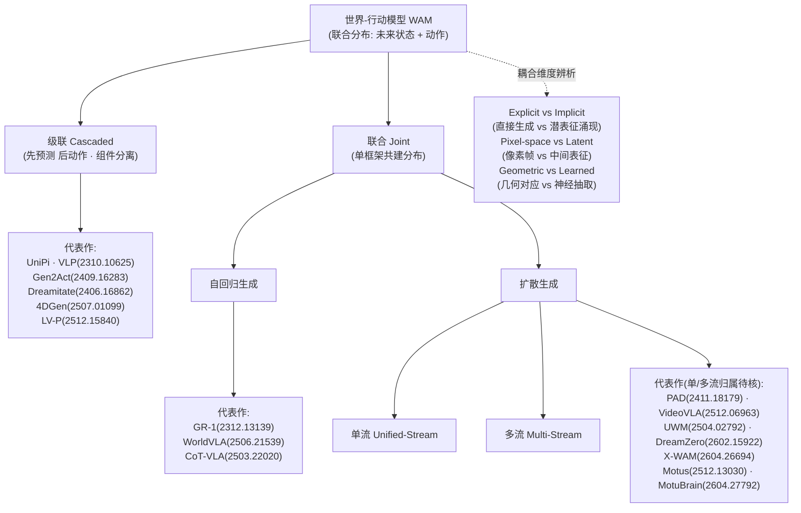

# 世界-行动模型 WAM:联合预测未来状态与动作

> **横切专题** · 2025–2026 前沿范式 · 联合分布建模(未来状态 + 动作)· 权威源:综述 arXiv:2605.12090(OpenMOSS)
> [← 返回主报告](../index.md)

> 本页系统梳理「世界-行动模型」(World Action Models, WAM)这一 2025–2026 前沿范式:它是「统一预测式状态建模与动作生成、对未来状态与动作的**联合分布**建模」的具身基础模型。内容覆盖定义辨析、综述 taxonomy、代表模型细读、数据生态与评测协议,以及 WAM 与本站既有 VLA 谱系的对位关系。可信度体例:⚠️ = 提出方/厂商自评(本页绝大多数定量属此类);✅ = 经基准维护方统一第三方评测(本语料中几乎缺位);**待核** = 一手源未给出、不以外部记忆或常识补全。所标 arXiv 编号均取自语料。

## 一、什么是 WAM:定义与辨析

### 1.1 综述给出的定义:从「动作分布」到「状态—动作联合分布」

「世界-行动模型」(World Action Models, WAM)这一术语,其最系统的界定来自 OpenMOSS(复旦系)的权威综述《World Action Models: The Next Frontier in Embodied AI》(arXiv 2605.12090,2026-05-12 提交,14 作者)。该综述自称是「the first systematic account of the WAMs landscape」(首个对 WAM 领域的系统梳理)⚠️。

其逐字定义为:

> "embodied foundation models that unify predictive state modeling with action generation, targeting a joint distribution over future states and actions rather than actions alone."

即:WAM 是一类**统一了「预测式状态建模」与「动作生成」的具身基础模型,其建模目标是「未来状态与动作」的联合分布,而非仅仅动作**。这是 WAM 区别于既有范式的核心命题——它把「世界会如何变化」与「机器人该做什么」放进同一个概率分布里联合求解。

### 1.2 为何现在出现:VLA 反应式映射的局限

综述对 WAM 出现动机的诊断,同样以逐字方式针对既有 VLA(视觉—语言—动作模型):VLA "learn reactive observation-to-action mappings without explicitly modeling how the physical world evolves under intervention"(学到的是反应式的 obs→action 映射,而**不显式建模物理世界在干预之下如何演化**)。

换言之,VLA 把策略压缩为「看到什么就输出什么动作」的直接映射;它没有一个关于「我这么动,世界会变成什么样」的内部模型。WAM 的提出正是要补上这一环:先(显式或隐式地)对未来状态作预测,再让动作从这一预测中产生或与之联合生成。

这一动机判断与 NVIDIA 的辨析互证。NVIDIA glossary 在区分 WAM 与 VLA 时同样指出:VLA "map observations and instructions to actions rather than explicitly modeling spatiotemporal physical dynamics"(把观测与指令映射到动作,而非显式建模时空物理动力学);而 WAM 从大规模视频预训练中继承了时空物理先验。⚠️(此辨析为 NVIDIA 厂商陈述)两处定义在「VLA 缺少显式动力学建模」这一点上一致。

### 1.3 两处一手定义互证:NVIDIA 的工程化表述

NVIDIA glossary 对「World Action Model」的定义为:"a type of AI model for robotics that learns both how the world is likely to change and what actions a robot can take to shape that change"(一类机器人 AI 模型,**同时学习「世界可能如何变化」与「机器人可采取何种动作去塑造这一变化」**),即联合预测未来视觉状态与对应机器人动作。⚠️(厂商定义)

两处定义可相互印证:综述强调「未来状态与动作的联合分布」,NVIDIA 强调「世界如何变化 + 机器人如何塑造变化」——前者是概率建模的语言,后者是工程能力的语言,指向同一对象。

NVIDIA 还补充了一个值得注意的运行机制细节:其 WAM 在运行时 "takes a text instruction and starting observation, predicts a compressed representation of the intended transition, and derives robot commands directly from it, without ever generating full images"(接收文本指令与起始观测,预测目标转移的**压缩表征**,并据此直接导出机器人指令,而**从不生成完整图像**)——即在潜空间想象、不渲染完整像素帧,实现为统一的 "Joint Video-Action Diffusion Transformer (DiT)"。⚠️(NVIDIA 厂商陈述)

> 关于 WAM 与「世界基础模型」的关系,NVIDIA 给出辨析:WAM 是 world foundation model 的「动作使能」(action-enabled)变体;其 Cosmos 提供基础设施,WAM 则将其用于机器人控制。⚠️(厂商辨析)

### 1.4 三者对比:WAM vs VLA vs 纯世界模型

下表依据综述与 NVIDIA 两处一手定义整理。其中「纯世界模型」一栏指不直接产出可执行动作、仅建模世界演化的模型;语料未给出独立的「纯世界模型」逐字定义,故该栏多处据 NVIDIA「WAM 是 world foundation model 的动作使能变体」反推,标注「待核」。

| 维度 | VLA(视觉—语言—动作) | WAM(世界-行动模型) | 纯世界模型 / world foundation model |
|---|---|---|---|
| 建模目标 | 动作分布(actions alone) | 未来状态与动作的**联合分布**(joint distribution over future states and actions) | 世界如何演化(基础设施型,如 Cosmos)⚠️/待核 |
| 输入 | 观测 + 指令(observations and instructions) | 文本指令 + 起始观测(text instruction and starting observation)⚠️ | 视觉/物理状态序列(待核) |
| 输出 | 动作 | 「目标转移的压缩表征」→ 直接导出机器人指令(潜空间想象,不生成完整图像)⚠️ | 预测的未来状态 / 视频(不直接产出动作,待核) |
| 是否显式建模动力学 | 否——"without explicitly modeling how the physical world evolves under intervention" | 是——统一 predictive state modeling 与 action generation | 是——建模世界演化(待核其是否含「干预下」语义) |
| 动作来源 | 反应式 obs→action 直接映射 | 从对未来状态的预测中联合/派生而来 | 无原生动作产出;经「动作使能」后成为 WAM(NVIDIA 辨析)⚠️/待核 |
| 物理/时空先验 | 缺少显式时空物理动力学建模 ⚠️(NVIDIA 框架) | 从大规模视频(含互联网视频、第一视角人类视频)预训练继承 ⚠️ | 提供物理 AI 基础设施(Cosmos)⚠️ |

### 1.5 与本站既有内容的接续

本站已有的[预测式 VLA(世界模型作策略)](predictive-vla)页(覆盖 VPP / DreamVLA / WorldVLA)在 WAM 的 taxonomy 中属 **Joint 类**(其中 WorldVLA 为 Joint-自回归)。也就是说,predictive-vla 是 WAM 的一个早期、较窄的切片,而 WAM 是其伞形上位范式。值得对照的是,本站 [RynnVLA](rynnvla)(RynnVLA-001)用视频生成做「训练先验」、推理时丢弃未来帧——这与 WAM「推理时预演未来再反推动作」恰成对照:**预测当先验** vs **预测当策略主体**。NVIDIA 谱系中的 [GR00T N1](groot-n1) 与 Isaac GR00T 2(后者称「built on a world action model architecture」⚠️)亦属同一脉络。

## 二、范式分类(综述 taxonomy)

综述把已有方法组织为 **Cascaded(级联)** 与 **Joint(联合)** 两大类,再按生成模态(generation modality)、条件机制(conditioning mechanism)、动作解码策略(action decoding strategy)三个轴细分。下面先讲清两大类的分野,再展开 Joint 类的自回归 / 扩散(单流·多流)细分,最后给出贯穿全类的耦合维度辨析。

### 2.1 Cascaded(级联):先预测,后动作

级联式 WAM 把「预测未来」与「生成动作」拆成**分离的组件**:先用一个生成/预测模块想象未来(通常是未来视频帧或关键状态),再用一个独立的动作模块从想象结果反推机器人指令。其优点是组件解耦、各司其职,代价是误差可能在级联链上累积。

代表作(arXiv 编号取自 OpenMOSS 同组维护的 Awesome-WAM 清单):

| 模型 | arXiv / 出处 |
| --- | --- |
| UniPi | NeurIPS 2023 |
| VLP | 2310.10625(ICLR 2024) |
| Gen2Act | 2409.16283(CoRL 2025) |
| Dreamitate | 2406.16862(CoRL 2024) |
| 4DGen | 2507.01099(ICLR 2026) |
| LV-P | 2512.15840(2025) |

### 2.2 Joint(联合):预测与动作共建一个分布

联合式 WAM 在**单一框架内**同时建模未来状态与动作,直接逼近综述定义的「未来状态与动作的联合分布」。综述按生成机制把 Joint 进一步分为**自回归**与**扩散**两支。

#### 2.2.1 Joint · 自回归生成

以自回归方式逐步生成未来表征与动作 token。

| 模型 | arXiv / 出处 |
| --- | --- |
| GR-1 | 2312.13139(ICLR 2024) |
| WorldVLA | 2506.21539(2025) |
| CoT-VLA | 2503.22020(CVPR 2025) |

#### 2.2.2 Joint · 扩散生成(单流 / 多流)

以扩散方式生成未来与动作;综述再按数据流结构区分 **Unified-Stream(单流)** 与 **Multi-Stream(多流)**。

| 模型 | arXiv / 出处 |
| --- | --- |
| PAD | 2411.18179(NeurIPS 2024) |
| VideoVLA | 2512.06963(NeurIPS 2025) |
| UWM(Unified World Models) | 2504.02792(RSS 2025) |
| DreamZero | 2602.15922(2026) |
| X-WAM | 2604.26694(2026) |
| Motus | 2512.13030(2025) |
| MotuBrain | 2604.27792(2026) |

> 注:综述将上表归入「扩散生成」并标注其内部分为单流 / 多流两型,但各模型分别属于单流还是多流,语料未逐一指明(**待核**)。各模型的扩散与联合属性可由一手 arXiv 摘要印证(以下要点均为作者自评 ⚠️):DreamZero 自称建于预训练视频扩散骨干、联合建模 video+action(arXiv 2602.15922);X-WAM 自述为统一 4D 世界模型,在单框架内统一实时动作执行与高保真 4D 世界合成,并指出先前的 UWM 仅建模 2D pixel-space(arXiv 2604.26694);UWM 即「Coupling Video and Action Diffusion」,用于大规模机器人数据预训练(arXiv 2504.02792)。

### 2.3 耦合维度辨析

除 Cascaded / Joint 的顶层划分外,综述还提出三组正交的**耦合维度**,用以刻画「预测」与「动作」如何耦合:

- **Explicit vs Implicit**:动作是被直接生成(显式),还是从潜表征中涌现(隐式)。
- **Pixel-space vs Latent**:模型在像素帧空间预测,还是在学到的中间(潜)表征上预测。X-WAM 批评 UWM 停留在 2D pixel-space ⚠️;NVIDIA glossary 描述其 WAM「预测意图转移的压缩表征并据此直接推导机器人指令,而从不生成完整图像」,即典型的 latent 路线 ⚠️。
- **Geometric vs Learned Extraction**:动作是经由几何对应关系抽取,还是由神经网络学习抽取。

### 2.4 分类树

> 与本站既有内容的位置关系:本站[预测式 VLA](predictive-vla)页覆盖的 VPP / DreamVLA / WorldVLA 在本 taxonomy 中属 **Joint** 类(WorldVLA 为 Joint-自回归),可视为 WAM 的早期 / 狭窄切片,而 WAM 是其伞形上位范式;[RynnVLA](rynnvla)把视频生成当「训练先验」、推理时丢弃未来帧,与 Joint·扩散类「推理时预演未来再反推动作」恰成对照。NVIDIA 谱系的 [GR00T N1](groot-n1) 与更早的 GR-1 同属一脉。

## 三、代表模型细读

下面逐一深读五个具有代表性的世界-行动模型(WAM)。需提醒读者:本节几乎全部定量指标均来自论文/厂商自评(标 ⚠️),尚未经基准维护方的统一第三方评测;语料未给出的事实一律写「待核」,不以外部记忆补全。

### 3.1 DreamZero(arXiv 2602.15922)

**论文题为《World Action Models are Zero-shot Policies》** —— 标题本身即是一种主张:把 WAM 直接当作零样本策略来用,而非仅作训练先验。这与本站 [RynnVLA](rynnvla) 形成关键对照:RynnVLA 用视频生成做训练先验、推理时丢弃未来帧;DreamZero 则把「预演未来再反推动作」放在推理主回路里(即「预测当策略主体」)。

- **定位**:建于预训练视频扩散主干(pretrained video diffusion backbone)之上、联合建模 video+action 的零样本策略。提交于 2026-02-17,36 作者(lead Seonghyeon Ye),机构未在摘要列出(待核)。
- **机制要点**:在 WAM taxonomy 中,DreamZero 属 Joint 类扩散生成谱系(与本站 [预测式 VLA](predictive-vla) 页所覆盖的 Joint 类工作同属一脉,但 DreamZero 不在该页收录范围内);其核心是从视频扩散先验迁移到动作生成,并辅以模型与系统级优化以达成实时闭环。
- **关键数字**(均为作者自评 ⚠️):
  - 真机实验中对新任务/新环境泛化 **">2x improvement"** 优于 SOTA VLA ⚠️
  - 通过模型与系统优化,使 **"14B autoregressive video diffusion model"** 实现 **"real-time closed-loop control at 7Hz"** ⚠️
  - 跨本体:仅用其他机器人或人类的 video-only 示范、**10–20 分钟**数据,unseen 任务 **">42% relative improvement"** ⚠️
  - few-shot 本体适配:仅 **"30 minutes of play data"** 即可迁移到新本体并保留 zero-shot 泛化 ⚠️

### 3.2 X-WAM(arXiv 2604.26694)

- **定位**:《Unified 4D World Action Modeling from Video Priors with Asynchronous Denoising》。统一的 4D 世界模型,在单一框架内同时支撑「实时机器人动作执行」与「高保真 4D 世界合成(video+3D 重建)」。v1 2026-04-29 / v2 2026-05-07;作者 Jun Guo, Qiwei Li, Peiyan Li, Zilong Chen, Nan Sun, Yifei Su, Heyun Wang, Yuan Zhang, Xinghang Li, Huaping Liu(机构未在摘要明列,疑为刘华平组、清华系——待核确认)。
- **机制要点**:
  - 指出先前 unified world model(如 UWM,见 3.3)只建模 2D pixel-space,无法兼顾动作效率与世界建模质量;X-WAM 通过预测 **multi-view RGB-D videos** 来想象未来。
  - 轻量结构适配:复制预训练 DiT 末尾几个 block 成专用深度预测分支。
  - 提出 **Asynchronous Noise Sampling(ANS)**:推理时异步去噪调度——动作用更少步数快速解码以实时执行、视频用完整步数保高保真;训练时从联合分布采样以对齐推理分布。
- **关键数字**(作者自评 ⚠️):
  - 预训练于 **"over 5,800 hours of robotic data"** ⚠️
  - RoboCasa **"79.2%"**、RoboTwin 2.0 **"90.7%"** 平均成功率 ⚠️(RoboCasa 见本站 [数据集与基准](benchmarks))
  - 4D 重建/生成在视觉与几何指标上「超越现有方法」(具体数值待核)

### 3.3 UWM(arXiv 2504.02792)

- **定位**:Unified World Models(RSS 2025),通过耦合 video 与 action 扩散(Coupling Video and Action Diffusion),在大规模机器人数据上做预训练。属 Joint 类扩散生成早期代表。
- **机制要点**:联合建模视频与动作的扩散过程,用于大规模机器人数据预训练;X-WAM 将其作为对照基线,指其**仅建模 2D pixel-space**,因而在动作效率与世界建模质量之间难以兼顾(此为 X-WAM 作者陈述 ⚠️)。
- **关键数字**:语料未给出 UWM 的具体成功率/数据规模等定量指标(**待核**)。其余技术细节待核。

### 3.4 Genie Envisioner(智元 AgiBot)

- **定位**:智元 AgiBot(AGIBOT)的动作驱动世界模型;与本站 [GO-1](go-1)(同为智元)同机构。2025 年 AGIBOT 称其为 **"industry's first action-driven world model"** ⚠️。
- **机制要点**:Genie Envisioner 2.0 标志该模型从「world action model」向完全交互的「world simulator」演进(来源:The Robot Report 报道)。
- **关键数字**:技术细节、论文编号、成功率等定量指标语料均未提供(**待核**)。

### 3.5 NVIDIA Isaac GR00T 2

- **定位**:NVIDIA 的机器人基础模型,自称 **"built on a world action model architecture"** ⚠️;与本站 [GR00T N1](groot-n1) 同一谱系,更早的 GR-1 亦属该谱系。NVIDIA 对 WAM 的术语定义为 "a type of AI model for robotics that learns both how the world is likely to change and what actions a robot can take to shape that change"。
- **机制要点**(以下为 NVIDIA glossary 对 WAM 通用机制的陈述,GR00T 2 即构建于该架构):
  - 在大规模视频(含互联网视频与第一视角人类视频)上预训练,习得物理/运动先验。
  - 运行时「takes a text instruction and starting observation, predicts a compressed representation of the intended transition, and derives robot commands directly from it, without ever generating full images」—— 即潜空间想象、不生成完整图像,实现为统一的 **Joint Video-Action Diffusion Transformer(DiT)**。
  - 可解释性:可检视预测帧以定位失败。
- **关键数字 / 能力**(均为厂商陈述 ⚠️):
  - 称在 **MolmoSpaces** 与 **RoboArena** 基准排名第一 ⚠️
  - 对未见任务 zero-shot(如解鞋带、熨烫等)⚠️
  - 人→机迁移仅需 **10–20 分钟**无动作标签视频 ⚠️
  - 跨本体仅需 **30 分钟 play data** ⚠️
  - (注:NVIDIA 体系内 Cosmos 为 world foundation models,提供物理 AI 基础设施;WAM 是其「动作使能」变体,将基础设施用于机器人控制。)

> 横向小结:DreamZero 与 NVIDIA GR00T 2 在「人→机 10–20 分钟」「跨本体 30 分钟 play data」上给出高度一致的数字口径(均 ⚠️),反映 WAM 阵营对「视频先验降低本体迁移成本」的共同主张;而 X-WAM 的差异化在于把世界建模升到 4D(multi-view RGB-D)并用 ANS 解耦动作与视频的去噪步数。所有对比成功率与泛化倍数均为自评,尚待统一第三方评测核验。

## 四、数据生态与评测协议

WAM 的训练数据与评测方式,都直接由它「联合建模未来状态与动作」这一目标所牵引。这一节先看四类数据来源如何对应到本站 [具身数据全景](embodied-data),再看综述提出的三维评测协议与传统成功率评测的区别。

### 4.1 四类数据来源

综述将 WAM 的数据生态归为四类:**机器人遥操作(robot teleoperation)、便携人类示范(portable human demonstrations)、仿真(simulation)、互联网级第一视角视频(internet-scale egocentric video)**。NVIDIA 在其 "World Action Model" 词条中给出的运行机制与此呼应——模型在「大规模视频(含互联网视频与第一视角人类视频)」上预训练以习得物理/运动先验。⚠️(NVIDIA 为厂商陈述)

这四类与本站 [具身数据全景](embodied-data) 所梳理的来源(遥操作/人类示范/仿真/第一视角视频)一一对应。值得注意的是它们对 WAM 的价值梯度并不相同:

- **遥操作数据**带完整动作标签,是动作解码分支可直接监督的来源;X-WAM(arXiv 2604.26694)即预训练于「超过 5,800 小时机器人数据」。⚠️
- **互联网级第一视角视频与便携人类示范**通常缺少机器人动作标签,但正是 WAM 区别于传统 VLA 的关键养料——它让模型从「世界如何演化」中继承时空物理先验,而非只学反应式 obs→action 映射。综述对 VLA 的批评(学到反应式映射、不显式建模世界在干预下如何演化)正是从数据侧得到回答。
- 这一点在旗舰模型的跨本体/人→机迁移能力上体现得最直接:DreamZero(arXiv 2602.15922)称仅用其他机器人或人类的 **video-only 示范、10–20 分钟数据**,在 unseen 任务上获 ">42% relative improvement";NVIDIA 同样称人→机迁移仅需「10–20 分钟无动作标签视频」、跨本体仅需「30 分钟 play data」。⚠️(均为作者/厂商自评)

换言之,WAM 把「无动作标签的视频」从 VLA 时代的边角料,提升为可直接驱动泛化的一等数据源——这是数据生态层面相对 VLA 的范式转移。

### 4.2 评测三维:从「成功率」到「过程可信度」

综述提出的评测协议是三维的:**视觉保真(visual fidelity)、物理常识(physical commonsense)、动作合理性(action plausibility)**。这与传统操作策略只看任务**成功率(success rate)**形成结构性区别。

二者的差异源于建模对象的不同。传统 VLA 输出动作,评测自然只问「任务是否完成」,这是一个对最终结果的单点判定。而 WAM 联合建模「未来状态 + 动作」,它在推理时会先预演未来(NVIDIA 称之为潜空间想象、不生成完整图像;X-WAM 则预测 multi-view RGB-D videos 来想象未来),再从中反推动作。因此对 WAM 的评测必须同时审视它**想象出的世界**与它**导出的动作**:

- **视觉保真**——预测的未来帧/视频是否清晰、可信;
- **物理常识**——预测出的演化是否符合物理规律(物体不会穿模、力学关系合理);
- **动作合理性**——从预测状态导出的动作是否可执行、合乎意图。

这正是 WAM 的「可解释性」主张的评测落点:NVIDIA 称可通过检视预测帧来定位失败⚠️——这一诊断方式在纯成功率评测下根本无从谈起,因为成功率只给出 0/1 结果而不暴露过程。

需要强调:三维评测与成功率并非互斥,而是互补。旗舰模型仍在传统成功率基准上报告结果,以与 SOTA VLA 可比。X-WAM 在 [数据集与基准](benchmarks) 收录的 **RoboCasa 报 79.2%**、在 RoboTwin 2.0 报 90.7% 平均成功率⚠️;同时它声称 4D 重建/生成在视觉与几何指标上超越现有方法⚠️——后者正对应「视觉保真/物理常识」一维,是传统成功率无法覆盖的部分。可以说,WAM 的完整评测 = 成功率(动作端结果)+ 三维协议(世界想象端的过程质量)。

关于三维协议下各维度的统一基准、量化口径与权威评测方,综述未在本语料中给出可核对的具体方案,**待核**。本站 [数据集与基准](benchmarks) 目前收录的 RoboCasa 等仍以成功率为主轴,WAM 三维评测如何落到这些基准之上,亦**待核**。

> 对照阅读:本站 [预测式 VLA](predictive-vla)(VPP / DreamVLA / WorldVLA)在评测上多沿用成功率口径,而它们在 WAM taxonomy 中属 Joint 类(WorldVLA 为 Joint-自回归)——可见三维评测协议是 WAM 伞形范式对这一早期切片提出的更高要求。另见 [RynnVLA](rynnvla):它把视频生成仅当作训练先验、推理时丢弃未来帧,因而天然落在「成功率」一维里,与 WAM「预演未来再反推动作、需审视想象质量」的评测诉求形成鲜明对照。

## 五、与本站内容的关系 + 开放挑战 + 判断

### 5.1 WAM 与本站既有谱系的对位

WAM 不是凭空出现的范式,本站此前已分散记录了它的若干早期切片与同谱系工作。把它们放回综述(arXiv 2605.12090,OpenMOSS)给出的 Cascaded / Joint 二分法里,关系就清晰了:

| 本站既有页 | 在 WAM taxonomy 中的位置 | 关键对照 |
| --- | --- | --- |
| [预测式 VLA](predictive-vla)(VPP / DreamVLA / WorldVLA) | Joint 类的早期切片;其中 WorldVLA 属 **Joint·自回归** | 是 WAM 的狭窄前身,WAM 是其上位伞形范式 |
| [RynnVLA](rynnvla) | 预测当**训练先验**,推理时丢弃未来帧 | 与 WAM「预测当**策略主体**」形成关键对照 |
| [GR00T N1](groot-n1)(NVIDIA) | 与 NVIDIA Isaac GR00T 2(称建于 WAM 架构 ⚠️)同谱系;GR-1 是更早工作 | 同一技术血脉的不同世代 |
| [GO-1](go-1)(智元 AgiBot) | 与 Genie Envisioner(同为智元)同机构 | 同机构对 WAM 的产业化尝试 |

**预测式 VLA 是 WAM 的早期/狭窄切片。** 本站[预测式 VLA](predictive-vla)页覆盖的 VPP / DreamVLA / WorldVLA,在综述的分类体系里都落入 Joint 类——动作与未来状态在同一模型中联合生成。其中 WorldVLA 被 Awesome-WAM 明确归入 **Joint·自回归生成**(与 GR-1、CoT-VLA 同列)。也就是说,「预测式 VLA」描述的是 WAM 这一伞形范式下一个偏早期、偏狭窄的子集;WAM 才是其上位概念,它把 Cascaded(先预测后动作、组件分离,如 UniPi、VLP、Gen2Act)与各类 Joint 方法一并纳入,并按生成模态、条件机制、动作解码策略进一步细分。

**RynnVLA 与 WAM 是同一技术(视频生成)的两种用法,方向相反。** 本站 [RynnVLA-001](rynnvla)用视频生成做训练先验,但在推理时丢弃未来帧——预测只是塑造表征的脚手架。而 WAM 综述对范式的定义恰恰相反:它要求「未来状态与动作」的**联合分布**(joint distribution over future states and actions),典型 WAM(如 NVIDIA glossary 描述的运行机制、DreamZero、X-WAM)在推理时先「想象/预演」未来转移、再据此反推动作。这构成一条清晰的分界线:**预测当先验(RynnVLA)** vs **预测当策略主体(WAM)**。RynnVLA 因此更像一座桥,既不是纯反应式 VLA,也未走到推理期主动预演那一步。

**GR00T / GR-1 谱系与智元谱系。** NVIDIA Isaac GR00T 2 被描述为「built on a world action model architecture」(⚠️ 厂商陈述),与本站 [GR00T N1](groot-n1)同属 NVIDIA 谱系,而 GR-1(2312.13139,ICLR 2024)是该谱系中更早的 Joint·自回归工作。智元一侧,本站 [GO-1](go-1)与 Genie Envisioner / Genie Envisioner 2.0 同出智元 AgiBot;后者据 The Robot Report 报道标志着从「world action model」向完全交互的「world simulator」演进(技术细节、论文编号待核)。

### 5.2 开放挑战

综述与旗舰论文的自评(均为 ⚠️ 提出方陈述)暴露出几条尚未闭合的难题:

- **推理成本与实时性。** 让生成式世界模型跑进闭环控制是核心瓶颈。DreamZero 需通过模型与系统优化,才把一个「14B autoregressive video diffusion model」压到 7Hz 实时闭环 ⚠️;X-WAM 则提出 Asynchronous Noise Sampling(ANS)——动作用更少去噪步数快速解码以实时执行、视频用完整步数保高保真 ⚠️。两条路径都说明:不专门优化,生成式 WAM 难以满足控制频率。NVIDIA glossary 描述的「潜空间想象、不生成完整图像」也是为绕开逐帧生成的开销 ⚠️。

- **评测标准化。** 综述给出的评测协议是三维的——视觉保真(visual fidelity)、物理常识(physical commonsense)、动作合理性(action plausibility)——但这三者如何统一打分、跨工作可比,语料未给出定论(待核)。当前各家在不同基准上自报成绩(X-WAM 报 RoboCasa 79.2% / RoboTwin 2.0 90.7% ⚠️;NVIDIA 称 GR00T 2 在 MolmoSpaces、RoboArena 排名第一 ⚠️),语料中未见由基准维护方做的统一第三方评测(本语料中绝大多数定量为 ⚠️,经第三方核验的 ✅ 几乎缺位)。

- **物理合理性与几何一致。** 综述对 VLA 的批评是其「不显式建模世界在干预下如何演化」。WAM 要补的正是这一课,但只在 2D 像素空间建模并不够:X-WAM 直指先前 unified world model(如 UWM,arXiv 2504.02792)只建模 2D pixel-space,无法兼顾动作效率与世界建模质量,因此转向预测 multi-view RGB-D、做 4D 世界合成(video+3D 重建)⚠️。像素级保真与几何级一致能否同时达成,仍是开放问题。

- **长程组合泛化。** 旗舰模型的强项目前集中在「新任务/新环境/新本体」的零样本与少样本迁移(DreamZero 称新任务/环境 >2x、跨本体 video-only >42% 相对提升、30 分钟 play data 适配新本体 ⚠️),但这些多是短程技能层面的泛化。更长程、需要多步组合规划的任务表现,语料未给出系统证据(待核)。

### 5.3 判断:取代还是融合

基于现有(且多为厂商/作者自评的)证据,克制的判断是:**WAM 更可能是 VLA 的扩展与吸收,而非简单取代。**

- 从范式定义看,WAM 并不抛弃动作生成,而是在其上**叠加**预测式状态建模——综述的措辞是「rather than actions alone」(而非仅动作),NVIDIA 也把 WAM 称作 world foundation model 的「动作使能」变体(⚠️ 厂商陈述)。这是「加法」而非「替换」。
- 从谱系演化看,本站记录的 WorldVLA(Joint VLA)、GR-1→GR00T 2、RynnVLA(视频先验)显示,业界是在 VLA 的既有骨架上逐步引入世界建模能力,而非另起炉灶。WAM 像是给 VLA「补上世界模型这一课」后的自然延续。
- 真正的不确定性在于**推理期是否值得预演未来**:若实时性(DreamZero 7Hz、X-WAM ANS 等工程手段 ⚠️)能稳定压住生成开销,且预测带来的泛化收益(零样本、跨本体)被第三方统一评测证实(目前为 ⚠️,尚待 ✅),则推理期主动想象的 WAM 路线将占优;否则 RynnVLA 式「预测仅作训练先验、推理走轻量策略」的折中可能在工程上更划算。

一句话:就语料证据而言,WAM 是 VLA 的伞形上位范式与能力补全,二者大概率走向融合;「取代」的说法尚无经核查的基准证据支撑(待核)。

## 参考文献

体例声明:⚠️ 标注的指标均为提出方/厂商自评,尚未经基准维护方统一第三方评测;**待核**表示一手源在本语料中未给出、不以外部记忆或常识补全。

- 综述:《World Action Models: The Next Frontier in Embodied AI》,arXiv **2605.12090**(OpenMOSS / 复旦系,2026-05-12 提交,14 作者)。WAM 统一定义、Cascaded/Joint taxonomy、耦合三维、四类数据生态、三维评测协议的一手来源。
- DreamZero:《World Action Models are Zero-shot Policies》,arXiv **2602.15922**(2026-02-17,36 作者,lead Seonghyeon Ye)。
- X-WAM:《Unified 4D World Action Modeling from Video Priors with Asynchronous Denoising》,arXiv **2604.26694**(v1 2026-04-29 / v2 2026-05-07)。
- UWM:Unified World Models《Coupling Video and Action Diffusion》,arXiv **2504.02792**(RSS 2025)。
- NVIDIA glossary "World Action Model" 词条:WAM 厂商定义、运行机制(压缩转移表征、不生成完整图像、Joint Video-Action DiT)、与 Cosmos / world foundation model 的辨析、Isaac GR00T 2 架构及 MolmoSpaces/RoboArena 排名等陈述(均 ⚠️ 厂商陈述)。
- Awesome-WAM(OpenMOSS 同组维护清单):本页各代表模型 arXiv 编号与 Cascaded/Joint 归类来源,含 UniPi、VLP(2310.10625)、Gen2Act(2409.16283)、Dreamitate(2406.16862)、4DGen(2507.01099)、LV-P(2512.15840)、GR-1(2312.13139)、WorldVLA(2506.21539)、CoT-VLA(2503.22020)、PAD(2411.18179)、VideoVLA(2512.06963)、Motus(2512.13030)、MotuBrain(2604.27792)等。
- AGIBOT(智元)Genie Envisioner 相关报道(含 The Robot Report 对 Genie Envisioner 2.0 由「world action model」向「world simulator」演进的报道):「industry's first action-driven world model」陈述来源(⚠️;技术细节、论文编号待核)。

参见:[预测式 VLA](predictive-vla)、[RynnVLA](rynnvla)、[GR00T N1](groot-n1)、[GO-1](go-1)、[具身数据全景](embodied-data)、[数据集与基准](benchmarks)、[主报告](../index.md)。