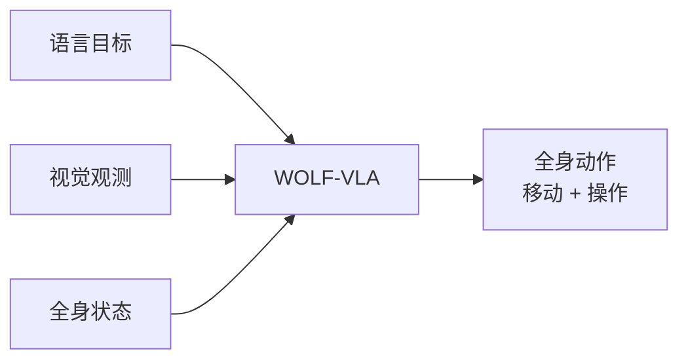

# WOLF-VLA:把 VLA 推向全身人形运动控制

> **arXiv**: [2606.25591](https://arxiv.org/abs/2606.25591) | **时间**: 2026.06 | **路线**: VLA · 人形全身控制
> [← 返回 VLA 总览](/vla/) · [实验机器人本体](robots)

## TL;DR

WOLF-VLA 的重要性在于任务边界:它不是桌面机械臂 VLA,而是面向 **whole-body humanoid** 的语言视觉动作模型。人形机器人不只要伸手抓物,还要移动、保持平衡、协调躯干和上肢,控制问题比 7-DoF 机械臂更硬。

这使它成为 VLA 从 manipulation 扩展到 humanoid loco-manipulation 的候选节点。

## 问题

人形全身 VLA 同时面对三类耦合:

- **移动与操作耦合**:脚步、躯干和手臂必须协同。
- **平衡与接触耦合**:动作不能只追求末端目标,还要保持全身稳定。
- **语义与低层控制耦合**:语言目标需要落到高维全身动作。

桌面 VLA 的 action chunk 思路不能直接解决这些问题。

## 方法位置

本站把它放在 **连续动作 / 人形全身控制** 线,与 [MotionWAM](/wam/papers/motionwam) 形成 VLA/WAM 两种人形移动操作路线的对照。

## 谱系位置

- 与 [GR00T N1](groot-n1):GR00T 是 NVIDIA 工业级人形 VLA 代表;WOLF-VLA 是新近学术候选。
- 与 [MotionWAM](/wam/papers/motionwam):二者都面向 humanoid loco-manipulation,但 MotionWAM 更强调世界-动作模型与视频世界模型特征。
- 与 [实验机器人本体](robots):提示 VLA 谱系必须从单臂/双臂扩到全身本体。

## 局限与待核

- 人形任务结果极易受硬件、低层控制器和安全约束影响,不能只看模型名。
- 若动作空间依赖强低层 MPC/WBC,需要明确 VLA 输出到控制器的接口。
- 预印本自评需要等待代码、视频和更多真实部署细节。

## 来源

- arXiv:[2606.25591](https://arxiv.org/abs/2606.25591).

