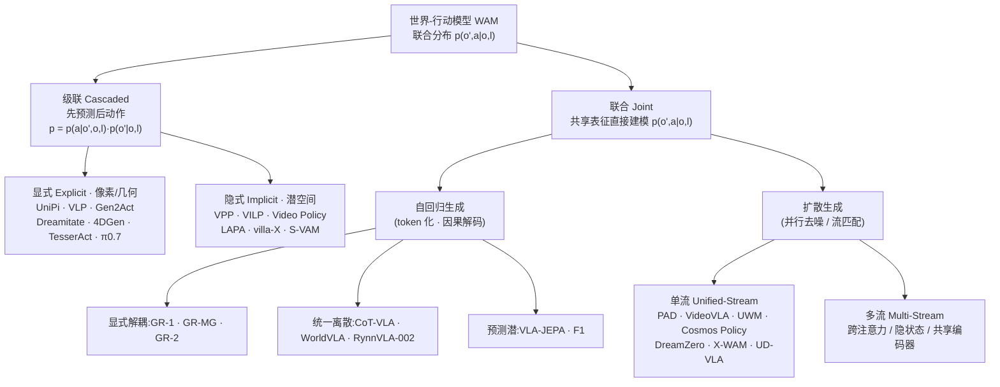

# 世界-行动模型 WAM:联合预测未来状态与动作

> **WAM 调研 · 总览** · 2025–2026 前沿范式 · 联合分布建模(未来状态 + 动作)· 权威源:综述 arXiv:2605.12090(OpenMOSS)
> [← VLA 调研报告](/vla/) · **28 篇细读**(按范式,亦见侧栏):级联·显式 [UniPi](/wam/papers/unipi)·[Gen2Act](/wam/papers/gen2act)·[Veo-Act](/wam/papers/veo-act) ｜ 级联·隐式 [VPP](/wam/papers/vpp)·[LAPA](/wam/papers/lapa)·[DexWorldModel](/wam/papers/dexworldmodel) ｜ 联合·自回归 [GR-1](/wam/papers/gr-1)·[WorldVLA](/wam/papers/worldvla)·[RynnVLA-002](/wam/papers/rynnvla-002) ｜ 联合·扩散 [UWM](/wam/papers/uwm)·[DreamZero](/wam/papers/dreamzero)·[X-WAM](/wam/papers/x-wam)·[LingBot-VA](/wam/papers/lingbot-va)·[τ0-WM](/wam/papers/tau0-wm)·[GR00T N2](/wam/papers/groot-n2)·[LaDi-WM](/wam/papers/ladi-wm)·[WALL-WM](/wam/papers/wall-wm)·[GigaWorld-Policy](/wam/papers/gigaworld-policy)·[WAV](/wam/papers/wav)·[MotuBrain](/wam/papers/motubrain) ｜ 联合·混合 [UVA](/wam/papers/uva)·[FLARE](/wam/papers/flare)·[OA-WAM](/wam/papers/oa-wam)·[HiMem-WAM](/wam/papers/himem-wam) ｜ 基座/平台/仿真 [Cosmos 3](/wam/papers/cosmos3)·[Genie Envisioner](/wam/papers/genie-envisioner)·[GE-Sim 2.0](/wam/papers/ge-sim-2)·[RoboDream](/wam/papers/robodream)

> 本页系统梳理「世界-行动模型」(World Action Models, WAM)这一 2025–2026 前沿范式:它是「统一预测式状态建模与动作生成、对未来状态与动作的**联合分布**建模」的具身基础模型。内容覆盖定义辨析、综述 taxonomy、代表模型细读、数据生态与评测协议,以及 WAM 与本站既有 VLA 谱系的对位关系。可信度体例:⚠️ = 提出方/厂商自评(本页绝大多数定量属此类);✅ = 经基准维护方统一第三方评测(本语料中几乎缺位);**待核** = 一手源未给出、不以外部记忆或常识补全。所标 arXiv 编号均取自语料。

**WAM 谱系总览**(线 = 范式 · 站 = 论文细读,点击进站;横轴为 arXiv 提交年月。VLA 主线的对应谱系图见 [VLA 调研报告](/vla/);逐格横向对比见 [全模型规格对比](/wam/papers/models-spec)):

<LineageMap track="wam" />

## 一、什么是 WAM:定义与辨析

### 1.1 综述给出的定义:从「动作分布」到「状态—动作联合分布」

「世界-行动模型」(World Action Models, WAM)这一术语,其最系统的界定来自 OpenMOSS(复旦系)的权威综述《World Action Models: The Next Frontier in Embodied AI》(arXiv 2605.12090,2026-05-12 提交,14 作者)。该综述自称是「the first systematic account of the WAMs landscape」(首个对 WAM 领域的系统梳理)⚠️。

其逐字定义为:

> "embodied foundation models that unify predictive state modeling with action generation, targeting a joint distribution over future states and actions rather than actions alone."

即:WAM 是一类**统一了「预测式状态建模」与「动作生成」的具身基础模型,其建模目标是「未来状态与动作」的联合分布,而非仅仅动作**。这是 WAM 区别于既有范式的核心命题——它把「世界会如何变化」与「机器人该做什么」放进同一个概率分布里联合求解。

### 1.2 为何现在出现:VLA 反应式映射的局限

综述对 WAM 出现动机的诊断,同样以逐字方式针对既有 VLA(视觉—语言—动作模型):VLA "learn reactive observation-to-action mappings without explicitly modeling how the physical world evolves under intervention"(学到的是反应式的 obs→action 映射,而**不显式建模物理世界在干预之下如何演化**)。

换言之,VLA 把策略压缩为「看到什么就输出什么动作」的直接映射;它没有一个关于「我这么动,世界会变成什么样」的内部模型。WAM 的提出正是要补上这一环:先(显式或隐式地)对未来状态作预测,再让动作从这一预测中产生或与之联合生成。

这一动机判断与 NVIDIA 的辨析互证。NVIDIA glossary 在区分 WAM 与 VLA 时同样指出:VLA "map observations and instructions to actions rather than explicitly modeling spatiotemporal physical dynamics"(把观测与指令映射到动作,而非显式建模时空物理动力学);而 WAM 从大规模视频预训练中继承了时空物理先验。⚠️(此辨析为 NVIDIA 厂商陈述)两处定义在「VLA 缺少显式动力学建模」这一点上一致。

### 1.3 两处一手定义互证:NVIDIA 的工程化表述

NVIDIA glossary 对「World Action Model」的定义为:"a type of AI model for robotics that learns both how the world is likely to change and what actions a robot can take to shape that change"(一类机器人 AI 模型,**同时学习「世界可能如何变化」与「机器人可采取何种动作去塑造这一变化」**),即联合预测未来视觉状态与对应机器人动作。⚠️(厂商定义)

两处定义可相互印证:综述强调「未来状态与动作的联合分布」,NVIDIA 强调「世界如何变化 + 机器人如何塑造变化」——前者是概率建模的语言,后者是工程能力的语言,指向同一对象。

NVIDIA 还补充了一个值得注意的运行机制细节:其 WAM 在运行时 "takes a text instruction and starting observation, predicts a compressed representation of the intended transition, and derives robot commands directly from it, without ever generating full images"(接收文本指令与起始观测,预测目标转移的**压缩表征**,并据此直接导出机器人指令,而**从不生成完整图像**)——即在潜空间想象、不渲染完整像素帧,实现为统一的 "Joint Video-Action Diffusion Transformer (DiT)"。⚠️(NVIDIA 厂商陈述)

> 关于 WAM 与「世界基础模型」的关系,NVIDIA 给出辨析:WAM 是 world foundation model 的「动作使能」(action-enabled)变体;其 Cosmos 提供基础设施,WAM 则将其用于机器人控制。⚠️(厂商辨析)

### 1.4 形式化:三个目标函数 + 级联/联合两种因子分解

综述(§2)用一个统一的概率视角把三种范式区分开($o$ 为当前观测、$l$ 为语言指令、$a$ 为动作、$o'$ 为下一观测):

- **VLA**:只建模动作分布 $\mathcal{L}_{\text{VLA}}=\mathbb{E}_{(o,l,a)}[-\log p(a\mid o,l)]$——反应式 obs→action 映射。
- **世界模型(WM)**:只建模前向动力学 $\mathcal{L}_{\text{WM}}=\mathbb{E}_{(o,a,o')}[-\log p(o'\mid o,a)]$——给定状态与动作预测下一状态,是"状态的概率传播器",本身**不产出可执行动作**。
- **WAM**:建模未来状态与动作的**联合分布** $\mathcal{L}_{\text{WAM}}=\mathbb{E}_{(o,l,o',a)}[-\log p(o',a\mid o,l)]$。

综述给 WAM 立了**两条硬性判据**(必须同时满足):① **前向预测建模**——以某种可量化表征预测环境的物理演化 $o'$(显式像素/视频,或隐式物理潜表征);② **耦合动作生成**——动作 $a$ 必须与所预测的未来状态 $o'$ **对齐**地导出(可为联合概率输出,也可为级联/统一潜架构里的策略条件化)。

据此 WAM 内部按"如何耦合预测与动作"分两支(即下一节 taxonomy 的顶层划分):

- **级联式(Cascaded)**:显式因子分解 $p(o',a\mid o,l)=p(a\mid o',o,l)\,p(o'\mid o,l)$——先合成未来状态、再据此推动作,二者组件分离。
- **联合式(Joint)**:在共享表征里直接建模联合分布 $p(o',a\mid o,l)$,状态预测与动作生成共同优化、不硬解耦。

> **与相邻概念的辨析(综述 §2.2,逐条转述)**:
> - **视频-动作模型(VAM)**:把视频预测与动作对齐;WAM 是更广、**模态无关**的上位集合(视频只是建模世界的一种代理,WAM 也可用单图状态转移、稠密点云、触觉/力等),即 **WAM ⊃ VAM**。
> - **视频策略(Video Policy)**:由"结构血统"定义——用视频生成骨干(如 DiT)抽取时空表征后直接做 obs→action 映射 $p(a\mid o)$,**不要求**对未来作预测承诺;WAM 则**必须**有显式世界建模监督(合成 $o'$ 是推理与输出的显式一环)。
> - **动作世界模型(AWM)**:与 WAM 同构($p(o',a\mid o,l)$),但 "AWM" 的中心词是"世界模型"(把系统看作增强的模拟器),而 "WAM" 把"世界"与"动作"摆成**并列**成分、定位为 VLA 谱系的**直接后继**与完整机器人基础模型——综述用 **WAM = AWM** 标注二者等价(见综述 Fig 3)。

### 1.5 与本站既有内容的接续

本站已有的[预测式 VLA(世界模型作策略)](/vla/papers/predictive-vla)页(覆盖 VPP / DreamVLA / WorldVLA)是 WAM 的一个早期、较窄的切片,而 WAM 是其伞形上位范式。**值得注意的是,这几个模型在综述 Fig 2 里并不同属一支**:**VPP 被归入 Cascaded·隐式(Implicit)**(潜空间规划),**WorldVLA 被归入 Joint·自回归**——即"预测式 VLA"横跨了级联与联合两大分支,正说明它只是 WAM 大图里的若干点,而非一个统一类别。值得对照的是,本站 [RynnVLA](/vla/papers/rynnvla)(RynnVLA-001)用视频生成做「训练先验」、推理时丢弃未来帧——这与 WAM「推理时预演未来再反推动作」恰成对照:**预测当先验** vs **预测当策略主体**。NVIDIA 谱系中的 [GR00T N1](/vla/papers/groot-n1) 与 GR00T N2(后者称「built on a world action model architecture」⚠️)亦属同一脉络。

## 二、范式分类(综述 taxonomy)

综述把已有方法组织为 **Cascaded(级联)** 与 **Joint(联合)** 两大类,再按生成模态(generation modality)、条件机制(conditioning mechanism)、动作解码策略(action decoding strategy)三个轴细分。下面先讲清两大类的分野,再展开 Joint 类的自回归 / 扩散(单流·多流)细分,最后给出贯穿全类的耦合维度辨析。

### 2.1 Cascaded(级联):先预测,后动作

级联式 WAM 把「预测未来」与「生成动作」拆成**分离的组件**,显式因子分解 $p(o',a\mid o,l)=p(a\mid o',o,l)\,p(o'\mid o,l)$:先想象未来、再从想象结果反推指令。组件解耦、各司其职,代价是误差可能沿级联链累积。综述(§4.1)按"未来在什么空间表示"再分两条:

- **显式(Explicit)· 像素/几何级预测**:直接生成未来视频、图像或几何目标(光流、点图、位姿),再用逆动力学或几何抽取(如位姿跟踪 + 逆运动学)得到动作——动作抽取因而**可独立于机器人形态**。代表:UniPi、VLP、Gen2Act、AVDC、Im2Flow2Act、3DFlowAction、NovaFlow、Dreamitate(用工具 6-DoF 位姿作人-机桥接)、4DGen(两视角 RGB-D → 多视角 RGB + 点图)、RIGVid、LVP、TesserAct,以及综述把本站细读的 **π0.7 也归入此格**。本站另收录的 [Veo-Act](/wam/papers/veo-act)(前沿视频模型 Veo-3 作高层规划器 + π0.5 执行)亦按其「先合成未来、再抽动作」机制归入此格(本站归类)。
- **隐式(Implicit)· 潜空间规划**:像素级合成开销大、难实时,故在压缩潜空间预测未来潜序列、不解码回像素。代表:VPP(VAE 潜 + 单步潜预测 + 轻量策略,**首次在该框架做到实时**)、VILP、Video Policy(冻结视频 U-Net + 独立动作 U-Net)、S-VAM、LAPA、villa-X、mimic-video(flow matching + 部分去噪提特征)、MWM(以语义掩码潜替代 RGB,过滤光度噪声)。本站另收录的 [DexWorldModel](/wam/papers/dexworldmodel)(以冻结 DINOv3 特征为生成目标 + O(1) TTT 记忆)亦按其级联潜空间机制归入此格(本站归类)。

> 说明:上表代表作与归类取自综述 Fig 2 与 §4.1;arXiv 编号见文末参考与 Awesome-WAM 清单。同一模型在不同来源的归类可能略有出入,以综述原文为准。

### 2.2 Joint(联合):预测与动作共建一个分布

联合式 WAM 在**单一模型**内把未来状态与动作作为共同监督目标一起训练,直接逼近 $p(o',a\mid o,l)$。综述(§4.2)按"在什么基底上实现联合"分自回归与扩散两支。

#### 2.2.1 Joint · 自回归生成

把世界变量与动作变量**序列化进 token 空间**、用因果(左到右)解码联合建模。核心张力:逐 token 串行带来延迟,且早期视觉幻觉会沿序列**级联**成动作失败。综述按"用什么表征接口"再分三式(代表与规模据综述 Table 2):

| 子式 | 思路 | 代表(主干 / 规模,⚠️ 取自综述 Table 2) |
|---|---|---|
| 显式解耦表征 | 各模态保留异构格式、经独立输出头解码(靠 [ACT]/[OBS] 控制 token 路由) | GR-1(195M)· GR-MG · GR-2(30–719M),GPT 式因果 Transformer |
| 统一离散表征 | 视觉与动作全量化进同一词表、共享 next-token 头 | CoT-VLA(7B,VILA-U)· WorldVLA(7B,Chameleon)· [RynnVLA-002](/wam/papers/rynnvla-002)(综述 Table 2 记 5B、Chameleon+动作头;论文未公布参数量,本站细读标待核) |
| 预测式潜表征 | 不生成显式 token,在抽象连续潜空间自回归 | VLA-JEPA(2B,Qwen3-VL;JEPA 式,future 仅作监督、结构无泄漏)· F1(4.2B,MoT) |

> 注:本站 [RynnVLA-001](/vla/papers/rynnvla) 细读的对象是 RynnVLA;综述 Table 2 列的 **RynnVLA-002** 是其后继(Chameleon + 动作头),本站已有[完整细读](/wam/papers/rynnvla-002)——注意其推理为「解耦查询」:作策略时不 roll out 未来帧,互增强发生在训练期。

#### 2.2.2 Joint · 扩散生成(单流 / 多流)

用多步去噪 / 流匹配**并行**生成未来与动作,绕开自回归的串行瓶颈,利于高频闭环。综述按"预测流如何耦合"分两型(见综述 Fig 6):

- **单流(Unified-Stream)**:世界与动作变量进**同一个 DiT 主干**联合去噪,靠共享注意力同步。再分:
  - **显式未来预测**(未来观测/其潜代理作直接去噪目标):**PAD**(拼接未来图像潜 + 动作 token,可掺无动作网络视频)、**VideoVLA**(CogVideoX-5B 主干、7-DoF)、**[UWM](/wam/papers/uwm)**(给世界与动作各自独立噪声步 → 一套权重可切策略/正向动力学/逆动力学/视频生成)、**Cosmos Policy**(Cosmos-Predict2 主干、潜帧注入 → 同一 checkpoint 兼作策略+世界模型+价值函数、best-of-N 规划)、**[DreamZero](/wam/papers/dreamzero)**、**[GigaWorld-Policy](/wam/papers/gigaworld-policy)**(同 DreamZero 设计但推理只注意历史/当前观测 → 无需在线生成未来视频)、**[X-WAM](/wam/papers/x-wam)**(复制 DiT 末块作交错深度分支 → 显式 RGB-D)、**UD-VLA**(离散扩散 mask-and-predict)。
  - **隐式未来预测**(未来仅作内部对齐约束、不显式生成):**[FLARE](/wam/papers/flare)**(可学习 future token 经 MLP 投影、对齐冻结教师编码的真实未来特征;可单独用于无动作视频)、**FRAPPE**(冻结 RDT 主干 + 多对齐专家,Mixture-of-Prefix-and-LoRA)。
- **多流(Multi-Stream)**:世界与动作分到**不同分支/专家**,经显式耦合交互——综述给出三种(Fig 6):**跨注意力**(CA-Coupled)、**隐状态传递**(Hidden-State,视频 DiT 的隐状态条件化动作 DiT)、**共享编码器**(Shared-Rep,先过统一编码器再各自解码)。蚂蚁灵波 [LingBot-VA](/wam/papers/lingbot-va) 用 Mixture-of-Transformers 把视觉与动作 token 整合进共享潜空间,即属此支(MoT 专家分担,单/多流确切归属待核)。

### 2.3 耦合维度辨析

除 Cascaded / Joint 的顶层划分外,综述还提出三组正交的**耦合维度**,用以刻画「预测」与「动作」如何耦合:

- **Explicit vs Implicit**:动作是被直接生成(显式),还是从潜表征中涌现(隐式)。
- **Pixel-space vs Latent**:模型在像素帧空间预测,还是在学到的中间(潜)表征上预测。X-WAM 批评 UWM 停留在 2D pixel-space ⚠️;NVIDIA glossary 描述其 WAM「预测意图转移的压缩表征并据此直接推导机器人指令,而从不生成完整图像」,即典型的 latent 路线 ⚠️。
- **Geometric vs Learned Extraction**:动作是经由几何对应关系抽取,还是由神经网络学习抽取。

### 2.4 分类树

> 与本站既有内容的位置关系:本站[预测式 VLA](/vla/papers/predictive-vla)页覆盖的 VPP / DreamVLA / WorldVLA 在本 taxonomy 中**并不同属一支**——综述 Fig 2 把 **VPP 归入 Cascaded·隐式**、**WorldVLA 归入 Joint·自回归**;可见"预测式 VLA"是横跨级联与联合的若干早期点,WAM 才是统摄它们的伞形范式。[RynnVLA](/vla/papers/rynnvla)把视频生成当「训练先验」、推理时丢弃未来帧,与 WAM「推理时预演未来再反推动作」恰成对照(其后继 RynnVLA-002 已进入综述 Joint·自回归)。NVIDIA 谱系的 [GR00T N1](/vla/papers/groot-n1) 与更早的 GR-1 同属一脉。

## 三、代表模型细读

下面逐一深读五个具有代表性的世界-行动模型(WAM)。需提醒读者:本节几乎全部定量指标均来自论文/厂商自评(标 ⚠️),尚未经基准维护方的统一第三方评测;语料未给出的事实一律写「待核」,不以外部记忆补全。

### 3.1 DreamZero(arXiv 2602.15922) · [完整细读 →](/wam/papers/dreamzero)

**论文题为《World Action Models are Zero-shot Policies》** —— 标题本身即是一种主张:把 WAM 直接当作零样本策略来用,而非仅作训练先验。这与本站 [RynnVLA](/vla/papers/rynnvla) 形成关键对照:RynnVLA 用视频生成做训练先验、推理时丢弃未来帧;DreamZero 则把「预演未来再反推动作」放在推理主回路里(即「预测当策略主体」)。

- **定位**:建于预训练视频扩散主干(pretrained video diffusion backbone)之上、联合建模 video+action 的零样本策略。提交于 2026-02-17,36 作者(lead Seonghyeon Ye),机构未在摘要列出(待核)。
- **机制要点**:在 WAM taxonomy 中,DreamZero 属 Joint 类扩散生成谱系(与本站 [预测式 VLA](/vla/papers/predictive-vla) 页所覆盖的 Joint 类工作同属一脉,但 DreamZero 不在该页收录范围内);其核心是从视频扩散先验迁移到动作生成,并辅以模型与系统级优化以达成实时闭环。
- **关键数字**(均为作者自评 ⚠️):
  - 真机实验中对新任务/新环境泛化 **">2x improvement"** 优于 SOTA VLA ⚠️
  - 通过模型与系统优化,使 **"14B autoregressive video diffusion model"** 实现 **"real-time closed-loop control at 7Hz"** ⚠️
  - 跨本体:仅用其他机器人或人类的 video-only 示范、**10–20 分钟**数据,unseen 任务 **">42% relative improvement"** ⚠️
  - few-shot 本体适配:仅 **"30 minutes of play data"** 即可迁移到新本体并保留 zero-shot 泛化 ⚠️

### 3.2 X-WAM(arXiv 2604.26694) · [完整细读 →](/wam/papers/x-wam)

- **定位**:《Unified 4D World Action Modeling from Video Priors with Asynchronous Denoising》。统一的 4D 世界模型,在单一框架内同时支撑「实时机器人动作执行」与「高保真 4D 世界合成(video+3D 重建)」。v1 2026-04-29 / v2 2026-05-07;作者 Jun Guo, Qiwei Li, Peiyan Li, Zilong Chen, Nan Sun, Yifei Su, Heyun Wang, Yuan Zhang, Xinghang Li, Huaping Liu(机构未在摘要明列,疑为刘华平组、清华系——待核确认)。
- **机制要点**:
  - 指出先前 unified world model(如 UWM,见 3.3)只建模 2D pixel-space,无法兼顾动作效率与世界建模质量;X-WAM 通过预测 **multi-view RGB-D videos** 来想象未来。
  - 轻量结构适配:复制预训练 DiT 末尾几个 block 成专用深度预测分支。
  - 提出 **Asynchronous Noise Sampling(ANS)**:推理时异步去噪调度——动作用更少步数快速解码以实时执行、视频用完整步数保高保真;训练时从联合分布采样以对齐推理分布。
- **关键数字**(作者自评 ⚠️):
  - 预训练于 **"over 5,800 hours of robotic data"** ⚠️
  - RoboCasa **"79.2%"**、RoboTwin 2.0 **"90.7%"** 平均成功率 ⚠️(RoboCasa 见本站 [数据集与基准](/vla/papers/benchmarks))
  - 4D 重建/生成在视觉与几何指标上「超越现有方法」(具体数值待核)

### 3.3 UWM(arXiv 2504.02792) · [完整细读 →](/wam/papers/uwm)

- **定位**:Unified World Models(RSS 2025),通过耦合 video 与 action 扩散(Coupling Video and Action Diffusion),在大规模机器人数据上做预训练。属 Joint 类扩散生成早期代表。
- **机制要点**:联合建模视频与动作的扩散过程,用于大规模机器人数据预训练;X-WAM 将其作为对照基线,指其**仅建模 2D pixel-space**,因而在动作效率与世界建模质量之间难以兼顾(此为 X-WAM 作者陈述 ⚠️)。
- **关键数字**:语料未给出 UWM 的具体成功率/数据规模等定量指标(**待核**)。其余技术细节待核。

### 3.4 Genie Envisioner(智元 AgiBot) · [完整细读 →](/wam/papers/genie-envisioner)

- **定位**:智元 AgiBot 的统一「世界基础平台」(arXiv:2508.05635,2025-08),把策略学习/评估/仿真整合进单一视频生成框架;与本站 [GO-1](/vla/papers/go-1)(同为智元)同机构。称其为 **"industry's first action-driven world model"** ⚠️。
- **机制要点**:三件套——GE-Base(指令条件化视频扩散底座)/ GE-Act(轻量 flow-matching 解码器出动作轨迹)/ GE-Sim(动作条件神经仿真器,其 2.0 版本本站已有[细读](/wam/papers/ge-sim-2))。Genie Envisioner 2.0 标志其向交互式「world simulator」演进(The Robot Report 报道;2.0 细节待核)。
- **关键数字**(厂商自评 ⚠️):GE-Base 训练于 ~3,000 小时 / >100 万 episodes(AgiBot-World-Beta);GE-Act 在商用 GPU 上 200ms 内生成 54 步力矩轨迹;跨本体迁移仅需 1 小时遥操作示范。

### 3.5 NVIDIA GR00T N2 · [完整细读 →](/wam/papers/groot-n2)

- **定位**:NVIDIA 预览的下一代机器人基础模型,**"based on DreamZero research"、"built on a new world action model architecture"** ⚠️。务必区分:GR00T **N1/N1.5/N1.7 是 VLA**(本站已细读 [GR00T N1](/vla/papers/groot-n1)),**N2 才是 WAM 架构**;N2「计划年底前可用」,撰写时尚未完全释出(待核)。NVIDIA 对 WAM 的术语定义为 "a type of AI model for robotics that learns both how the world is likely to change and what actions a robot can take to shape that change"。
- **机制要点**(以下为 NVIDIA glossary 对 WAM 通用机制的陈述,GR00T 2 即构建于该架构):
  - 在大规模视频(含互联网视频与第一视角人类视频)上预训练,习得物理/运动先验。
  - 运行时「takes a text instruction and starting observation, predicts a compressed representation of the intended transition, and derives robot commands directly from it, without ever generating full images」—— 即潜空间想象、不生成完整图像,实现为统一的 **Joint Video-Action Diffusion Transformer(DiT)**。
  - 可解释性:可检视预测帧以定位失败。
- **关键数字 / 能力**(均为厂商陈述 ⚠️):
  - 称在 **MolmoSpaces** 与 **RoboArena** 基准排名第一 ⚠️
  - 对未见任务 zero-shot(如解鞋带、熨烫等)⚠️
  - 人→机迁移仅需 **10–20 分钟**无动作标签视频 ⚠️
  - 跨本体仅需 **30 分钟 play data** ⚠️
  - (注:NVIDIA 体系内 Cosmos 为 world foundation models,提供物理 AI 基础设施;WAM 是其「动作使能」变体,将基础设施用于机器人控制。)

> 横向小结:DreamZero 与 NVIDIA GR00T 2 在「人→机 10–20 分钟」「跨本体 30 分钟 play data」上给出高度一致的数字口径(均 ⚠️),反映 WAM 阵营对「视频先验降低本体迁移成本」的共同主张;而 X-WAM 的差异化在于把世界建模升到 4D(multi-view RGB-D)并用 ANS 解耦动作与视频的去噪步数。所有对比成功率与泛化倍数均为自评,尚待统一第三方评测核验。

## 四、数据生态与评测协议

WAM 的训练数据与评测方式,都直接由它「联合建模未来状态与动作」这一目标所牵引。这一节先看四类数据来源如何对应到本站 [具身数据全景](/vla/papers/embodied-data),再看综述提出的三维评测协议与传统成功率评测的区别。

### 4.1 四类数据来源

综述(§5)将 WAM 的数据生态归为四类,各有典型数据集(下列示例取自综述 Fig 2 的数据 roadmap):

| 数据来源 | 特点 | 综述列举的代表数据集 |
|---|---|---|
| 机器人遥操作 | 动作标签完整、状态同步,可直接监督动作分支 | OXE、RT-1、BridgeData v2、DROID、RH20T、RoboMIND、AgiBot World、DexCap |
| 便携人类示范(UMI 式) | 可规模化、in-the-wild,需域迁移/重定向 | UMI、FastUMI / FastUMI-100K、DexUMI、UMI on Legs、RDT2 |
| 仿真 | 标签完美、含特权信息、可程序化多样化 | ManiSkill2、RoboCasa、RoboTwin / RoboTwin 2.0、SynGrasp-1B、DexMimicGen |
| 互联网级 / 第一视角人类视频 | 规模最大、被动世界动态先验,但无动作标签 | Ego4D、HowTo100M、EPIC-KITCHENS、Ego-Exo4D、EgoDex、SSv2 |

NVIDIA 词条与此呼应——其 WAM 在「大规模视频(含互联网视频与第一视角人类视频)」上预训练以习得物理/运动先验 ⚠️(NVIDIA 为厂商陈述)。

这四类与本站 [具身数据全景](/vla/papers/embodied-data) 所梳理的来源(遥操作/人类示范/仿真/第一视角视频)一一对应。值得注意的是它们对 WAM 的价值梯度并不相同:

- **遥操作数据**带完整动作标签,是动作解码分支可直接监督的来源;X-WAM(arXiv 2604.26694)即预训练于「超过 5,800 小时机器人数据」。⚠️
- **互联网级第一视角视频与便携人类示范**通常缺少机器人动作标签,但正是 WAM 区别于传统 VLA 的关键养料——它让模型从「世界如何演化」中继承时空物理先验,而非只学反应式 obs→action 映射。综述对 VLA 的批评(学到反应式映射、不显式建模世界在干预下如何演化)正是从数据侧得到回答。
- 这一点在旗舰模型的跨本体/人→机迁移能力上体现得最直接:DreamZero(arXiv 2602.15922)称仅用其他机器人或人类的 **video-only 示范、10–20 分钟数据**,在 unseen 任务上获 ">42% relative improvement";NVIDIA 同样称人→机迁移仅需「10–20 分钟无动作标签视频」、跨本体仅需「30 分钟 play data」。⚠️(均为作者/厂商自评)

换言之,WAM 把「无动作标签的视频」从 VLA 时代的边角料,提升为可直接驱动泛化的一等数据源——这是数据生态层面相对 VLA 的范式转移。

### 4.2 评测三维:从「成功率」到「过程可信度」

综述提出的评测协议是三维的:**视觉保真(visual fidelity)、物理常识(physical commonsense)、动作合理性(action plausibility)**。这与传统操作策略只看任务**成功率(success rate)**形成结构性区别。

二者的差异源于建模对象的不同。传统 VLA 输出动作,评测自然只问「任务是否完成」,这是一个对最终结果的单点判定。而 WAM 联合建模「未来状态 + 动作」,它在推理时会先预演未来(NVIDIA 称之为潜空间想象、不生成完整图像;X-WAM 则预测 multi-view RGB-D videos 来想象未来),再从中反推动作。因此对 WAM 的评测必须同时审视它**想象出的世界**与它**导出的动作**:

- **视觉保真**——预测的未来帧/视频是否清晰、可信;
- **物理常识**——预测出的演化是否符合物理规律(物体不会穿模、力学关系合理);
- **动作合理性**——从预测状态导出的动作是否可执行、合乎意图。

这正是 WAM 的「可解释性」主张的评测落点:NVIDIA 称可通过检视预测帧来定位失败⚠️——这一诊断方式在纯成功率评测下根本无从谈起,因为成功率只给出 0/1 结果而不暴露过程。

需要强调:三维评测与成功率并非互斥,而是互补。旗舰模型仍在传统成功率基准上报告结果,以与 SOTA VLA 可比。X-WAM 在 [数据集与基准](/vla/papers/benchmarks) 收录的 **RoboCasa 报 79.2%**、在 RoboTwin 2.0 报 90.7% 平均成功率⚠️;同时它声称 4D 重建/生成在视觉与几何指标上超越现有方法⚠️——后者正对应「视觉保真/物理常识」一维,是传统成功率无法覆盖的部分。可以说,WAM 的完整评测 = 成功率(动作端结果)+ 三维协议(世界想象端的过程质量)。

综述 Fig 2 为每一维列出了具体评测手段(本身多为视频生成 / 世界模型领域已有基准,被借来评 WAM 的"世界想象"质量):

- **视觉保真**:PSNR、SSIM、LPIPS、DreamSim、DINO、FVD(Fréchet Video Distance)——标准视频生成保真指标。
- **物理常识**:VideoPhy、PhyGenBench、VBench-2.0、WorldModelBench、Physics-IQ、WorldScore、EWMBench——专测"预测是否守物理"。
- **动作合理性**:WorldSimBench 等——测预测里"可执行的信息含量"。
- **动作策略(成功率,与 VLA 可比)**:综述同时罗列 LIBERO、CALVIN、RoboCasa、ManiSkill2、SimplerEnv、RoboTwin、HumanoidBench、HomeRobot、RoboArena 等数十个基准(双臂/人形、移动操作、接触与形变、真机榜各成一组)。

> 需强调:综述将这些"世界想象"指标与传统成功率**并列**,正因为它指出当前协议**仍缺**直接评估"世界预测与动作生成之间因果对齐"的统一方法(见 §5.2 开放挑战)。本站 [数据集与基准](/vla/papers/benchmarks) 目前以成功率为主轴;上述视觉/物理类指标如何落到具体模型上,各家口径不一,**待核**。

> 对照阅读:本站 [预测式 VLA](/vla/papers/predictive-vla)(VPP / DreamVLA / WorldVLA)在评测上多沿用成功率口径,而它们在综述 taxonomy 中横跨级联与联合(VPP 属 Cascaded·隐式、WorldVLA 属 Joint·自回归)——三维评测协议正是 WAM 伞形范式对这些早期点提出的更高要求。另见 [RynnVLA](/vla/papers/rynnvla):它把视频生成仅当作训练先验、推理时丢弃未来帧,因而天然落在「成功率」一维里,与 WAM「预演未来再反推动作、需审视想象质量」的评测诉求形成鲜明对照。

## 五、与本站内容的关系 + 开放挑战 + 判断

### 5.1 WAM 与本站既有谱系的对位

WAM 不是凭空出现的范式,本站此前已分散记录了它的若干早期切片与同谱系工作。把它们放回综述(arXiv 2605.12090,OpenMOSS)给出的 Cascaded / Joint 二分法里,关系就清晰了:

| 本站既有页 | 在 WAM taxonomy 中的位置 | 关键对照 |
| --- | --- | --- |
| [预测式 VLA](/vla/papers/predictive-vla)(VPP / DreamVLA / WorldVLA) | **横跨两支**:VPP 属 Cascaded·隐式、WorldVLA 属 Joint·自回归(综述 Fig 2) | 是 WAM 的狭窄前身,WAM 是其上位伞形范式 |
| [RynnVLA](/vla/papers/rynnvla) | 预测当**训练先验**,推理时丢弃未来帧 | 与 WAM「预测当**策略主体**」形成关键对照 |
| [GR00T N1](/vla/papers/groot-n1)(NVIDIA) | 与 NVIDIA GR00T N2(称建于 WAM 架构 ⚠️)同谱系;GR-1 是更早工作 | 同一技术血脉的不同世代 |
| [GO-1](/vla/papers/go-1)(智元 AgiBot) | 与 Genie Envisioner(同为智元)同机构 | 同机构对 WAM 的产业化尝试 |

**预测式 VLA 是 WAM 的早期/狭窄切片,且横跨两支。** 本站[预测式 VLA](/vla/papers/predictive-vla)页覆盖的 VPP / DreamVLA / WorldVLA,在综述 Fig 2 里并不属同一类:**VPP 落在 Cascaded·隐式**(VAE 潜 + 单步潜预测 + 轻量策略),**WorldVLA 落在 Joint·自回归**(Chameleon 基 MLLM,与 CoT-VLA 同组)。这恰恰说明「预测式 VLA」不是一个统一类别,而是 WAM 大图里散落的若干点;WAM 才是上位概念,它把 Cascaded(显式/隐式)与各类 Joint(自回归/扩散)一并纳入,并按生成模态、条件机制、动作解码策略细分。

**RynnVLA 与 WAM 是同一技术(视频生成)的两种用法,方向相反。** 本站 [RynnVLA-001](/vla/papers/rynnvla)用视频生成做训练先验,但在推理时丢弃未来帧——预测只是塑造表征的脚手架。而 WAM 综述对范式的定义恰恰相反:它要求「未来状态与动作」的**联合分布**(joint distribution over future states and actions),典型 WAM(如 NVIDIA glossary 描述的运行机制、DreamZero、X-WAM)在推理时先「想象/预演」未来转移、再据此反推动作。这构成一条清晰的分界线:**预测当先验(RynnVLA)** vs **预测当策略主体(WAM)**。RynnVLA 因此更像一座桥,既不是纯反应式 VLA,也未走到推理期主动预演那一步。

**GR00T / GR-1 谱系与智元谱系。** NVIDIA GR00T N2 被描述为「built on a world action model architecture」(⚠️ 厂商陈述),与本站 [GR00T N1](/vla/papers/groot-n1)同属 NVIDIA 谱系,而 GR-1(2312.13139,ICLR 2024)是该谱系中更早的 Joint·自回归工作。智元一侧,本站 [GO-1](/vla/papers/go-1)与 Genie Envisioner / Genie Envisioner 2.0 同出智元 AgiBot;后者据 The Robot Report 报道标志着从「world action model」向完全交互的「world simulator」演进(技术细节、论文编号待核)。

### 5.2 开放挑战

综述与旗舰论文的自评(均为 ⚠️ 提出方陈述)暴露出几条尚未闭合的难题:

- **推理成本与实时性。** 让生成式世界模型跑进闭环控制是核心瓶颈。DreamZero 需通过模型与系统优化,才把一个「14B autoregressive video diffusion model」压到 7Hz 实时闭环 ⚠️;X-WAM 则提出 Asynchronous Noise Sampling(ANS)——动作用更少去噪步数快速解码以实时执行、视频用完整步数保高保真 ⚠️。两条路径都说明:不专门优化,生成式 WAM 难以满足控制频率。NVIDIA glossary 描述的「潜空间想象、不生成完整图像」也是为绕开逐帧生成的开销 ⚠️。

- **评测标准化。** 综述给出的评测协议是三维的——视觉保真(visual fidelity)、物理常识(physical commonsense)、动作合理性(action plausibility)——但这三者如何统一打分、跨工作可比,语料未给出定论(待核)。当前各家在不同基准上自报成绩(X-WAM 报 RoboCasa 79.2% / RoboTwin 2.0 90.7% ⚠️;NVIDIA 称 GR00T 2 在 MolmoSpaces、RoboArena 排名第一 ⚠️),语料中未见由基准维护方做的统一第三方评测(本语料中绝大多数定量为 ⚠️,经第三方核验的 ✅ 几乎缺位)。

- **物理合理性与几何一致。** 综述对 VLA 的批评是其「不显式建模世界在干预下如何演化」。WAM 要补的正是这一课,但只在 2D 像素空间建模并不够:X-WAM 直指先前 unified world model(如 UWM,arXiv 2504.02792)只建模 2D pixel-space,无法兼顾动作效率与世界建模质量,因此转向预测 multi-view RGB-D、做 4D 世界合成(video+3D 重建)⚠️。像素级保真与几何级一致能否同时达成,仍是开放问题。

- **长程组合泛化。** 旗舰模型的强项目前集中在「新任务/新环境/新本体」的零样本与少样本迁移(DreamZero 称新任务/环境 >2x、跨本体 video-only >42% 相对提升、30 分钟 play data 适配新本体 ⚠️),但这些多是短程技能层面的泛化。更长程、需要多步组合规划的任务表现,综述指为开放问题(待核)。

综述 §7 还另外点出几条(以下为综述论点的转述,非定量):

- **多模态超越 RGB。** 当前 WAM「压倒性地以 RGB 为中心」,而精细操作需要力、触觉、本体感知等模态的融合——如何把这些非视觉信号纳入"世界预测"仍待解(综述结合 OmniVTA 等视-触工作讨论)。
- **数据配比设计。** 如何把"人类视频预训练"桥接到"精确的机器人动作条件化",即异构数据(遥操作/人类/仿真/网络视频)的混合配方,是把规模转化为可控性的关键。
- **评测方法学的缺口。** 综述明确指出当前**缺少**评估"世界预测与动作生成之间因果对齐"的指标与协议——视觉保真高 ≠ 动作合理,二者需被联合验证(这也是上面"评测标准化"的更深层版本)。
- **安全。** 基于模型的预测能力要求**前置的验证流水线**(proactive verification),以免错误的"想象"直接驱动真机动作。

### 5.3 判断:取代还是融合

基于现有(且多为厂商/作者自评的)证据,克制的判断是:**WAM 更可能是 VLA 的扩展与吸收,而非简单取代。**

- 从范式定义看,WAM 并不抛弃动作生成,而是在其上**叠加**预测式状态建模——综述的措辞是「rather than actions alone」(而非仅动作),NVIDIA 也把 WAM 称作 world foundation model 的「动作使能」变体(⚠️ 厂商陈述)。这是「加法」而非「替换」。
- 从谱系演化看,本站记录的 WorldVLA(Joint·自回归)、GR-1→GR00T N2、RynnVLA→RynnVLA-002(视频先验)显示,业界是在 VLA 的既有骨架上逐步引入世界建模能力,而非另起炉灶。WAM 像是给 VLA「补上世界模型这一课」后的自然延续。
- 真正的不确定性在于**推理期是否值得预演未来**:若实时性(DreamZero 7Hz、X-WAM ANS 等工程手段 ⚠️)能稳定压住生成开销,且预测带来的泛化收益(零样本、跨本体)被第三方统一评测证实(目前为 ⚠️,尚待 ✅),则推理期主动想象的 WAM 路线将占优;否则 RynnVLA 式「预测仅作训练先验、推理走轻量策略」的折中可能在工程上更划算。

一句话:就语料证据而言,WAM 是 VLA 的伞形上位范式与能力补全,二者大概率走向融合;「取代」的说法尚无经核查的基准证据支撑(待核)。

## 参考文献

体例声明:⚠️ 标注的指标均为提出方/厂商自评,尚未经基准维护方统一第三方评测;**待核**表示一手源在本语料中未给出、不以外部记忆或常识补全。

- 综述(本页主干来源,**已读全文**):《World Action Models: The Next Frontier in Embodied AI》,arXiv **2605.12090**,2026-05-12;复旦大学 Institute of Trustworthy Embodied AI / OpenMOSS、上海创智学院(Shanghai Innovation Institute)、新加坡国立(NUS)合作,14 作者(Siyin Wang 等,Yu-Gang Jiang 通讯)。本页的形式化定义(§2 三个目标函数 + 级联/联合因子分解)、WAM vs VAM/Video Policy/AWM 辨析(§2.2)、Cascaded(显式/隐式)与 Joint(自回归三式 / 扩散单流·多流)taxonomy(§4、Fig 2、Table 2、Fig 6)、四类数据生态(§5)、三维评测与开放挑战(§6–7)均据此。
- DreamZero:《World Action Models are Zero-shot Policies》,arXiv **2602.15922**(2026-02-17,36 作者,lead Seonghyeon Ye)。
- X-WAM:《Unified 4D World Action Modeling from Video Priors with Asynchronous Denoising》,arXiv **2604.26694**(v1 2026-04-29 / v2 2026-05-07)。
- UWM:Unified World Models《Coupling Video and Action Diffusion》,arXiv **2504.02792**(RSS 2025)。
- NVIDIA glossary "World Action Model" 词条:WAM 厂商定义、运行机制(压缩转移表征、不生成完整图像、Joint Video-Action DiT)、与 Cosmos / world foundation model 的辨析、GR00T N2 架构及 MolmoSpaces/RoboArena 排名等陈述(均 ⚠️ 厂商陈述)。
- Awesome-WAM(OpenMOSS 同组维护清单):本页各代表模型 arXiv 编号与 Cascaded/Joint 归类来源,含 UniPi、VLP(2310.10625)、Gen2Act(2409.16283)、Dreamitate(2406.16862)、4DGen(2507.01099)、LV-P(2512.15840)、GR-1(2312.13139)、WorldVLA(2506.21539)、CoT-VLA(2503.22020)、PAD(2411.18179)、VideoVLA(2512.06963)、Motus(2512.13030)、MotuBrain(2604.27792)等。
- AGIBOT(智元)Genie Envisioner 相关报道(含 The Robot Report 对 Genie Envisioner 2.0 由「world action model」向「world simulator」演进的报道):「industry's first action-driven world model」陈述来源(⚠️;技术细节、论文编号待核)。

参见:[预测式 VLA](/vla/papers/predictive-vla)、[RynnVLA](/vla/papers/rynnvla)、[GR00T N1](/vla/papers/groot-n1)、[GO-1](/vla/papers/go-1)、[具身数据全景](/vla/papers/embodied-data)、[数据集与基准](/vla/papers/benchmarks)、[主报告](/vla/)。