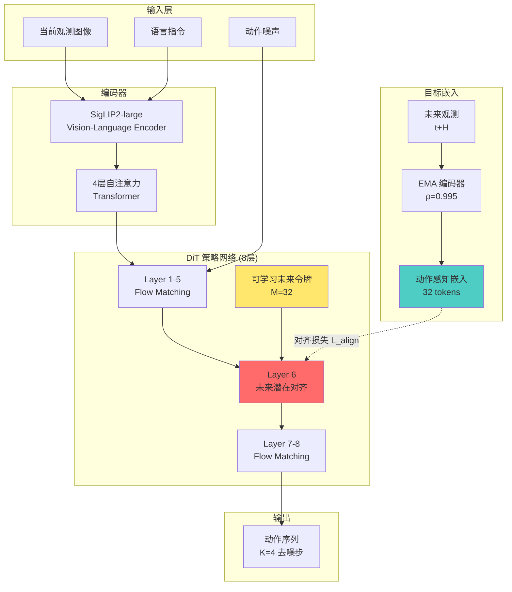
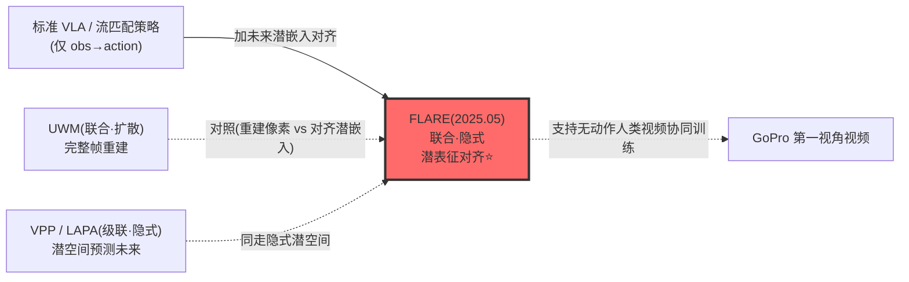

# FLARE:未来潜表征对齐,轻量隐式世界建模

> **arXiv**: [2505.15659](https://arxiv.org/abs/2505.15659)(2025-05)
> **机构**: NVIDIA GEAR / University of Maryland / UT Austin
> **作者**: Ruijie Zheng, Jan Kautz, Scott Reed, Furong Huang, Yuke Zhu, Linxi Fan 等
> **路线**: 联合 · 隐式(扩散策略特征对齐未来观测潜嵌入)
> **项目主页**: <https://arxiv.org/abs/2505.15659>

> [← 返回 WAM 总览](../index.md)

## TL;DR

FLARE 是 NVIDIA GEAR 团队提出的一种联合隐式世界模型方法,核心创新在于将扩散策略网络的内部特征与**未来观测的潜在嵌入**对齐,而非传统方法中的当前观测对齐。这种设计使模型能够在动作生成过程中隐式推理未来状态,从而增强长期规划能力。方法通过可学习的未来查询令牌(future tokens)实现流匹配(flow-matching)和对齐两条独立流的交互,仅需在标准 VLA 模型中添加少量令牌即可集成,架构开销极小。

在实验验证方面,FLARE 在 RoboCasa 24 任务基准上达到 70.1% 成功率,相比基线提升最高 26%;在 GR1 24 任务基准上达到 55.0%,超越训练 5 倍步数的 UWM 基线。真实 GR1 人形机器人实验中,FLARE 达到 95.1% 成功率,比基线高 14%,展现出更好的物体规避能力。方法还支持**无动作标签的人类第一视角视频协同训练**,仅用 1 条机器人轨迹配合 150 条人类 GoPro 演示,在新物体上达到 60% 成功率,10 条轨迹时提升至 80%,显著降低对专家机器人数据的依赖。

技术实现上,FLARE 使用 SigLIP2-large 作为视觉-语言编码器,配合 Diffusion Transformer (DiT) 策略骨干网络。动作感知嵌入模型通过 Q-former 结构和 32 个可学习查询令牌生成,端到端训练时附加 8 层 DiT 块以产生动作条件化的 VL 嵌入。未来潜在对齐应用于 8 层 DiT 的第 6 层,损失函数结合流匹配损失和对齐损失(λ=0.2)。预训练使用约 3,000 小时多模态数据(GR-1、DROID、RT-1、Bridge-v2 等),256 张 H100 GPU 训练 15 万步,多任务微调使用 32 张 H100 训练 8 万步。消融实验证明对齐损失贡献 11.1% 成功率提升,动作感知嵌入相比通用 VL 模型提升 5.4%,EMA 系数 ρ=0.995 为最优配置。

> ⚠️ **可信度提示**:本页全部定量(RoboCasa 70.1%、GR1 55.0%、真机 GR1 95.1%、人类视频协同 60–80%、各消融增益等)均为**作者自评**,基于 NVIDIA 自有/合作评测,**无第三方独立复现**;模型为 arXiv 预印本(2025-05),尚未见会议正式发表。引用请连同自评属性与基准口径保留。

> 📌 与本站 [UWM](uwm.md) 直接对照:UWM 用**完整帧重建**预测未来,FLARE 主张只在**潜空间对齐未来嵌入**(不重建像素)以保持轻量;论文称 GR1 上以更少训练步超过 UWM 基线。隐式潜空间预测的思路亦与 [VPP](vpp.md)、[LAPA](lapa.md) 相通。

## 1. 要解决的问题

传统视觉-语言-动作(VLA)模型主要关注当前观测到动作的映射,缺乏对未来状态的显式推理能力,限制了长期规划和复杂任务执行。现有世界模型方法(如 UWM)通过完整帧重建预测未来,但计算开销大且难以集成到高频机器人控制中。此外,机器人专家演示数据获取成本高,如何利用丰富的人类视频数据(如第一视角 GoPro 录像)进行协同训练,是提升泛化能力的关键挑战。

FLARE 提出通过**未来潜在表征对齐**解决上述问题:在扩散策略网络内部对齐紧凑的未来观测嵌入,而非重建完整像素,既保留长期推理能力又保持轻量架构。通过仅使用对齐损失(无需动作标签),方法支持人类视频协同训练,显著降低对机器人演示的依赖。

## 2. 方法与架构

### 核心设计

FLARE 在标准流匹配策略(flow-matching policy)基础上引入未来潜在对齐机制:

1. **动作感知嵌入模型**: 使用 SigLIP2-large 视觉-语言编码器,配合 Q-former 结构和 M=32 个可学习查询令牌,端到端训练时附加 8 层 DiT 块,生成动作条件化的紧凑嵌入(相比原始 256 个令牌压缩至 32 个)
2. **未来潜在对齐**: 在 DiT 策略网络第 6 层(共 8 层)应用对齐损失,将去噪网络隐藏状态与未来观测嵌入对齐,使用 EMA 目标网络(ρ=0.995)稳定训练
3. **可学习未来令牌**: 引入独立的令牌流用于对齐,通过自注意力机制与流匹配流交互,避免大规模架构修改
4. **联合训练**: 损失函数 L = L_fm + λ·L_align,其中 λ=0.2 平衡流匹配和对齐目标

### 架构图

### 训练流程

**嵌入预训练阶段**:
- 硬件: 256 张 H100 GPU
- 批次大小: 8192
- 训练步数: 150,000
- 优化器: AdamW (β1=0.95, β2=0.999, ε=1e-8)
- 学习率: 余弦衰减,0.05 预热比例
- 权重衰减: 1e-5

**多任务 FLARE 训练**:
- 硬件: 32 张 H100 GPU
- 批次大小: 1024
- 训练步数: 80,000
- EMA 更新率: ρ=0.995

**数据集** (总计约 2,989.5 小时 / 169.5M 帧):
- GR-1 in-house: 88.4 小时
- GR-1 Simulation: 1,742.6 小时
- DROID: 428.3 小时
- RT-1: 338.4 小时
- Language Table: 195.7 小时
- Bridge-v2: 111.1 小时
- RoboSet: 78.9 小时
- MUTEX: 5.0 小时
- Plex: 1.1 小时

**待核**: 论文摘要声明约 2,000 小时预训练数据,但表 3 统计总计 2,989.5 小时,存在内部不一致。

## 3. 关键设计与创新点

1. **未来潜在对齐**: 首次将扩散策略内部特征与未来观测潜在嵌入对齐(而非当前观测),使模型在动作生成中隐式推理长期后果
2. **可学习未来令牌**: 通过独立令牌流实现流匹配和对齐的解耦,仅需自注意力交互即可集成,架构修改最小化
3. **动作感知嵌入模型**: Q-former + 8 层 DiT 端到端训练生成动作条件化 VL 嵌入,相比通用模型提升 5.4% 成功率
4. **无动作标签视频协同训练**: 支持仅用对齐损失从人类第一视角视频学习,1 条机器人轨迹配合人类演示即可泛化到新物体
5. **轻量集成**: 仅添加少量令牌到标准 VLA 模型,适用于高频机器人控制场景

## 4. 实验与关键结果

### RoboCasa 基准 (24 任务) 自评

| 方法 | 成功率 (%) | 提升 |
|------|-----------|------|
| **FLARE** | **70.1** | - |
| Policy Only | 61.9 | +8.2 |
| UWM | 60.8 | +9.3 |
| GR00T N1 (Scratch) | 60.6 | +9.5 |
| Diffusion Policy | 51.7 | +18.4 |

**说明**: FLARE 相比最强基线提升 8.2%,相比 Diffusion Policy 提升最高 26%。

### GR1 基准 (24 任务) 自评

| 方法 | 成功率 (%) | 训练步数 | 提升 |
|------|-----------|---------|------|
| **FLARE** | **55.0** | 80k | - |
| GR00T N1 (Scratch) | 45.1 | 80k | +9.9 |
| Policy Only | 44.0 | 80k | +11.0 |
| Diffusion Policy | 40.9 | 80k | +14.1 |
| UWM | 29.5 | 400k (5x) | +25.5 |

**说明**: UWM 训练 5 倍步数(400k)仍低于 FLARE 25.5%;报告最后 5 个检查点的最大值。

### 真实 GR1 人形机器人 自评

| 方法 | 成功率 (%) | 提升 |
|------|-----------|------|
| **FLARE** | **95.1** | - |
| Baseline | ~81.0 | +14.1 |

**说明**: FLARE 能够绕过物体操作,基线倾向于碰倒物体。

### 人类第一视角视频协同训练 自评

| 场景 | FLARE 成功率 (%) | 基线成功率 (%) | 提升 |
|------|-----------------|---------------|------|
| 1 条机器人轨迹/物体 + 150 条人类 GoPro 演示 | **60** | ~30 | +30 |
| 10 条机器人轨迹 + 人类视频 | **80** | ~40 | +40 |

**说明**: 5 个新物体测试,部分成功(抓取但未放置)计 0.5 分;显著降低对机器人演示依赖。

### 跨具身预训练嵌入 自评

| 嵌入类型 | 成功率 (%) |
|---------|-----------|
| **跨具身预训练嵌入** | **71.3** |
| 领域特定嵌入 | 70.2 |

**说明**: 1000 条轨迹训练,跨具身嵌入略优于领域特定嵌入。

### 后训练少样本适应 自评

| 场景 | 成功率提升 (%) |
|------|---------------|
| RoboCasa 后训练 (100 条轨迹/任务) | **~10** |

### 消融实验 自评

| 配置 | 成功率 (%) | 相对完整模型 |
|------|-----------|-------------|
| **FLARE 完整** | **55.0** | - |
| 无 FLARE 损失 | 43.9 | -11.1 |
| SigLIP2 (256 tokens) | 49.6 | -5.4 |
| SigLIP2 平均池化 (64 tokens) | 50.9 | -4.1 |
| EMA ρ=0.99 | ~50.0 | -5.0 |

**说明**: 对齐损失贡献 11.1%,动作感知嵌入贡献 5.4%,EMA ρ=0.995 为最优配置(ρ=1.0 仍优于基线但不如 0.995)。

## 5. 在 WAM 谱系中的位置

FLARE 属于 **联合(Joint)· 隐式** 类别:在扩散策略网络内部对齐紧凑的**未来观测潜在嵌入**,而非重建完整像素或使用独立世界模型。

**定位说明**:
- **联合 · 隐式**:策略网络与世界建模联合训练、共享表征,但世界建模以「对齐未来潜嵌入」的隐式形式存在。
- **区别于 [UWM](uwm.md)**:UWM 重建完整像素帧,FLARE 只对齐未来观测的**压缩表征**,架构开销小、可更少训练步达到更优(论文称 GR1 上超训练 5× 步的 UWM)。
- **与 [VPP](vpp.md)/[LAPA](lapa.md) 相通**:都在潜空间处理未来预测,但 VPP/LAPA 偏级联(先预测潜未来、再出动作),FLARE 把对齐嵌进扩散策略内部、联合优化。
- 符合 WAM 双判据:① 前向预测(对齐未来观测潜嵌入)② 耦合动作(流匹配动作流与对齐流交互)。

## 6. 局限与存疑

1. **任务范围受限**: 聚焦于真实人形机器人的抓取-放置操作,限于受控桌面场景,未涉及精细灵巧操作
2. **依赖专家演示**: 训练需要专家演示数据,未来需探索减少对专家数据的依赖
3. **人类视频数据局限**: 第一视角视频协同训练限于头戴 GoPro 数据,未扩展到自然环境数据集
4. **缺乏强化学习验证**: 无强化学习实验,方法在模仿学习之外的扩展性不明确
5. **数据量不一致**: 论文摘要声明约 2,000 小时预训练数据,但表 3 统计总计 2,989.5 小时,存在内部矛盾(本页正文采信 ~3,000 小时口径并就地标注)
6. **参数量未明确**: 论文未明确说明完整模型参数量,仅描述 SigLIP2-large 骨干和 DiT 结构(**待核**)

## 来源

- **论文**: FLARE: Robot Learning with Implicit World Modeling. [arXiv:2505.15659](https://arxiv.org/abs/2505.15659)(2025-05)
- **项目页**: <https://research.nvidia.com/labs/gear/flare>
- **代码 / 权重**: 待核(论文未明确提供)
- **机构**: NVIDIA GEAR / University of Maryland / UT Austin

> 说明:本页定量(RoboCasa 70.1%、真机 GR1 95.1%、消融增益等)为**作者自评**,无第三方复现;模型总参数量、更大规模人类视频数据表现、RL 场景有效性一手未给处标「待核」。引用请连同自评属性保留。
