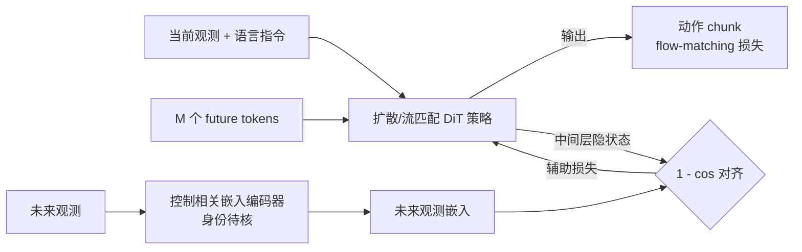

# FLARE 细读

> **WAM 论文细读** · 用未来潜表征对齐(Future LAtent REpresentation alignment)作为隐式世界建模辅助目标,轻量地强化扩散/流匹配策略 · arXiv:2505.15659
> [← WAM 总览](/wam/) · [主报告](/vla/)

## TL;DR

FLARE(**F**uture **LA**tent **RE**presentation alignment,论文正题为 *Robot Learning with Implicit World Modeling*)出自 NVIDIA GEAR 等机构(Ruijie Zheng 等,作者署名含 Jan Kautz、Yuke Zhu、Linxi Fan)。其核心主张:不去显式重建未来图像帧,而是把 **「预测未来观测的潜表征」** 作为一项 **辅助对齐目标**,塞进一个扩散 / 流匹配的 VLA 策略里——具体做法是给标准 VLA 加上少量 **可学习的 future tokens**,让动作去噪网络的隐状态去 **对齐未来观测的嵌入(embedding)**,从而让策略在生成动作时「隐式地」推理长期后果。

它最吸引人的两点:一是 **极其轻量**——作者称只需对标准 VLA 做最小架构改动(加几个 token),无需任何逐帧像素重建;二是 **解锁无动作视频学习**——因为对齐目标只需要「未来观测」而不需要动作标签,人类第一人称(ego-view)视频也能拿来共训。作者(自评 ⚠️)报告在两个多任务仿真模仿学习基准上达到 SOTA,较既有策略学习基线 **最多提升约 26%**。下文凡一手源(摘要 / arXiv / 项目页)未交叉确认的实现细节与数字,一律标 **待核**,不以外部记忆补全。

## 一、定位与动机

把「世界建模」接进机器人策略,常见做法是让模型显式预测未来——典型如 **video diffusion / 像素级未来帧预测**(本站谱系里 [VPP](vpp)、[UWM](uwm) 等都走重建路线)。但显式重建有两个代价:像素空间信息密度低、且为生成无关于控制的纹理细节耗费大量算力与容量;同时它通常要求对主干做较重的改造。

FLARE 的回应是把世界建模 **降维到潜空间、并降格为辅助损失**:策略不必「画出」未来,只需在隐状态里 **预测未来观测的一个紧凑表征**,并令其与某个目标嵌入对齐。这样既保留了「让策略意识到自身动作如何改变世界」的世界模型先验,又避免了重建开销——作者称这是一种 **implicit(隐式)世界建模**。

在本站 WAM taxonomy 中,FLARE 被归入 **联合·混合 / 「未来潜表征对齐·隐式」**:它不像级联式「先预测未来、再据此出动作」,而是在 **同一个动作去噪网络内部**,以并行的对齐目标把未来信号注入策略表征——介于纯模仿与显式世界模型之间的折中路线。

## 二、方法与架构

以下据摘要、arXiv 与 NVIDIA 项目页;凡仅见于 HTML 正文、未被摘要/项目页交叉确认者,均显式标 **待核**。

- **future tokens(未来 token)**:在标准 VLA 的输入序列中加入 **M 个可学习的 future token 嵌入**,与状态、动作 token 一并送入扩散 transformer(DiT)处理。M 的取值、token 的具体插入位置等 **待核**。
- **对齐目标(隐式世界建模)**:让这些 future token 对应的 **DiT 中间层隐状态**,去对齐 **未来观测的嵌入**;对齐以 **余弦相似度**(以 `1 − cosine_similarity` 作损失)实现。HTML 正文称默认取第 6 层(共 8 层)做对齐——此「layer 6 / 8」细节仅见正文,**待核**。
- **双目标联合训练**:整体损失 = **常规动作流匹配损失(action flow-matching)** + **未来潜表征对齐损失**。前者保证动作生成质量,后者注入世界模型先验。作者称两者协同提升了性能。
- **目标嵌入来自何处**:这是理解 FLARE 的关键问。一手项目页只笼统说目标是「一个专门捕捉与机器人控制相关信息的嵌入模型,预训练于跨本体 / 任务 / 环境的多样机器人数据」;HTML 正文进一步写为「SigLIP-2 视觉/文本编码器 + Q-former 压缩到 32 token 的紧凑视觉-语言嵌入」。**该编码器的确切身份(SigLIP-2 / Q-former / 32 token)仅见正文,待核**——但可确定的是:**它不是 DINOv2/ViT 这类冻结通用视觉特征**,而是一个为策略学习定制、面向「控制相关信息」的嵌入。

> 一句话直觉:FLARE = 流匹配 VLA + 「猜未来观测长什么样(在嵌入空间)」的辅助作业。猜得准 → 策略表征里隐含了动力学先验 → 动作更有前瞻性。

*示意图(自绘,据论文描述,非原图)*

## 三、关键设计 / 创新

1. **潜空间对齐取代像素重建**:相比 video-prediction 式世界模型,FLARE 在 **嵌入空间** 对齐未来,省去逐帧生成,作者称由此实现「轻量 + 高效」的隐式世界建模。
2. **近零架构改动**:仅向既有 VLA 加少量 future token + 一个对齐头,即可挂载到 **扩散或流匹配** 策略上,迁移成本低。
3. **辅助损失而非新任务头**:世界建模以 **auxiliary loss** 形式存在,不改变策略的动作输出接口,推理时可不引入额外开销(推理期开销情况 **待核**)。
4. **解锁无动作视频共训**:因对齐只需「未来观测」而无需动作标签,**人类 ego-view 视频**(无动作标注)可仅靠对齐损失参与训练,把人类演示中的动力学信息注入策略——这是 FLARE 区别于纯模仿的关键能力。

## 四、实验与结果

> ⚠️ 以下均为 **作者自评 / 自报**;凡未被摘要或 NVIDIA 项目页交叉确认的具体数值,标 **待核**,不编造。

- **基准**:两个多任务模仿学习仿真基准——**RoboCasa**(单臂、模拟厨房,**24 个 atomic 任务**)与 **GR-1 tabletop**(人形桌面操作,**24 个任务**;HTML 正文分解为 18 物体重排 + 6 关节物体,该拆分 **待核**)。两者合计约 48 任务。
- **总体增益** ⚠️:摘要称在上述多任务基准上达 SOTA,较既有策略学习基线 **最多提升约 26%**。
- **逐项对照** ⚠️ **待核**:HTML 正文给出 RoboCasa pick-and-place 上 FLARE 53.2% vs Diffusion Policy 29.2%(约 +24 个百分点)——此对照仅见正文,**待核**;所对比的基线全集与口径 **待核**。
- **泛化到新物体 + 人类视频共训** ⚠️:项目页称在新物体上,**仅 1 条机器人示范** 配合人类 ego-view 视频可达约 **60% 成功率**,**10 条机器人示范** + 人类视频进一步到约 **80%**。各设置的物体数、人类视频条数等细节 **待核**(不同来源数字略有出入)。
- **真机** ⚠️ **待核**:项目页提及真机 GR-1 人形操作(若干任务、每任务百条轨迹)取得高成功率(具体数值 **待核**)。
- **工程落地**:FLARE 被并入 **NVIDIA GR00T N1.5**——在其流匹配损失之外加上 Future LAtent Representation Alignment,据称既提升策略表现、又解锁从人类视频学习的能力(厂商陈述 ⚠️)。

## 五、局限与待核

- **目标编码器身份不确定**:产生「未来观测嵌入」的编码器,一手项目页只给了功能性描述;SigLIP-2 / Q-former / 32 token、对齐层「6/8」、future token 数 M 等均 **仅见 HTML 正文,待核**。这些恰是复现的核心超参。
- **数字口径分散**:总体「26%」来自摘要,而 53.2/29.2、60%/80% 等分别来自正文与项目页,彼此设置不完全可比;严格复现需回到论文表格逐一核对(**待核**)。
- **基线全集未在一手摘要列明**:摘要仅言「prior policy learning baselines」,具体对比对象(如各类 diffusion/flow policy、显式世界模型法)需查正文(**待核**)。
- **隐式 vs 显式世界建模的边界**:FLARE 主张「无需重建」即可获益,但其潜表征究竟编码了多少真实动力学(相对显式 video-prediction 路线),论文层面属经验性结论,机制性证据 **待核**。
- **推理期成本与可迁移性**:future token 在推理时是否引入额外开销、对齐目标对不同主干(非 DiT)的普适性,均 **待核**。

## 六、在 WAM 谱系中的位置

- **对照「显式重建」路线**:[VPP](vpp)(以视频预测表征驱动策略)、[UWM](uwm)(统一 transformer 内联合 video+action 双扩散)走的是显式未来建模;FLARE 反其道,**只在嵌入空间对齐未来、不重建像素**,是「隐式世界建模」的代表性轻量方案。
- **对照「无动作视频学习」同好**:[UWM](uwm) 借独立扩散时间步、[LAPA](lapa) 借隐动作(latent action)从无动作视频学习;FLARE 则借 **对齐损失不需要动作标签** 这一性质,直接让人类 ego-view 视频参与共训——三者目标相近、机制各异。
- **与 WorldVLA / 级联式的差异**:[WorldVLA](worldvla) 等把世界模型与动作模型更显式地耦合;FLARE 把世界建模降为 **辅助对齐目标**,不改动作输出接口,耦合更轻。
- **工程谱系**:FLARE 已落到 NVIDIA GR00T 线上——与本站对 [GR00T N2](groot-n2) 的世代分析互为参照(N1.5 在 VLA 框架内挂 FLARE 作辅助目标;N2 则被官方表述为整体转向 WAM 架构)。可视作 GR00T 从「VLA + 隐式世界建模辅助」走向「WAM 架构」过渡期的一个关键技术点。
- **谱系一句话**:FLARE 是把「世界模型」做成 **可即插的潜空间辅助损失** 的代表——介于纯模仿([GR-1](gr-1) 等)与显式世界模型之间,以最小代价换取前瞻性与无动作视频可用性。

## 来源

- <https://arxiv.org/abs/2505.15659>
- NVIDIA GEAR 项目页:<https://research.nvidia.com/labs/gear/flare/>(交叉核对用,非主源)
