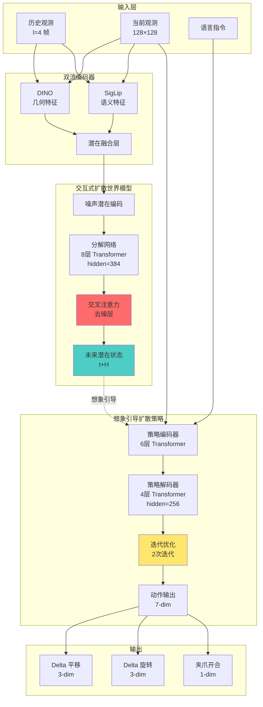
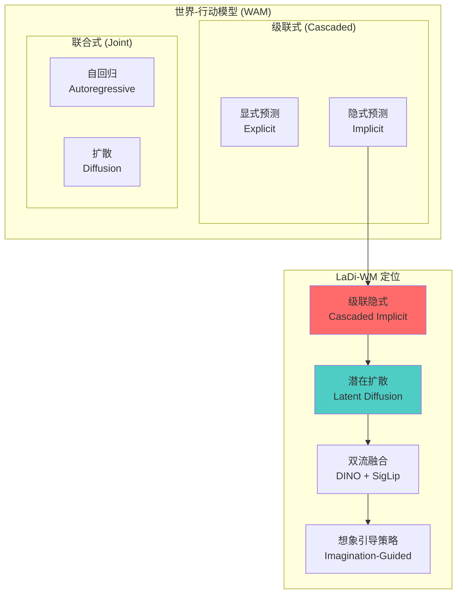

# LaDi-WM:潜扩散世界模型,想象引导动作精炼

> **arXiv**: [2505.11528](https://arxiv.org/abs/2505.11528)(2025-05,**CoRL 2025**)
> **机构**: 国防科技大学 / 北京大学 / 深圳大学 / 湘江实验室
> **作者**: Yuhang Huang, Jiazhao Zhang, Shilong Zou, Xinwang Liu, Ruizhen Hu, Kai Xu
> **路线**: 级联 · 隐式(潜空间扩散预测未来 + 想象引导扩散策略)
> **项目主页**: <https://arxiv.org/abs/2505.11528>

> [← 返回 WAM 总览](../index.md)

## TL;DR

LaDi-WM 是一个级联隐式世界模型,核心创新在于将世界建模从像素空间转移到潜空间,通过**交互式扩散过程**(interactive diffusion process)从噪声 DINO/SigLip 编码中分解出干净的潜在组件,并使用交叉注意力机制对齐几何与语义两条潜在分布。方法采用双流设计:DINO 提供几何特征,SigLip 提供语义特征,在统一潜空间中融合后预测未来状态演化。策略端引入**想象引导的扩散策略**(imagination-guided diffusion policy),通过迭代利用预测的未来状态逐步优化动作分布,实现闭环动作细化。

在实验验证方面,LaDi-WM 在 LIBERO-LONG(10 demos)上达到 68.7% 成功率(自评 ⚠️),相比 Seer 的 53.6% 提升 27.9%;完整数据下达到 90.7%,超越 Seer 的 87.7% 和 OpenVLA 的 54.0%。CALVIN D-D 跨场景迁移实验中平均完成 3.63 步任务链(自评 ⚠️),超越 Seer 的 3.60 步;LIBERO→CALVIN 跨域迁移达到 3.05 步。真实机器人实验中平均成功率 60.0%(自评 ⚠️),比 vanilla BC 的 40.0% 提升 20 个百分点。消融实验显示交互式扩散贡献 8.6% 成功率提升,潜空间建模相比像素扩散提升 14.7%,迭代优化在 2 次迭代时收敛至峰值性能。

技术实现上,世界模型使用 8 层 transformer 分解网络(隐藏维度 384)配合交叉注意力去噪层,策略网络为 6 层编码器 + 4 层解码器的 transformer(隐藏维度 256),使用 ADM 扩散算法和 MSE 损失训练。输入图像分辨率 128×128,patch 大小 14×14,历史长度 4 帧,7 维动作空间(平移/旋转/夹爪)。世界模型在单张 NVIDIA 4090 上训练约 3 天(批次大小 4),策略模型训练约 6 小时(批次大小 24)。世界模型在 LIBERO-90 数据集上预训练,从未见过策略学习任务,体现了跨任务泛化能力。

> ⚠️ **可信度提示**:本页全部定量(LIBERO-LONG 68.7%/90.7%、CALVIN 3.63 步、真机 60%、各消融增益等)均为**作者自评**(CoRL 2025 同行评审,但真机/迁移数字非独立第三方复现)。引用请连同自评属性与基准口径(尤其 demos 数与对照模型)保留。

> 📌 LaDi-WM 是典型的**级联·隐式** WAM(先在潜空间预测未来、再据此精炼动作),与本站 [VPP](vpp.md)(潜空间预测未来视觉表征)、[LAPA](lapa.md)(潜动作预训练)同支;区别于联合式的 [UWM](uwm.md)/[FLARE](flare.md)(预测与动作在共享表征里联合优化)。

## 1. 要解决的问题

传统世界模型方法主要在像素空间预测未来帧,面临三大挑战:

1. **像素级预测的计算开销**:完整图像重建需要大量计算资源,限制了模型规模和训练效率
2. **视觉基础模型对齐困难**:像素空间预测难以直接利用预训练视觉基础模型(如 DINO、CLIP)的强大表征能力
3. **几何与语义信息解耦不足**:现有方法通常使用单一特征流,难以同时捕捉物体几何结构和语义理解

LaDi-WM 提出通过**潜空间世界建模**解决上述问题:在 DINO(几何)和 SigLip(语义)的潜在表征空间中预测未来状态演化,而非重建完整像素。通过交互式扩散过程对齐两条潜在分布,既保留了视觉基础模型的先验知识,又显著降低了计算成本。策略端引入想象引导机制,利用预测的未来状态迭代优化动作,实现闭环细化。

## 2. 方法与架构

### 核心设计

LaDi-WM 采用级联隐式架构,分为世界模型和策略模型两个阶段:

1. **双流潜在编码器**: 使用 DINO(几何特征)和 SigLip(语义特征)两个视觉基础模型并行提取特征,在统一潜空间中融合
2. **交互式扩散世界模型**: 通过 8 层 transformer 分解网络从噪声编码中提取干净潜在组件,使用交叉注意力层实现几何与语义潜在分布的交互对齐
3. **想象引导的扩散策略**: 6 层编码器 + 4 层解码器的 transformer,接收当前观测和预测的未来潜在状态,通过迭代优化逐步降低动作分布熵
4. **闭环迭代细化**: 策略推理时进行多次迭代(实验显示 2 次迭代最优),每次利用更新的未来状态预测优化动作输出

### 架构图

### 训练流程

**世界模型训练**:
- 硬件: 单张 NVIDIA 4090 GPU
- 批次大小: 4
- 训练时长: 约 3 天
- 数据集: LIBERO-90(90 个短时域任务)
- 损失函数: 扩散去噪损失(ADM 算法)

**策略模型训练**:
- 硬件: 单张 NVIDIA 4090 GPU
- 批次大小: 24
- 训练时长: 约 6 小时
- 损失函数: MSE 损失
- 关键设置: 世界模型从未见过策略学习任务,体现跨任务泛化

**数据配置**:
- 图像分辨率: 128×128
- Patch 大小: 14×14
- 历史长度: l=4 帧
- 动作空间: 7 维(delta 平移 3-dim + delta 旋转 3-dim + 夹爪开合 1-dim)
- CALVIN 训练: 在一半任务(push/move/open/place)上训练,在其余任务上评测
- 真实机器人: 每任务 10 条演示,从仿真微调

## 3. 关键设计与创新点

1. **交互式扩散过程**: 从噪声 DINO/SigLip 编码中分解干净潜在组件,通过交叉注意力实现几何与语义潜在分布对齐,这是首次在世界模型中显式建模双流交互
2. **双流潜在表征**: 融合 DINO 几何特征和 SigLip 语义特征于统一潜空间,与视觉基础模型对齐,继承其预训练先验
3. **想象引导的扩散策略**: 迭代利用预测的未来状态优化动作输出,逐步降低动作分布熵,实现闭环动作细化
4. **潜空间世界建模**: 预测未来潜在状态演化而非像素级图像,显著提升可学习性和泛化性,消融实验显示相比像素扩散提升 14.7%
5. **级联隐式架构**: 结合世界模型预测与扩散策略,实现闭环动作优化,区别于联合建模或显式像素预测方法

## 4. 实验与关键结果

以下全部为**论文作者自评 ⚠️**,尚无第三方统一评测。

### LIBERO-LONG 基准(10 demos)

| 方法 | 平均成功率(%) | 备注 |
|---|---|---|
| **LaDi-WM(自评 ⚠️)** | **68.7** | 相比 Seer 提升 27.9% |
| Seer | 53.6 | 当前 SOTA |
| ATM | 44.0 | - |
| TDMPC2 | 37.0 | - |
| DreamerV3 | 33.5 | - |

**完整数据对比**:
| 方法 | 平均成功率(%) |
|---|---|
| **LaDi-WM(自评 ⚠️)** | **90.7** |
| Seer | 87.7 |
| OpenVLA | 54.0 |

### CALVIN 基准

| 方法 | D-D 平均长度(步) | 备注 |
|---|---|---|
| **LaDi-WM(自评 ⚠️)** | **3.63** | 训练于 LIBERO |
| Seer | 3.60 | - |
| ATM | 2.98 | - |
| DreamerV3 | 2.51 | - |
| Vanilla BC | 2.44 | - |
| **LaDi-WM 跨域迁移(自评 ⚠️)** | **3.05** | LIBERO→CALVIN |

### 真实机器人实验

| 方法 | 平均成功率(%) | 提升 |
|---|---|---|
| **LaDi-WM(自评 ⚠️)** | **60.0** | +20% vs BC |
| Pixel diffusion | 51.4 | - |
| Without diffusion | 49.3 | - |
| Vanilla BC | 40.0 | 基线 |

### 消融实验

**世界模型架构组件**(LIBERO-LONG):

| 配置 | 成功率(%) | 损失 |
|---|---|---|
| **完整模型(自评 ⚠️)** | **60.7** | - |
| 无交互式扩散 | 58.9 | -1.8% |
| 无干净交互 | 56.7 | -4.0% |
| 无 SigLip | 57.3 | -3.4% |
| 无扩散 | 52.1 | -8.6% |
| Copy 模型基线 | 40.2 | -20.5% |

**迭代优化次数**(LIBERO-LONG):

| 迭代次数 | 成功率(%) | 备注 |
|---|---|---|
| 0 | 40.8 | 无迭代优化 |
| 1 | 60.7 | - |
| **2(自评 ⚠️)** | **68.7** | 最优配置 |
| 3 | 67.9 | 开始下降 |
| 4 | 68.2 | - |

**潜空间 vs 像素空间**(LIBERO-LONG):

| 方法 | 成功率(%) | 提升 |
|---|---|---|
| **潜空间扩散(自评 ⚠️)** | **68.7** | +14.7% |
| 像素空间扩散 | 54.0 | 基线 |

**状态表征类型**(LIBERO-LONG):

| 状态类型 | 成功率(%) | 提升 |
|---|---|---|
| **关节状态(自评 ⚠️)** | **60.7** | +9.0% |
| 末端执行器状态 | 51.7 | 基线 |

**想象帧数量**: 峰值在 6 帧,去噪在 2 步收敛(自评 ⚠️)

## 5. 在 WAM 谱系中的位置

LaDi-WM 在 WAM taxonomy 中的定位:

**分类特征**:
- **级联隐式**: 世界模型与策略分阶段训练,世界模型预测潜在状态而非显式像素
- **潜在扩散**: 在 DINO/SigLip 潜空间中进行扩散建模,而非像素空间
- **双流架构**: 几何(DINO)与语义(SigLip)特征并行提取后融合
- **想象引导**: 策略推理时迭代利用预测的未来状态优化动作

**与其他 WAM 方法对比**:
- vs [DreamZero](dreamzero.md)/[GR00T N2](groot-n2.md)(**联合式**): LaDi-WM 世界模型与策略分阶段训练(级联),DreamZero 联合建模 video+action
- vs [UWM](uwm.md)(**联合·扩散**): LaDi-WM 在潜空间预测未来状态,UWM 在统一 transformer 内耦合视频+动作扩散
- vs Seer(级联基线): LaDi-WM 用扩散 + DINO/SigLip 双流,Seer 用单流 transformer

## 6. 局限与存疑

- **训练规模有限(待核)**: 作者承认训练规模有限,计划增加更多数据以提升性能;当前数据集规模与多样性相比大规模 VLA(如 OpenVLA)仍有差距
- **长时域预测误差累积**: 长时域预测存在复合误差累积问题,时间一致性随预测步数增加而退化;论文未给出长程闭环稳定性分析(待核)
- **缺乏显式记忆机制**: 无显式时间一致性记忆机制,作者提出作为未来工作方向
- **评测范围局限**: 评测限于操作任务(LIBERO、CALVIN),对其他领域(导航、移动操作)的泛化能力不明确
- **真实世界实验规模小**: 真实机器人实验规模有限,对多样真实场景的可扩展性未充分验证
- **参数规模未明确(待核)**: 论文给出各组件层数和隐藏维度,但总参数量未明确声明
- **代码未释出(待核)**: GitHub 链接标注为「forthcoming」,撰写时尚未公开;项目页面与预训练权重均未提供
- **全部成绩为作者自评 ⚠️**: 所有基准数字均出自论文作者,尚无第三方统一评测或基准维护方交叉验证

## 来源

- 论文:LaDi-WM: A Latent Diffusion-based World Model for Predictive Manipulation. CoRL 2025. [arXiv:2505.11528](https://arxiv.org/abs/2505.11528)。作者:Yuhang Huang, Jiazhao Zhang, Shilong Zou, Xinwang Liu, Ruizhen Hu, Kai Xu。
- 代码仓库(待释出):<https://github.com/GuHuangAI/LaDiWM>

> 体例声明:本页所有定量成绩为论文作者自评(标 ⚠️),尚无基准维护方或第三方统一评测(故不使用 ✅);标「待核」者为一手源未给出或未释出。
