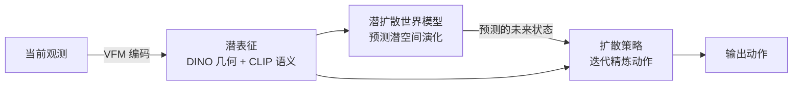

# LaDi-WM 细读

> **WAM 论文细读** · 在 VFM 对齐的潜空间用扩散预测未来表征以指导策略 · arXiv:2505.11528
> [← WAM 总览](/wam/) · [主报告](/vla/)

## TL;DR

LaDi-WM(Latent Diffusion-based World Model)的核心主张是:与其让世界模型在 **像素级** 上预测机器人-物体交互的未来视觉状态(摘要明指这「依然是个公认难题」,尤其难以得到高质量的像素级表征),不如把预测搬到 **潜空间(latent space)**——用 **扩散建模(diffusion modeling)** 预测未来状态在潜空间中的演化。这个潜空间不是临时学来的,而是 **对齐到预训练视觉基础模型(Visual Foundation Models, VFMs)** 的成熟潜空间,由两部分构成:**几何特征(DINO-based)** 与 **语义特征(CLIP-based)**。作者的关键经验发现(⚠️ 自评)是:**预测潜空间的演化,比直接预测像素图像更易学、也更具泛化性**。在 LaDi-WM 之上,作者进一步设计了一个 **扩散策略(diffusion policy)**:它把世界模型 **预测出的未来状态(forecasted states)** 纳入,**迭代式地精炼输出动作**,从而生成更一致、更准确的结果。仿真与真机基准上,作者报告 LaDi-WM 在 **LIBERO-LONG** 上把策略性能提升 **27.9%**、真机场景提升 **20%**(均 ⚠️ 作者自评),并称世界模型与策略在真机实验中展现出可观的泛化性。论文为 **CoRL 2025**。

## 一、定位与动机

LaDi-WM 切入的是近来在具身智能社区颇受关注的 **预测式操作(predictive manipulation)**:其潜力在于——利用「预测出来的状态」来改进机器人策略的表现。

但摘要点明了横在路上的难题:**要从世界模型生成准确的、机器人-物体交互的未来视觉状态,本身就难**,尤其是要达到 **高质量的像素级表征**。LaDi-WM 的回应是绕开像素这一关——既然像素级生成又难又未必必要,那就把预测目标换成 **潜空间中的状态演化**,而且是借力已经训练好、表征质量有保证的 **VFM 潜空间**(几何上用 DINO、语义上用 CLIP),让世界模型只需学「表征如何随时间演化」,而非「逐像素重建画面」。

在本站 WAM taxonomy 中,LaDi-WM 属 **扩散类**,且其鲜明特征是 **在潜/表征空间(而非像素空间)做世界预测**——预测出的未来表征再回馈给策略。这一「潜空间预测 + 预测态指导策略」的取径,使它区别于在 2D 像素空间生成未来帧的世界模型。

## 二、方法与架构

LaDi-WM 的方法可拆为三个要点(均据摘要逐字,不外推实现细节):

- **预测对象:VFM 对齐潜空间中的未来表征。** LaDi-WM 是一个「predicts the latent space of future states using diffusion modeling」的世界模型。它所用的潜空间 **对齐到预训练 VFM**,并 **同时包含几何特征(DINO-based)与语义特征(CLIP-based)** 两类——即用扩散去建模这一复合潜表征 **随时间的演化**,而不是去重建像素帧。
- **核心发现:潜空间演化比像素更易学、更泛化。** 作者明确陈述其经验观察——「predicting the evolution of the latent space is easier to learn and more generalizable than directly predicting pixel-level images」。这是支撑「为何选潜空间」的关键论据(⚠️ 作者自评,见下文待核)。
- **下游:用预测态迭代精炼动作的扩散策略。** 在 LaDi-WM 之上,作者设计了一个 **扩散策略**:它 **纳入被预测的未来状态(forecasted states)**,对输出动作做 **迭代式精炼(iteratively refines output actions)**,从而得到 **更一致、更准确** 的动作。也就是说,世界模型与策略并非各自为政——世界模型的预测被显式喂回策略,作为动作精炼的条件。

> 摘要未给出网络规模、扩散步数、潜空间维度、DINO/CLIP 特征的融合方式、策略与世界模型的耦合训练目标等实现细节,这些一律 **待核**,不以外部记忆补全。下图为「潜空间预测 + 预测态回馈策略」这一信息流的示意,仅据摘要文字勾勒。

*示意图(自绘,据论文描述,非原图)*

## 三、关键设计 / 创新

- **把世界预测从像素搬到 VFM 潜空间。** 这是 LaDi-WM 最核心的设计抉择:不追求像素级未来帧,而是预测「对齐 VFM 的复合潜表征」的演化,以规避高质量像素生成之难。
- **几何 × 语义的双特征潜空间。** 潜空间显式由 **DINO(几何)+ CLIP(语义)** 两类特征构成,而非单一表征——兼顾「物体在哪/几何结构」与「物体是什么/语义」。
- **预测态闭环回策略:迭代精炼。** 世界模型的 **预测态被纳入扩散策略**,以 **迭代精炼** 动作,使预测与决策形成闭环,而不仅把世界模型当离线生成器。

## 四、实验与结果

<⚠️ 自评 / 待核>

以下定量结论均为 **作者自评(⚠️)**;摘要给出了两个具体提升幅度,但 **未见基准维护方的统一第三方评测** 交叉验证,对比口径(相对何种基线、绝对成功率)在摘要层面亦未完全展开,故标 ⚠️ 与「待核」。

- **LIBERO-LONG 提升 27.9%** ⚠️:作者称在 LIBERO-LONG 基准上,LaDi-WM **显著提升策略性能 27.9%**。相对基线、绝对成功率口径 **待核**。
- **真机场景提升 20%** ⚠️:作者称在 real-world 场景下提升 **20%**。具体任务集、对比口径 **待核**。
- **真机泛化性** ⚠️:作者称世界模型与策略在真机实验中展现「impressive generalizability」。其量化口径与边界条件 **待核**。
- **覆盖范围**:实验在 **合成(synthetic)与真机(real-world)** 两类基准上进行(据摘要)。各基准的任务数、采集规模等细节 **待核**。

## 五、局限与待核

- **关键发现为经验性自评。** 「潜空间演化比像素更易学、更泛化」是作者的经验观察(⚠️),摘要未给出消融的量化对比口径;该结论在何种任务/分布下成立,**待核**。
- **定量证据有限、缺第三方评测。** 27.9% 与 20% 两个数字均为作者自评(⚠️),相对基线与绝对水平的完整口径在摘要中未尽,亦未见统一第三方评测交叉验证(待核)。
- **实现细节缺位。** 潜空间维度、DINO/CLIP 特征如何融合、扩散世界模型与扩散策略的耦合训练目标、扩散步数与采样策略、迭代精炼的具体迭代次数等,摘要层面均 **待核**,不以外部记忆补全。
- **依赖外部 VFM 的边界未述。** 方法构建于预训练 VFM(DINO/CLIP)之上,其表征对某些操作场景(如细粒度接触、遮挡、新物体)的覆盖与失败模式,摘要未讨论(待核)。

## 六、在 WAM 谱系中的位置

- **扩散类,但在潜空间预测。** LaDi-WM 与 [UWM](uwm) 同属 **扩散** 路线;但 UWM 在 **2D 像素空间** 耦合 video/action 扩散,而 LaDi-WM 把预测移到 **VFM 对齐的潜空间**——这组对照恰好刻画「扩散 WAM」内部「像素空间 vs. 表征/潜空间」的分野。
- **与 VPP 对读:同走「表征预测」。** [VPP](vpp) 亦主张预测 **视觉表征** 以指导策略;LaDi-WM 可与之对照——两者都不在像素上较劲,而以「预测出的表征」喂给下游策略,区别在表征来源(VFM 潜空间 vs. 视频扩散先验)与预测建模方式。
- **与 WorldVLA 的取径分野。** [WorldVLA](worldvla) 走 **自回归 · 统一离散**(视觉与动作进同一词表、共享 next-token 头);LaDi-WM 则是 **扩散 · 潜空间预测 + 扩散策略迭代精炼**——同为「世界预测增益策略」的目标,路线全然不同。
- **与 LAPA / DreamZero 的对位。** [LAPA](lapa) 以潜动作(latent action)从无动作视频学习,关注「动作」的潜表征;LaDi-WM 关注「状态」的潜表征演化,二者在「潜空间」这一关键词上同源而对象不同。[DreamZero](dreamzero) 同属扩散谱系(建于视频扩散主干、联合 video+action),可与 LaDi-WM 对读「联合像素生成」与「潜空间预测 + 预测态回馈」两种思路。

## 来源

- <https://arxiv.org/abs/2505.11528>
- LaDi-WM:《LaDi-WM: A Latent Diffusion-based World Model for Predictive Manipulation》,arXiv **2505.11528**(提交 2025-05-13;CoRL 2025)。作者:Yuhang Huang, Jiazhao Zhang, Shilong Zou, Xinwang Liu, Ruizhen Hu, Kai Xu(国防科技大学 / 北京大学 / 深圳大学系;机构归属据公开检索,**待核**)。潜空间扩散预测未来状态、VFM 对齐潜空间(DINO 几何 + CLIP 语义)、「潜空间演化比像素更易学更泛化」、以预测态迭代精炼动作的扩散策略、LIBERO-LONG +27.9% 与真机 +20% 等要点的一手来源(定量为作者自评)。

> 体例声明:本页 ⚠️ 标注项为论文作者自评,截至发布尚无基准维护方的统一第三方评测交叉验证;标「待核」项为一手源(摘要)在本语料中未给出、本站不以外部记忆或常识补全。机构归属据公开检索补注、非一手摘要直述,故标待核。
