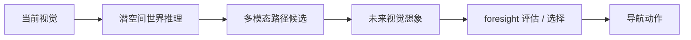

# NavWM:用未来视觉想象做闭环导航决策

> **arXiv**: [2606.24101](https://arxiv.org/abs/2606.24101) | **时间**: 2026.06 | **路线**: WAM · 导航世界模型 / 联合混合
> [← WAM 总览](/wam/) · [Qwen-RobotNav](/vla/papers/qwen-robotnav)

## TL;DR

NavWM 把 WAM 从桌面 manipulation 扩到视觉导航。它不是只预测下一步 waypoint,而是让模型想象候选路径可能看到的未来视觉,再用这些 foresight 评估和选择路径。

这正中 WAM 的核心:动作不再只是反应式输出,而是要和“世界会怎样变化”一起考虑。

## 方法

NavWM 结合三件事:

- **latent world reasoning**:在潜空间里推理环境未来变化。
- **multimodal action prediction**:生成多个可能路径/动作候选,避免单一路径 mode collapse。
- **controllable future visual generation**:根据候选动作生成可控未来视觉,用于评估。

## 谱系位置

- 与 [Qwen-RobotNav](/vla/papers/qwen-robotnav):Qwen-RobotNav 是 VLA 导航执行器;NavWM 是 WAM 式导航预演。
- 与 [DreamZero](dreamzero):都体现“想象未来再动作”的范式,但 NavWM 面向导航而非操作。
- 与 [WorldVLA](worldvla):WorldVLA 统一世界和动作 token;NavWM 更强调多路径候选和视觉 foresight。

## 局限与待核

- 未来视觉生成的质量会直接影响路径选择。
- 导航场景的安全约束、动态障碍和长程地图记忆需要更多实证。
- ECCV 接收信息和最终版本细节需要以后续 camera-ready 为准。

## 来源

- arXiv:[2606.24101](https://arxiv.org/abs/2606.24101).

