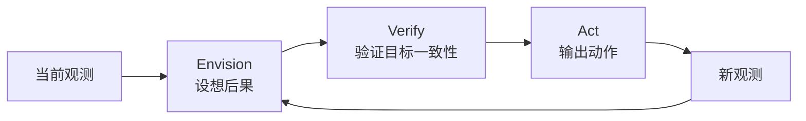

# ω-EVA:潜在交互式世界模型的设想-验证-执行闭环

> **arXiv**: [2606.09457](https://arxiv.org/abs/2606.09457) | **时间**: 2026.06 | **路线**: WAM · 潜在交互式世界模型 / 联合混合
> [← WAM 总览](/wam/) · [DreamZero](dreamzero)

## TL;DR

ω-EVA 的关键词是 **Envision-Verify-Act**:执行前先在潜空间里设想动作后果,再验证这个后果是否服务目标,最后执行动作。它把世界模型从“会生成未来”推进到“能在策略闭环里帮助检查动作”。

这与 WAM 的精神高度一致:动作不应孤立生成,而应和未来状态预测绑定。

## 方法位置

论文新闻采收时记录的关键信息是:约 **1.2B 参数**,不依赖额外预训练数据;定量均按作者自评处理。

## 谱系位置

- 与 [DreamZero](dreamzero):DreamZero 把 WAM 当零样本策略;ω-EVA 更强调执行前的验证闭环。
- 与 [World Value Models](world-value-models):二者都关心“未来是否好”,ω-EVA 在策略内验证,World Value Models 更偏价值估计模块。
- 与 [Reflective VLA](/vla/papers/reflective-vla):Reflective VLA 看历史 action consequence,ω-EVA 则在行动前想象 consequence。

## 局限与待核

- Verify 模块如何定义“好后果”是关键,否则设想可能变成视觉幻觉。
- 潜空间 world model 不额外预训练的规模效率值得继续验证。
- 若任务涉及复杂接触力,视觉后果验证可能不足。

## 来源

- arXiv:[2606.09457](https://arxiv.org/abs/2606.09457).

