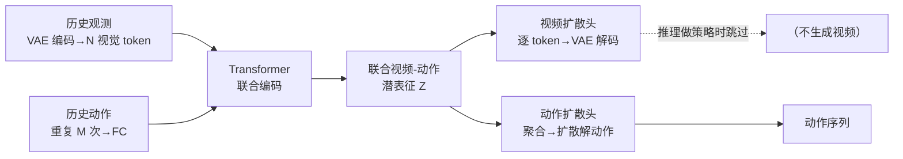

# UVA 细读

> **WAM 论文细读** · 联合建模视频与动作、推理时解耦视频/动作双头以兼顾性能与速度 · arXiv:2503.00200
> [← WAM 总览](/wam/) · [主报告](/vla/)

## TL;DR

UVA(Unified Video Action Model,arXiv:2503.00200,作者 Shuang Li、Yihuai Gao、Dorsa Sadigh、Shuran Song,Stanford)的核心主张有三:
- **联合视频-动作潜表征**:用一个 transformer 把历史观测(经预训练 VAE 编码的视觉 token)与历史动作编码为一组**共享潜表征** \(Z\),让它同时桥接视觉域与动作域、显式刻画视频序列与动作序列的关系。
- **解耦的视频/动作双头**:从共享潜 \(Z\) 出发,挂两个**轻量扩散解码头**——视频扩散头与动作扩散头。训练时两头联合优化;**推理做策略时,跳过视频头、只解码动作**,从而获得快速推理。
- **掩码训练(masked training)**:通过对输入/输出模态做选择性掩码(以 learned mask token 替换未用部分),同一个模型可承担**策略、视频生成、正向动力学、逆向动力学、联合规划**等多种角色,并据作者称能降低过拟合。

作者(自评 ⚠️)称 UVA 在多个仿真与真机任务上达到甚至超过任务专用方法,且保持实时推理速度。与 [UWM](uwm) 不同,本文给出了较多具体数值;但这些均为**作者自报、未见基准维护方统一第三方评测**,故下文一律以 ⚠️ 标注,可核对处给出原文数字,不可核对处标 **待核**。

## 一、定位与动机

UVA 想解决的是机器人学习里一对长期的张力:**视频生成式建模的通用性** vs. **策略推理的精度与速度**。

- 一方面,把机器人学习表述为「视频生成 + 动作预测」能带来通用性——同一框架可做策略学习、动力学建模、视频预测。但纯视频生成式策略(如 [UniPi](unipi))推理极慢:需要先生成未来帧、再从帧反解动作,代价高昂(本文报告其单条轨迹推理达 24.07s ⚠️,见 §四)。
- 另一方面,任务专用的动作策略(如 Diffusion Policy)推理快、精度高,却缺少视频生成式方法的世界建模与多任务通用能力。

UVA 的回应:**联合学习视频与动作的潜表征以获得通用性,再在推理时解耦双头、跳过视频生成以拿回速度**。在本站 WAM taxonomy 中,UVA 属 **Joint · 扩散类**——视频与动作在单一模型内联合建模,但通过「解耦解码」这一推理期机制规避了联合建模常见的速度代价。

## 二、方法与架构(联合潜表征 + 解耦视频/动作双头)

以下结构据论文 HTML 正文(arXiv:2503.00200v1)。

**(1) 输入编码与联合潜表征**
- 历史观测图像经**预训练 VAE(kl-f16)**编码并展平为 N 个视觉 token(维度 d)。
- 历史动作重复 M 次以对齐 token 数,再过全连接层。
- 视觉 token 与动作 token 拼接后送入 **Transformer**,产出一组**联合视频-动作潜表征** \(\{Z_{t+1},\dots,Z_{t+h}\}\),作为后续两个解码头的共享条件。

**(2) 解耦的两个扩散解码头**
- **视频扩散头**:逐个处理潜 token \(z_i\) 预测视频 patch,再经 VAE 解码还原图像。
- **动作扩散头**:用卷积 + MLP 聚合全部潜 token 得到动作潜,再喂入扩散模型解出动作序列。
- 两头从同一 \(Z\) 出发但相互独立,这正是「解耦」的含义:它使得二者可分别取舍。

**(3) 训练目标(逐字据正文)**
- 动作扩散损失:\(L_{action}(Z,A)=\mathbb{E}_{\epsilon,k}[\lVert\epsilon-\epsilon_\theta(A^{(k)}\mid k,Z)\rVert^2]\)
- 视频扩散损失:\(L_{video}(Z,O)=\mathbb{E}_{\epsilon,k}\big[\tfrac{1}{N}\sum_{i=1}^{N}\lVert\epsilon_i-\epsilon_\phi(O^{i,(k)}\mid k,z_i)\rVert^2\big]\)
- 总损失:\(L=L_{action}+L_{video}\),在时间跨度 \(h\) 上求和。按任务**选择性施加**动作损失/视频损失。

*示意图(自绘,据论文描述,非原图)*

## 三、关键设计 / 创新

- **联合潜表征作为「桥」**:不是把视频、动作分别建模再拼接,而是先学一个共享潜空间 \(Z\),让它同时承载视觉与动作信息、刻画二者关系——这是 Joint 路线区别于级联式「先预测帧、后反解动作」的关键。
- **解耦解码 = 通用性与速度的解耦**:训练期联合优化两头以获得世界建模能力;推理期做策略时**只跑轻量动作头、整条绕过视频解码**,从而既保留视频建模带来的好处,又不在每次动作推理时付出视频生成的代价。这是 UVA 相对纯视频生成式策略(如 UniPi)的核心提速机制。
- **掩码训练 → 一模型多角色**:对输入/输出模态做掩码(learned mask token 替换未用部分),配合「按任务选择性施加损失」,使**同一模型**支持五类用途——策略学习、视频生成、正向动力学 \(O_{t+1}=f(O_t,A_t)\)、逆向动力学 \(A_t=f(O_t,O_{t+1})\)、以及与现有策略(如 Diffusion Policy)结合做轨迹选择/规划。作者称掩码亦有助降低过拟合(⚠️)。
- **正向动力学反哺策略**:UVA 可作为「世界模型」用生成的未来观测来评估/筛选候选动作,从而提升下游策略成功率(数值见 §四)。

## 四、实验与结果

<⚠️ 以下数值均为作者自报(self-reported),未见基准维护方统一第三方评测;可核对处给出 arXiv:2503.00200 正文 / 项目页原文数字,不可核对处标「待核」。>

**基准与基线**
- 仿真:PushT、PushT-M(多目标)、Toolhang、Libero10(10 个带语言目标的长程任务)。
- 真机:UMI Cup Arrangement、Towel Folding、Mouse Arrangement;真机评测用 ARX X5 机械臂。
- 基线:Diffusion Policy(CNN/Transformer 变体,记作 DP-C/DP-T;真机用 UMI 预训练视觉编码器版 DP-UMI)、OpenVLA、[UniPi](unipi);逆动力学另对比 ORB-SLAM3 / ORB-SLAM 类方法。

**策略性能(成功率,⚠️ 自报)**
- PushT(单任务):UVA **0.98** vs DP-C 0.91。
- Libero10(多任务):UVA **0.93** vs DP-T 0.80。
- PushT-M(多任务):UVA **0.88** vs 基线 0.68。
- UMI Cup(真机单任务):UVA **0.85** vs DP-UMI 0.95(此项 UVA **不及** DP-UMI,⚠️)。
- UMI 多任务平均(真机):UVA **0.72** vs DP-UMI 0.53。
> 注:上表数字摘自论文 HTML 正文表格的二手转述,具体表号/精确小数与统计口径请以原 PDF 表格为准,**待核**。

**推理速度(⚠️ 自报)**
- 仿真:每条轨迹 **0.23s**(UVA)vs 0.50s(DP-C)vs **24.07s**(UniPi)。
- 真机:**95ms**(UVA)vs 70ms(DP-UMI),均在 16 个扩散步设定下;真机做策略时 UVA 略慢于 DP-UMI。

**其它能力的定量(⚠️ 自报)**
- 正向动力学辅助策略:DP 单独 38% → 用 UVA 生成观测辅助 60% → 真值模拟器上限 75%(均为平均成功率)。
- 逆向动力学:位置误差 **0.75cm**(UVA)vs UniPi 1.92cm。
- 视频生成质量用 Fréchet Video Distance(FVD)评估;具体 FVD 数值 **待核**。

**训练规模(⚠️ 自报)**:在 **8×H100** 上,视频生成预训练约 2 天 + 联合训练约 2 天(共约 4 天);真机每任务采样约 500 条轨迹。参数量、迭代步数、完整超参 **待核**(正文未在本语料中给全)。

## 五、局限与待核

- **真机单任务不占优**:在 UMI Cup 单任务上 UVA(0.85)**低于** DP-UMI(0.95),真机策略推理也略慢于 DP-UMI——「联合 + 解耦」的收益更多体现在多任务与通用性,单任务专用策略仍可能更强(⚠️ 据作者自报数据如此,代表性 **待核**)。
- **数值均为作者自评**:成功率、速度、动力学误差等均 self-reported,未见第三方统一评测;上文表格数字来自 HTML 正文的二手转述,精确值与表号 **待核**(以原 PDF 为准)。
- **像素/潜空间建模的固有问题**:UVA 经 VAE 在 2D 潜空间建模视频,与同谱系工作(如 [UWM](uwm) 被 X-WAM 批评「只建 2D pixel-space」)面临类似质疑——在更复杂 3D/接触丰富场景的世界建模质量如何,**待核**。
- **掩码训练降过拟合的证据**:「掩码减少过拟合」为作者陈述(⚠️),消融的具体口径与幅度 **待核**。
- **实现细节缺位**:Transformer 规模、扩散步数(正文提及 16 / 100 两档)、各任务掩码与损失开关的精确组合、完整数据集构成等 **待核**。
- **机构归属**:四位作者隶属 Stanford(据项目页/检索 ⚠️),论文页未逐一列出每位作者的明确机构标注,**待核确认**,勿当定论。

## 六、在 WAM 谱系中的位置

UVA 在本站 WAM taxonomy 中属 **Joint · 扩散类**:视频与动作在单一模型内联合建模,而非级联式「先预测、后动作」。

- 与 [UWM](uwm) 是最直接的对位:二者都在单一框架内耦合视频与动作扩散。区别在切换/提速机制——UWM 靠**模态独立的扩散时间步**调度四角色;UVA 靠**共享潜表征 + 解耦双头**,并在推理做策略时**直接跳过视频头**来提速。可视为 Joint·扩散谱系内两种不同的「联合而后取舍」思路。
- 与 [UniPi](unipi) 是「被超越的对照」:UniPi 是纯视频生成式策略(先生成帧再反解动作),UVA 把它列为推理速度与逆动力学的对比基线,并以解耦解码规避其慢推理(0.23s vs 24.07s,⚠️ 自报)。
- 与级联/两阶段路线(如 [Gen2Act](gen2act) 先生成人类操作视频再做动作、[GR-1](gr-1) 先视频预测预训练再迁移到动作)相比,UVA 强调**单模型联合潜表征**而非显式两阶段流水;与同样「联合视频+动作」的 [WorldVLA](worldvla) 同属 Joint 家族,各自在统一表征与解码策略上取径不同。

总体而言,UVA 的贡献可概括为一句:**用联合视频-动作潜表征拿到通用性,用推理期解耦双头拿回策略速度**——为 Joint·扩散路线提供了一种「既要世界建模、又要实时策略」的具体折中方案。

## 来源

- <https://arxiv.org/abs/2503.00200> — Unified Video Action Model。作者:Shuang Li、Yihuai Gao、Dorsa Sadigh、Shuran Song(Stanford,机构据项目页/检索,⚠️ 待核逐位标注)。
- 项目页:<https://unified-video-action-model.github.io/> — 贡献列表、能力(策略/视频生成/正逆动力学/可规划)、基线与部分数值的一手来源。
- 正文(HTML):<https://arxiv.org/html/2503.00200v1> — 架构、损失公式、基准/数值的取数处。

> 体例声明:⚠️ 标注的结论与数值均为作者自报(self-reported),尚未经基准维护方统一第三方评测;**待核** 表示一手源在本语料中未给全或为二手转述、不以外部记忆或常识补全。本篇含具体数字者,精确值与表号请以原 PDF 为准。
