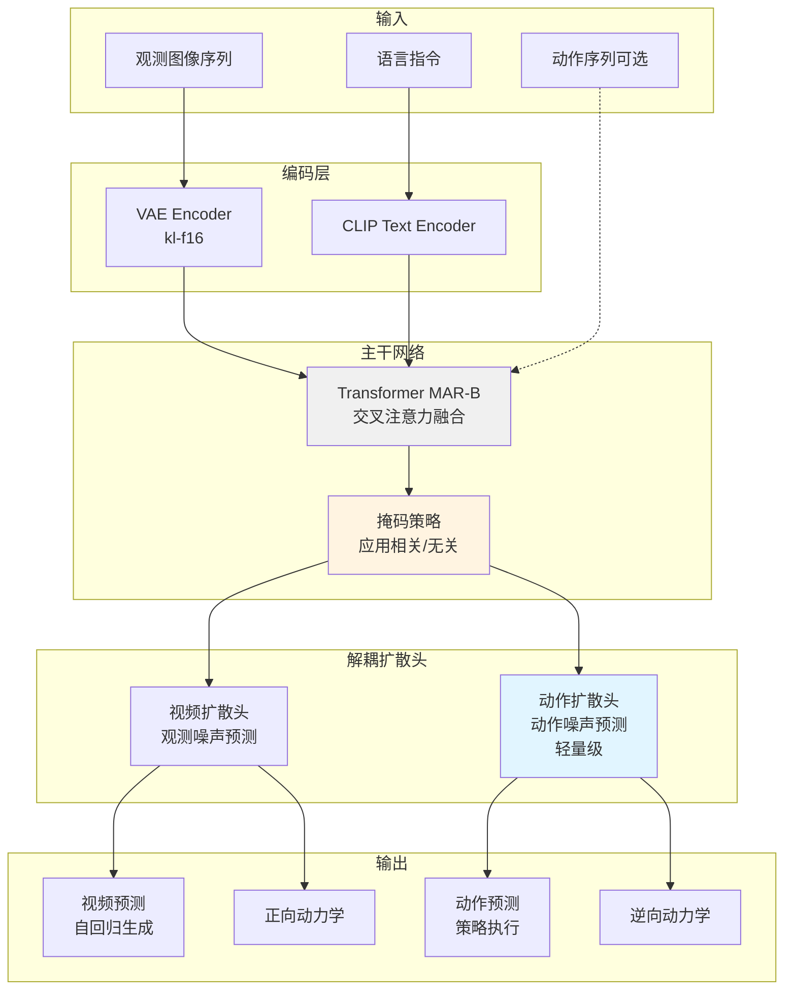
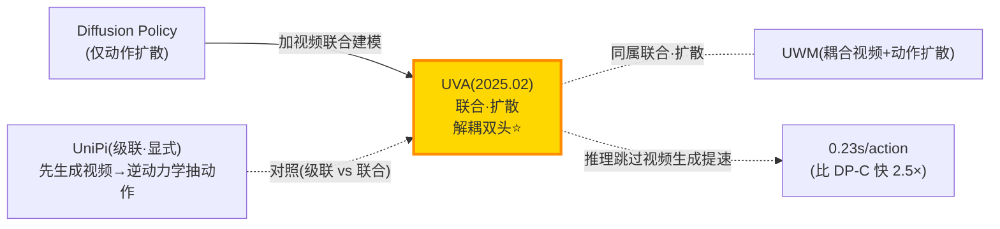

# UVA:统一视频-动作模型,解耦双扩散头

> **arXiv**: [2503.00200](https://arxiv.org/abs/2503.00200)(2025-02,v3 2025-04)
> **机构**: Stanford University
> **作者**: Shuang Li, Yihuai Gao, Dorsa Sadigh, Shuran Song
> **路线**: 联合 · 扩散(共享视频-动作潜表征 + 解耦双扩散头)
> **项目主页**: <https://unified-video-action-model.github.io>

> [← 返回 WAM 总览](../index.md)

---

## TL;DR

UVA（Unified Video Action Model）是 Stanford 大学 Dorsa Sadigh 和 Shuran Song 团队提出的统一视频-动作模型，核心创新在于将视频生成和动作预测统一到同一个潜在表示空间，通过解耦的扩散头（decoupled diffusion heads）实现多任务学习。模型基于 Transformer 架构（MAR-B base），配备 VAE 编码器和 CLIP 文本编码器，总参数量仅 0.5B，显著小于 π0（3.3B）和 OpenVLA（7B）等竞品。

在仿真基准测试中，UVA 展现出强劲性能：Libero10 任务成功率达到 90%（超越 π0 的 85%），PushT-M 成功率 88%（领先次优基线 20%），推理速度 0.23 秒/动作（比 DP-C 快 2.5 倍）。真实世界实验中，UVA 在多任务杯子排列任务上成功率 65%（比 DP-UMI 提升 15%），鼠标排列任务成功率 80%（提升 40%）。模型通过掩码训练策略（masked training）支持灵活的目标函数，可同时处理策略学习、视频生成、正向动力学和逆向动力学任务。

UVA 的关键设计是解耦的视频-动作扩散头：推理时可跳过视频生成直接预测动作，大幅提升速度；训练时通过掩码自编码器学习观测预测，支持自回归视频生成。模型还探索了利用无动作标注的人类视频数据（3,175 个视频）进行预训练，在 Libero10 小测试集上将成功率从 93% 提升至 97%。视频生成质量方面，8 步自回归生成在 Libero10 上的 FVD 为 51.10（优于 UniPi 的 56.55），在 CupArrange 上 FVD 为 29.72（显著优于 UniPi 的 71.37）。

尽管 UVA 在仿真环境表现优异，但真实世界部分任务（如毛巾折叠）仅与基线持平，且推理延迟（95ms）略高于 DP-UMI（70ms）。模型当前仅使用第三人称图像输入，未整合腕部视角或本体感知，且对大规模无标注视频数据的利用仍有待加强。论文指出未来方向包括网络规模视频预训练和多模态扩展（声音、力反馈）。

> ⚠️ **可信度提示**:本页全部定量(LIBERO-10 90%、PushT-M 88%、推理 0.23s/action、真机各任务成功率、FVD、+4% 人类视频增益等)均为**作者自评**,基于其自有仿真/真机评测,**无第三方独立复现**;模型为 arXiv 预印本(2025-03),尚未见会议正式发表。代码/权重一手未给(标待核)。引用请连同自评属性与具体基准口径保留。

> 📌 同属「联合 WAM」的还有本站 [UWM](uwm.md)(耦合视频+动作扩散)、[WorldVLA](worldvla.md)(自回归);UVA 与 UWM 同走「视频+动作联合扩散」但用**解耦双头**换取推理时跳过视频生成的提速,是二者关键差异。

## 1. 要解决的问题

当前机器人学习面临两大挑战：

1. **数据效率与泛化能力的权衡**：传统策略学习方法（如 Diffusion Policy）在单任务上表现优异，但需要大量标注数据且泛化能力有限；大规模视觉-语言-动作模型（如 OpenVLA、π0）虽然泛化能力强，但参数量大（3-7B）、推理速度慢（0.5-1.5s/action）
2. **视频生成与动作预测的割裂**：现有世界模型（如 UniPi）将视频生成和动作预测视为独立任务，无法在推理时灵活选择任务模式，且难以利用无动作标注的视频数据

UVA 提出统一框架，通过联合潜在表示和解耦扩散头同时解决上述问题，实现高效、灵活、多任务的机器人学习。

## 2. 方法与架构

### 核心设计

UVA 采用 **联合视频-动作潜在表示 + 解耦扩散头** 架构：

1. **编码器**：VAE（kl-f16）将观测图像编码为潜在表示，CLIP 文本编码器处理语言指令
2. **主干网络**：Transformer（MAR-B base）通过交叉注意力融合视觉和语言特征
3. **解耦扩散头**：
   - **视频扩散头**：预测未来观测的噪声，支持自回归视频生成
   - **动作扩散头**：轻量级头部预测动作序列的噪声，推理时可独立运行
4. **掩码训练**：根据任务类型灵活掩码输入（策略学习掩码未来观测，视频生成掩码未来帧，正向动力学掩码未来状态，逆向动力学掩码动作）

### 架构图

### 训练配置

- **损失函数**：L_total = L_action + L_video（均为噪声预测扩散损失），在时间窗口 h 上求和
- **掩码策略**：同位置掩码跨帧应用，根据任务选择掩码模式
- **去噪步数**：仿真 100 步，真实世界 16 步
- **动作块**：L 个动作，m 维度，采样频率高于观测频率
- **历史窗口**：历史长度 = 未来预测长度

## 3. 关键设计与创新点

1. **联合视频-动作潜在表示**：首次在单一模型中统一视觉和动作域，通过掩码训练支持策略学习、视频生成、正/逆向动力学等多任务，无需针对不同任务训练独立模型

2. **解耦扩散头设计**：视频和动作使用独立的轻量级解码器，推理时可跳过视频生成直接预测动作，速度提升至 0.23s/action（比 DP-C 的 0.50s 快 2.5 倍），同时保留视频生成能力用于规划和可视化

3. **灵活掩码训练策略**：提出应用相关（application-dependent）和应用无关（application-independent）掩码模式，同一模型通过不同掩码配置即可处理策略、视频生成、动力学建模等任务，大幅提升训练效率

4. **高效参数设计**：仅 0.5B 参数（π0 的 1/6.6，OpenVLA 的 1/14）在 Libero10 上超越 π0 5%（90% vs 85%），证明架构设计比模型规模更关键

5. **无动作视频数据利用**：通过预训练 3,175 个人类视频（无动作标注），在 Libero10 小测试集上将成功率从 93% 提升至 97%，为利用网络规模视频数据奠定基础

## 4. 实验与关键结果

### 仿真策略学习基准

| 基准任务 | UVA | DP-C | DP-T | OpenVLA | UniPi | π0 | π0-FAST | 备注 |
|---------|-----|------|------|---------|-------|----|---------|----|
| PushT | **0.98** 自评 | 0.91 | 0.78 | 0.35 | 0.42 | - | - | 超越最优基线 7% |
| Toolhang | **0.88** 自评 | 0.95 | 0.76 | 0.18 | 0.00 | - | - | 与 DP-C 竞争 |
| PushT-M | **0.88** 自评 | 0.68 | 0.63 | 0.22 | 0.19 | - | - | 超越最优基线 20% |
| Libero10 | **0.90** 自评 | 0.53 | 0.58 | 0.54 | 0.00 | 0.85 | 0.60 | 超越 π0 5%，模型小 6.6 倍 |

### 推理速度对比

| 模型 | 秒/动作 | 备注 |
|-----|---------|-----|
| **UVA** | **0.23** 自评 | 比 DP-C 快 2.5 倍 |
| DP-C | 0.50 | - |
| DP-T | 0.36 | - |
| π0 | 0.09 | - |
| π0-FAST | 0.09 | - |
| OpenVLA | 1.52 | - |
| UniPi | 24.07 | - |

### 真实世界机器人实验

| 任务 | UVA | DP-UMI | 提升幅度 |
|-----|-----|--------|---------|
| 杯子排列（单任务） | **0.85** 自评 | 0.95 | -10% |
| 杯子排列（多任务） | **0.65** 自评 | 0.50 | +15% |
| 毛巾折叠 | **0.70** 自评 | 0.70 | 持平 |
| 鼠标排列 | **0.80** 自评 | 0.40 | +40% |

**真实世界推理速度**：UVA 95ms/action（VAE 40ms + Transformer 40ms + 动作扩散 15ms），DP-UMI 70ms/action

### 视觉鲁棒性测试（PushT 扰动）

| 扰动类型 | UVA | DP-C | DP-T | OpenVLA | UniPi |
|---------|-----|------|------|---------|-------|
| 背景颜色变化 | **0.35** 自评 | 0.12 | 0.22 | 0.17 | 0.31 |
| 背景物体变化 | **0.31** 自评 | 0.21 | 0.17 | 0.13 | 0.36 |
| 目标颜色变化 | **0.64** 自评 | 0.17 | 0.28 | 0.32 | 0.40 |

### 视频生成质量（FVD，越低越好）

| 数据集 | 自回归步数 | UVA | UniPi | 备注 |
|-------|-----------|-----|-------|-----|
| Libero10 | 1 步 | **89.36** 自评 | 56.55 | 单步略逊 |
| Libero10 | 8 步 | **51.10** 自评 | 56.55 | 8 步超越 UniPi |
| CupArrange | 1 步 | **51.34** 自评 | 71.37 | 单步已超越 |
| CupArrange | 8 步 | **29.72** 自评 | 71.37 | 显著优于 UniPi |

### 正向动力学（方块推动任务）

| 颜色组合 | UVA | DP-C | GT-Dynamics | 备注 |
|---------|-----|------|-------------|-----|
| 红→红 | **0.80** 自评 | 0.20 | 0.80 | 匹配真实动力学 |
| 红→绿 | **0.70** 自评 | 0.50 | 0.70 | 匹配真实动力学 |
| 绿→红 | **0.50** 自评 | 0.60 | 0.75 | 待核 |
| 绿→绿 | **0.40** 自评 | 0.20 | - | 待核 |
| **平均** | **0.60** 自评 | 0.38 | - | 超越 DP-C 58% |

### 逆向动力学（位姿估计）

| 指标 | UVA | UniPi | Visual Inertial SLAM | 备注 |
|-----|-----|-------|---------------------|-----|
| 位置误差（cm） | **0.75** 自评 | 1.92 | 0.41 | 比 UniPi 好 2.56 倍 |
| 旋转误差（度） | **1.11** 自评 | 2.21 | 0.30 | 比 UniPi 好 2 倍 |

### 无动作视频预训练效果（Libero10）

| 测试集大小 | 无人类数据 | 有人类数据（3,175 视频） | 提升 |
|-----------|-----------|----------------------|-----|
| 30 测试样本 | 0.93 | **0.97** 自评 | +4% |
| 500 测试样本 | 0.90 | **0.91** 自评 | +1% |

## 5. 在 WAM 谱系中的位置

UVA 属于 **联合(Joint)· 扩散** 类别:在共享潜表示里联合建模视频与动作,但用**解耦的双扩散头**分别解码视频生成与动作预测。

**定位说明**:与 [UniPi](unipi.md)(级联·显式:先合成未来视频、再用逆动力学抽动作)不同,UVA 把视频与动作放进**同一潜表示联合建模**(联合式 WAM);而相比同属联合·扩散的 [UWM](uwm.md),UVA 的**解耦双头**让推理时可只跑动作头、跳过视频生成,把速度从 UniPi 级的 24.07s/action 拉到 0.23s/action。这正体现了 WAM「预测未来状态 + 耦合动作生成」双判据下,联合式如何兼顾世界建模与高效控制。

## 6. 局限与存疑

1. **真实世界性能不稳定**：部分任务（毛巾折叠）仅与基线持平（0.70），单任务杯子排列甚至低于 DP-UMI（0.85 vs 0.95），表明模型在真实世界的泛化能力仍有提升空间

2. **推理延迟略高**：真实世界推理 95ms/action，比 DP-UMI（70ms）慢 36%，可能影响需要高频控制的任务

3. **输入模态受限**：仅使用第三人称图像，未整合腕部视角或本体感知（关节角度、力矩），限制了对需要精细操作或力反馈任务的适用性

4. **无标注视频利用不足**：当前仅在 3,175 个人类视频上预训练，且在大测试集（500 样本）上提升有限（+1%），未充分发挥网络规模视频数据的潜力

5. **视频生成质量待提升**：单步自回归在 Libero10 上 FVD（89.36）逊于 UniPi（56.55），需要 8 步才能超越，增加了规划时的计算成本

6. **多模态扩展缺失**：论文指出未来需扩展至声音、力反馈等模态，表明当前模型在多模态感知方面存在局限

## 来源

- **论文**：Unified Video Action Model. [arXiv:2503.00200](https://arxiv.org/abs/2503.00200)(2025-02,v3 2025-04)
- **项目主页**：<https://unified-video-action-model.github.io>
- **代码 / 权重**：待核(论文/项目页未明确给出)
- **机构**：Stanford University(Shuang Li, Yihuai Gao, Dorsa Sadigh, Shuran Song)

> 说明:本页定量(LIBERO-10 90%、推理 0.23s/action、真机成功率、FVD 等)为**作者自评**,基于自有仿真/真机评测,无第三方复现;代码/权重一手未给处标「待核」。引用请连同自评属性与基准口径保留。
